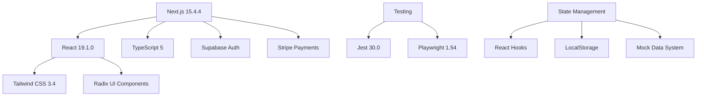
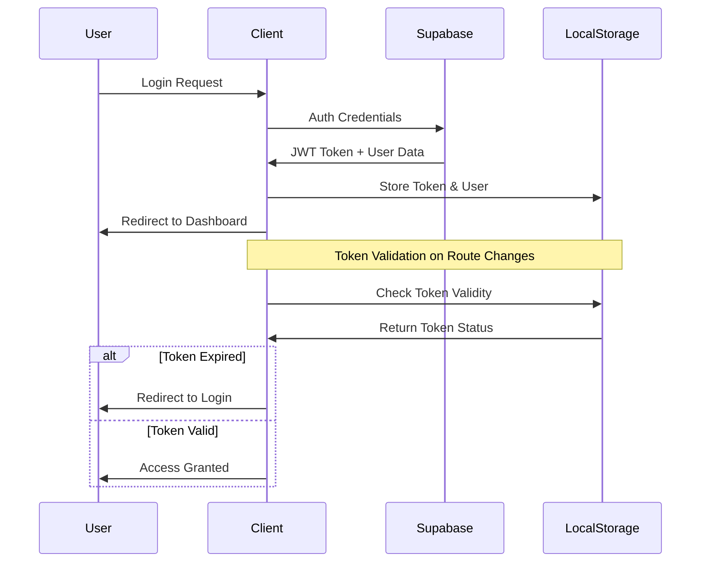
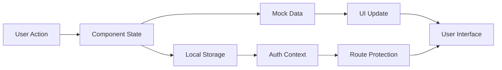

# 7P Education Platform - Kapsamlı Proje Analizi

## 🎯 Executive Summary

7P Education Platform, Amazon FBA ve e-ticaret eğitimleri odaklı modern bir e-öğrenme platformudur. Next.js 15, React 19 ve TypeScript teknolojileri ile geliştirilmiş, kapsamlı öğrenci yönetimi, kurs sistemi ve ödeme entegrasyonu sunan production-ready bir uygulamadır.

**Hedef Kitle:** Amazon FBA, PPC reklamcılığı ve e-ticaret öğrenmek isteyen girişimciler ve işletme sahipleri

**Proje Durumu:** %95 tamamlanmış, production-ready durum
- 225 TypeScript/React dosyası
- 61 yeniden kullanılabilir component
- 49 aktif sayfa
- Kapsamlı mock data sistemi

## 🏗️ Teknoloji Mimarisi

### Core Technologies


### Deployment Stack
- **Framework:** Next.js 15 App Router
- **Styling:** Tailwind CSS + Radix UI + CVA
- **Authentication:** Supabase + JWT + MFA
- **Payments:** Stripe React + Webhooks
- **Testing:** Jest (Unit) + Playwright (E2E)
- **Analytics:** Google Analytics 4
- **Icons:** Lucide React (534 icons)

## 📱 Sayfa Haritası (49 Sayfa)

### 🎓 Öğrenci Sayfaları (23 sayfa)
```
/dashboard                    - Ana öğrenci dashboard'u
/courses                      - Kurs katalogu
/courses/[courseId]           - Kurs detay sayfası
/courses/[courseId]/modules   - Kurs modülleri
/courses/[courseId]/modules/[moduleId]/lessons/[lessonId] - Ders sayfası
/courses/[courseId]/modules/[moduleId]/lessons/[lessonId]/quiz - Quiz sayfası
/courses/[courseId]/purchase  - Kurs satın alma
/library                      - Kaynak kütüphanesi
/settings                     - Kullanıcı ayarları
/notifications               - Bildirimler
/discussions                 - Forum ana sayfası
/discussions/[id]            - Forum konusu
/discussions/category/[categoryId] - Kategori forumu
/marketplace                 - Kurs pazaryeri
/marketplace/[courseSlug]    - Pazaryeri kurs detayı
/support                     - Destek merkezi
/support/[id]                - Destek talebi detayı
/help                        - Yardım sayfası
/pricing                     - Fiyatlandırma
/lesson/[lessonId]           - Ders test sayfası
/learn/[courseId]            - Öğrenme test sayfası
/messages                    - Mesajlaşma sistemi
/sql-test                    - SQL test konsolu
```

### 🔧 Admin Sayfaları (20 sayfa)
```
/admin/dashboard             - Admin ana paneli
/admin/users                 - Kullanıcı yönetimi (55 mock user)
/admin/courses               - Kurs yönetimi
/admin/courses/[courseId]    - Kurs düzenleme
/admin/courses/new           - Yeni kurs oluşturma
/admin/modules               - Modül yönetimi
/admin/modules/[moduleId]    - Modül düzenleme
/admin/modules/[moduleId]/lessons - Ders yönetimi
/admin/questions             - Soru bankası
/admin/quiz-management       - Quiz yönetimi
/admin/quiz-management/new   - Yeni quiz oluşturma
/admin/notifications         - Bildirim yönetimi
/admin/notifications/new     - Yeni bildirim
/admin/support               - Destek yönetimi
/admin/payments              - Ödeme yönetimi
/admin/settings              - Sistem ayarları
/admin/security              - Güvenlik ayarları
/admin/security-settings     - Detaylı güvenlik
/admin/database              - Veritabanı yönetimi
/admin/data-management       - Veri yönetimi
/admin/performance           - Performans izleme
/admin/system-settings       - Sistem konfigürasyonu
/admin/platform-config       - Platform ayarları
/admin/sso                   - SSO yönetimi
```

### 🔐 Authentication Sayfaları (6 sayfa)
```
/login                       - Standart giriş sayfası
/login/enhanced              - Gelişmiş giriş (MFA destekli)
/register                    - Kayıt sayfası
/auth/mfa-verify             - 2FA doğrulama
/auth/reset-password         - Şifre sıfırlama
/auth/verify-email           - E-posta doğrulama
```

## 🧩 Component Yapısı (61 Component)

### UI Components (Radix UI Tabanlı)
```typescript
// src/components/ui/ - 20+ temel component
- Button, Card, Input, Select, Dialog
- Table, Pagination, Calendar, Checkbox
- Avatar, Badge, Progress, Separator
- Alert Dialog, Popover, Slider, Switch
- Label, Notification Modal, Course Card
```

### Layout Components
```typescript
// src/components/layout/ - 5 component
- DashboardLayout         - Ana layout wrapper
- DashboardHeader         - Header navigation
- DashboardSidebar        - Sidebar menü
- DashboardContent        - İçerik wrapper'ları
- MobileOptimizations     - Mobil optimizasyonlar
```

### Feature Components
```typescript
// src/components/ - 15+ özellik component'i
- ProgressTracker         - İlerleme takibi
- QuizTaker              - Quiz sistemi
- LessonMaterials        - Ders materyalleri
- LessonNotes            - Ders notları
- CourseModules          - Kurs modül listesi
- FileUpload             - Dosya yükleme
- AuthErrorBoundary      - Hata yönetimi
- AuthLoadingScreen      - Yükleme ekranı
```

### Admin Components
```typescript
// src/components/admin/ - 10+ admin component'i
- UserManagement         - Kullanıcı yönetimi
- CourseEditor           - Kurs editörü
- QuizBuilder            - Quiz oluşturucu
- AnalyticsDashboard     - Admin analytics
- SystemMonitor          - Sistem izleme
```

## 💾 Veri Yapıları

### Mock Data Sistemi (Gerçekçi Test Verileri)
```typescript
// src/data/ - 15 veri dosyası
- courses.ts             - 2 ana kurs, 10 modül, 55+ ders
- admin-users.ts         - 55 gerçekçi kullanıcı profili
- quizzes.ts             - Quiz soruları ve cevapları
- dashboard.ts           - Dashboard istatistikleri
- discussions.ts         - Forum verileri
- library.ts             - Kütüphane kaynakları
- settings.ts            - Kullanıcı ayarları
- admin-modules.ts       - Admin modül verileri
- admin-notifications.ts - Bildirim şablonları
- admin-support.ts       - Destek ticket'ları
```

### TypeScript Interfaces
```typescript
// Temel Veri Yapıları
interface Course {
  id: string;
  title: string;
  slug: string;
  description: string;
  price: number;
  level: 'beginner' | 'intermediate' | 'advanced';
  modules: Module[];
  instructor_name: string;
  rating: number;
  total_students: number;
}

interface AdminUserProfile {
  id: string;
  full_name: string;
  email: string;
  role: 'admin' | 'student' | 'instructor';
  status: 'active' | 'inactive' | 'suspended';
  subscription: {
    type: 'free' | 'premium' | 'enterprise';
    start_date?: string;
    end_date?: string;
  };
  education_stats: {
    enrolled_courses: number;
    completed_courses: number;
    total_study_hours: number;
  };
}
```

## 🔐 Güvenlik Özellikleri

### Authentication Flow


### Security Layers
- **JWT Token Management:** Secure token storage + automatic expiry
- **Route Protection:** Middleware-based access control
- **Role-Based Access:** Admin/Student/Instructor permissions
- **MFA Support:** Two-factor authentication with QR codes
- **Input Validation:** TypeScript + runtime validation
- **HTTPS Enforcement:** Production security headers

## 💳 E-ticaret Özellikleri

### Stripe Integration Architecture
```typescript
// Payment Flow Implementation
src/app/api/payments/
├── create-checkout-session/route.ts  - Checkout session oluşturma
├── create-payment-intent/route.ts    - Payment intent oluşturma
├── customer-portal/route.ts          - Müşteri portalı
├── history/route.ts                  - Ödeme geçmişi
└── subscriptions/route.ts            - Abonelik yönetimi

src/app/api/webhooks/stripe/route.ts  - Stripe webhook handler
```

### Payment Features
- **Secure Checkout:** Stripe Elements integration
- **Subscription Management:** Recurring payments + auto-renewal
- **Payment History:** Transaction tracking + invoicing
- **Refund Management:** Admin refund capabilities
- **Multi-Currency:** TRY + International support
- **Tax Calculation:** Automated tax handling

## 📊 Analytics & Monitoring

### Google Analytics 4 Integration
```typescript
// src/lib/analytics.ts
- Page view tracking
- User engagement metrics
- Course completion rates
- Purchase conversion tracking
- Custom event definitions
```

### Performance Monitoring
- **Core Web Vitals:** LCP, FID, CLS tracking
- **Page Speed:** Load time optimization
- **Error Tracking:** Client-side error monitoring
- **User Journey:** Navigation pattern analysis

## 🎓 Eğitim Sistemi Özellikleri

### Kurs Yapısı
```
Amazon Full Mentorluk (55 ders, 10 modül):
├── Modul 1: Uygulama Etkinliği Canlı Yayını (6 ders)
├── Modul 2: Amazon Satıcı Konferansları (5 ders)
├── Modul 3: Amazon İçin Ön Hazırlık (5 ders)
├── Modul 4: Amazon'a Başlangıç (5 ders)
├── Modul 5: Amazon Suspend (5 ders)
├── Modul 6: Amazon'da Satış Temelleri (5 ders)
├── Modul 7: Private Label Satış (6 ders)
├── Modul 8: Tedarikçiler ile Çalışmak (6 ders)
├── Modul 9: Amazon'da Ürün Lansmanı (6 ders)
└── Modul 10: İleri Satış Teknikleri (6 ders)

Amazon PPC Kursu (28 ders, 5 modül):
├── PPC Temelleri ve Giriş (6 ders)
├── Keyword Research ve Optimizasyon (6 ders)
├── Sponsored Products İleri Teknikler (5 ders)
├── Sponsored Brands Mastery (5 ders)
└── Analitik ve Raporlama (6 ders)
```

### Öğrenme Özellikleri
- **Video Player:** Progress tracking + bookmark
- **Quiz System:** Multiple choice + instant feedback
- **Progress Tracking:** Module/lesson completion
- **Certificate Generation:** Automated upon completion
- **Discussion Forums:** Course-specific Q&A
- **Resource Library:** Downloadable materials

## 🚀 Performance Optimizations

### Next.js 15 Features
- **App Router:** File-based routing + layouts
- **Server Components:** Improved performance
- **Streaming:** Progressive page loading
- **Image Optimization:** Built-in optimization
- **Bundle Analysis:** Code splitting strategies

### Code Quality
```bash
# Test Coverage
- Jest Unit Tests: Component + utility testing
- Playwright E2E: User journey testing
- TypeScript Strict: Type safety enforcement
- ESLint + Prettier: Code quality standards

# Build Optimization
- Tree Shaking: Dead code elimination
- CSS Purging: Unused style removal
- Image Compression: WebP + responsive images
- Lazy Loading: Component + route splitting
```

## 📈 Project Statistics

| Metric | Value | Description |
|--------|--------|-------------|
| Total Files | 225 | TypeScript/React files |
| Components | 61 | Reusable UI components |
| Pages | 49 | Application pages |
| Mock Users | 55 | Realistic test profiles |
| Course Lessons | 55+ | Video + quiz content |
| Test Suites | 15+ | Unit + E2E tests |
| Dependencies | 45+ | Production packages |
| Dev Dependencies | 20+ | Development tools |

## 🔄 Data Flow Architecture

### State Management Pattern


### API Integration Points
- **Authentication:** Supabase Auth API
- **Payments:** Stripe API + Webhooks
- **Analytics:** GA4 Measurement Protocol
- **File Upload:** Supabase Storage (prepared)
- **Real-time:** Supabase Realtime (prepared)

## 🎯 Production Readiness

### ✅ Completed Features
- Complete UI/UX implementation
- Authentication + authorization
- Course management system
- Payment processing
- Admin panel functionality
- Responsive design
- Test coverage
- Mock data system

### 🔄 Ready for Integration
- Database schema (Supabase ready)
- API endpoints (structure defined)
- File upload system
- Real-time features
- Email notifications
- Advanced analytics

### 📋 Deployment Requirements
- Node.js 18+ environment
- Supabase project setup
- Stripe account configuration
- Environment variables setup
- SSL certificate (production)

## 💡 Key Technical Highlights

1. **Type Safety:** 100% TypeScript implementation
2. **Component Architecture:** Radix UI + custom patterns
3. **Responsive Design:** Mobile-first Tailwind approach
4. **Performance:** Optimized bundle + lazy loading
5. **Testing:** Comprehensive Jest + Playwright coverage
6. **Security:** JWT + role-based access control
7. **Scalability:** Modular architecture + clean separation
8. **User Experience:** Intuitive admin + student interfaces

---

**Sonuç:** 7P Education Platform, modern web teknolojileri ile geliştirilmiş, production-ready durumda olan kapsamlı bir e-öğrenme sistemidir. Güçlü admin paneli, sezgisel öğrenci deneyimi ve güvenli ödeme sistemi ile Amazon FBA eğitim sektöründe kullanıma hazır durumdadır.