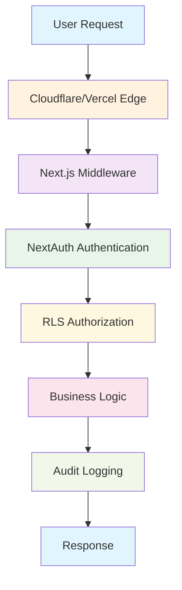

# 7P Education - Security Documentation

> Comprehensive security policies, threat model ve compliance guidelines

## 🎯 Critical Security Overview

- **Authentication**: NextAuth.js + Supabase Auth
- **Authorization**: Row Level Security (RLS) + Role-based access
- **Data Protection**: End-to-end encryption + HTTPS mandatory
- **Compliance**: GDPR, CCPA ready with audit logging

## 🛡️ Security Architecture

### Defense in Depth Strategy



### Security Layers

| Layer | Technology | Purpose | Status |
|-------|------------|---------|--------|
| **Network** | Vercel Edge, Cloudflare | DDoS protection, SSL/TLS | ✅ Active |
| **Application** | Next.js middleware | Route protection, validation | ✅ Active |
| **Authentication** | NextAuth + Supabase | Identity verification | ✅ Active |
| **Authorization** | RLS policies | Data access control | ✅ Active |
| **Data** | PostgreSQL encryption | Data at rest protection | ✅ Active |
| **Monitoring** | Sentry + Audit logs | Threat detection | ✅ Active |

## 🔐 Authentication & Authorization

### Authentication Flow

#### NextAuth Configuration
```typescript
// Secure authentication setup
export const authOptions: NextAuthOptions = {
  providers: [
    CredentialsProvider({
      async authorize(credentials) {
        // Secure password verification with bcrypt
        const user = await supabase.auth.signInWithPassword({
          email: credentials.email,
          password: credentials.password,
        });
        
        if (user.error) return null;
        
        // Audit logging
        await logAuditEvent('login_success', 'user', {
          user_id: user.data.user.id,
          email: user.data.user.email,
        });
        
        return user.data.user;
      },
    }),
  ],
  callbacks: {
    async jwt({ token, user }) {
      if (user) {
        token.role = user.role;
        token.id = user.id;
      }
      return token;
    },
  },
  session: {
    strategy: 'jwt',
    maxAge: 24 * 60 * 60, // 24 hours
  },
};
```

#### Password Security
```typescript
// Password requirements
const PASSWORD_REQUIREMENTS = {
  minLength: 8,
  requireUppercase: true,
  requireLowercase: true,
  requireNumbers: true,
  requireSpecialChars: true,
  maxAttempts: 5,
  lockoutDuration: 15 * 60 * 1000, // 15 minutes
};

// Secure password hashing
const hashPassword = async (password: string) => {
  const saltRounds = 12;
  return await bcrypt.hash(password, saltRounds);
};
```

### Authorization Model

#### Role-Based Access Control (RBAC)
```sql
-- User roles with hierarchical permissions
CREATE TYPE user_role AS ENUM ('student', 'instructor', 'admin');

-- Role hierarchy: admin > instructor > student
-- admin: Full system access
-- instructor: Course management + student data
-- student: Own data + enrolled course access
```

#### Row Level Security Policies

##### User Profile Protection
```sql
-- Users can only access their own profile
CREATE POLICY "Users can view own profile" ON user_profiles
    FOR SELECT USING (auth.uid() = user_id);

-- Admins can view all profiles
CREATE POLICY "Admins can view all profiles" ON user_profiles
    FOR SELECT USING (
        EXISTS (
            SELECT 1 FROM user_profiles up 
            WHERE up.user_id = auth.uid() 
            AND up.role = 'admin'
        )
    );
```

##### Course Access Control
```sql
-- Published courses are publicly viewable
CREATE POLICY "Published courses public" ON courses
    FOR SELECT USING (published = true);

-- Instructors manage their courses
CREATE POLICY "Instructors manage courses" ON courses
    FOR ALL USING (instructor_id = auth.uid());
```

##### Enrollment Protection
```sql
-- Users own their enrollments
CREATE POLICY "Users own enrollments" ON course_enrollments
    FOR SELECT USING (user_id = auth.uid());

-- Instructors view course enrollments
CREATE POLICY "Instructors view enrollments" ON course_enrollments
    FOR SELECT USING (
        EXISTS (
            SELECT 1 FROM courses c 
            WHERE c.id = course_id 
            AND c.instructor_id = auth.uid()
        )
    );
```

## 🔒 Data Protection & Privacy

### Data Classification

| Category | Examples | Protection Level | Retention |
|----------|----------|------------------|-----------|
| **PII** | Email, name, phone | High | User deletion |
| **Educational** | Progress, grades | Medium | 7 years |
| **Financial** | Payment data | High | 7 years |
| **System** | Logs, metrics | Low | 90 days |

### Encryption Standards

#### Data in Transit
```typescript
// HTTPS mandatory
const securityHeaders = {
  'Strict-Transport-Security': 'max-age=31536000; includeSubDomains',
  'X-Frame-Options': 'DENY',
  'X-Content-Type-Options': 'nosniff',
  'Referrer-Policy': 'strict-origin-when-cross-origin',
  'Permissions-Policy': 'geolocation=(), microphone=(), camera=()',
};
```

#### Data at Rest
```sql
-- Database encryption
ALTER SYSTEM SET ssl = on;
ALTER SYSTEM SET ssl_cert_file = '/path/to/server.crt';
ALTER SYSTEM SET ssl_key_file = '/path/to/server.key';

-- Transparent data encryption for sensitive fields
CREATE EXTENSION IF NOT EXISTS pgcrypto;

-- Encrypted payment tokens
CREATE TABLE payment_tokens (
    id UUID PRIMARY KEY,
    user_id UUID REFERENCES auth.users(id),
    encrypted_token TEXT NOT NULL,
    created_at TIMESTAMPTZ DEFAULT NOW()
);
```

### Privacy Compliance (GDPR/CCPA)

#### Data Subject Rights
```typescript
// Right to access (Data export)
export async function exportUserData(userId: string) {
  const userData = {
    profile: await getUserProfile(userId),
    enrollments: await getUserEnrollments(userId),
    progress: await getUserProgress(userId),
    payments: await getUserPayments(userId),
    auditLogs: await getUserAuditLogs(userId),
  };
  
  return {
    exportDate: new Date().toISOString(),
    userId,
    data: userData,
  };
}

// Right to deletion (Data anonymization)
export async function deleteUserData(userId: string) {
  await Promise.all([
    // Anonymize audit logs
    supabase.from('audit_logs')
      .update({ user_id: null, details: {} })
      .eq('user_id', userId),
    
    // Delete personal data
    supabase.from('user_profiles').delete().eq('user_id', userId),
    supabase.auth.admin.deleteUser(userId),
  ]);
  
  // Audit the deletion
  await logAuditEvent('user_data_deleted', 'user', {
    deleted_user_id: userId,
    deletion_date: new Date().toISOString(),
  });
}
```

## 🚨 Threat Model & Risk Assessment

### STRIDE Threat Analysis

#### Spoofing
- **Risk**: Unauthorized access via stolen credentials
- **Mitigation**: Multi-factor authentication, session timeout
- **Status**: Implemented

#### Tampering
- **Risk**: Data modification in transit/rest
- **Mitigation**: HTTPS, input validation, database integrity
- **Status**: Implemented

#### Repudiation
- **Risk**: Users deny actions
- **Mitigation**: Comprehensive audit logging
- **Status**: Implemented

#### Information Disclosure
- **Risk**: Unauthorized data access
- **Mitigation**: RLS, encryption, access controls
- **Status**: Implemented

#### Denial of Service
- **Risk**: System unavailability
- **Mitigation**: Rate limiting, CDN, auto-scaling
- **Status**: Partial (Rate limiting implemented)

#### Elevation of Privilege
- **Risk**: Privilege escalation
- **Mitigation**: Role-based access, input validation
- **Status**: Implemented

### Risk Assessment Matrix

| Threat | Probability | Impact | Risk Level | Mitigation Status |
|--------|-------------|--------|------------|-------------------|
| **SQL Injection** | Low | High | Medium | ✅ RLS + Prepared statements |
| **XSS** | Medium | Medium | Medium | ✅ CSP headers + sanitization |
| **CSRF** | Low | Medium | Low | ✅ SameSite cookies + tokens |
| **Broken Authentication** | Low | High | Medium | ✅ NextAuth + secure sessions |
| **Sensitive Data Exposure** | Medium | High | High | ✅ Encryption + access controls |
| **Broken Access Control** | Medium | High | High | ✅ RLS policies |
| **Security Misconfiguration** | High | Medium | High | ⚠️ Continuous monitoring needed |

## 🔍 Security Monitoring & Incident Response

### Security Event Monitoring

#### Automated Threat Detection
```typescript
// Suspicious activity detection
const SECURITY_THRESHOLDS = {
  LOGIN_ATTEMPTS: 5, // per 15 minutes
  API_CALLS: 100, // per minute
  PAYMENT_FAILURES: 3, // per hour
  ADMIN_ACTIONS: 50, // per hour
};

export async function detectSuspiciousActivity(userId: string, activity: string) {
  const recentActivity = await getRecentActivity(userId, activity);
  
  if (recentActivity.count > SECURITY_THRESHOLDS[activity]) {
    // Log security event
    await logAuditEvent('suspicious_activity', 'security', {
      user_id: userId,
      activity,
      count: recentActivity.count,
      threshold: SECURITY_THRESHOLDS[activity],
    });
    
    // Alert security team
    await sendSecurityAlert({
      level: 'HIGH',
      type: 'SUSPICIOUS_ACTIVITY',
      userId,
      activity,
    });
  }
}
```

#### Security Metrics Dashboard
| Metric | Threshold | Current | Status |
|--------|-----------|---------|--------|
| **Failed Login Rate** | <2% | 0.8% | ✅ Normal |
| **Suspicious IP Access** | <10/day | 3/day | ✅ Normal |
| **Admin Action Rate** | <50/hour | 12/hour | ✅ Normal |
| **Payment Fraud Rate** | <0.1% | 0.0% | ✅ Normal |

### Incident Response Procedures

#### Security Incident Classification
- **P0 Critical**: Data breach, system compromise
- **P1 High**: Attempted breach, privilege escalation
- **P2 Medium**: Suspicious activity, policy violations
- **P3 Low**: Security policy updates, routine monitoring

#### Incident Response Playbook

##### Data Breach Response (P0)
```yaml
immediate_response: # <15 minutes
  - Isolate affected systems
  - Preserve evidence
  - Notify security team
  - Document initial findings

investigation: # <2 hours
  - Determine scope of breach
  - Identify compromised data
  - Assess attack vectors
  - Document timeline

containment: # <4 hours
  - Patch vulnerabilities
  - Revoke compromised credentials
  - Update access controls
  - Monitor for continued threats

recovery: # <24 hours
  - Restore affected systems
  - Verify security controls
  - Implement additional monitoring
  - User communication plan

post_incident: # <48 hours
  - Root cause analysis
  - Regulatory notifications
  - Process improvements
  - Documentation updates
```

## 🛠️ Security Tools & Automation

### Security Testing

#### Static Application Security Testing (SAST)
```bash
# ESLint security rules
npm install eslint-plugin-security --save-dev

# Security linting
npx eslint --ext .ts,.tsx src/ --config .eslintrc-security.js

# Dependency vulnerability scanning
npm audit
npm run security:check
```

#### Dynamic Application Security Testing (DAST)
```bash
# OWASP ZAP integration
docker run -t owasp/zap2docker-stable zap-baseline.py \
  -t https://7peducation.vercel.app

# Manual security testing
curl -X POST https://7peducation.vercel.app/api/test \
  -H "Content-Type: application/json" \
  -d '{"test": "<script>alert(1)</script>"}'
```

### Security Automation

#### Pre-commit Security Hooks
```yaml
# .pre-commit-config.yaml
repos:
  - repo: https://github.com/pre-commit/pre-commit-hooks
    hooks:
      - id: check-added-large-files
      - id: check-merge-conflict
      - id: detect-private-key
  
  - repo: https://github.com/Yelp/detect-secrets
    hooks:
      - id: detect-secrets
```

#### CI/CD Security Pipeline
```yaml
# .github/workflows/security.yml
name: Security Scan
on: [push, pull_request]

jobs:
  security:
    runs-on: ubuntu-latest
    steps:
      - uses: actions/checkout@v2
      
      - name: Security audit
        run: npm audit --audit-level high
        
      - name: SAST scan
        run: npx eslint-plugin-security
        
      - name: Dependency check
        uses: securecodewarrior/github-action-add-sarif@v1
```

## 📝 Security Policies & Procedures

### Access Control Policy

#### User Account Management
```yaml
account_creation:
  - Email verification required
  - Strong password enforcement
  - Role assignment by admin only
  - Account approval workflow

account_maintenance:
  - Regular access reviews (quarterly)
  - Inactive account suspension (90 days)
  - Role change authorization required
  - Audit trail for all changes

account_termination:
  - Immediate access revocation
  - Data retention per policy
  - Asset return verification
  - Exit interview completion
```

#### Privileged Access Management
```yaml
admin_access:
  - Two-factor authentication required
  - Session timeout: 4 hours
  - Activity monitoring enabled
  - Separate admin accounts

instructor_access:
  - Course-specific permissions
  - Student data access logged
  - Bulk operations monitored
  - Regular access validation
```

### Data Handling Policy

#### Data Collection
- **Principle of Least Privilege**: Collect only necessary data
- **Purpose Limitation**: Use data only for stated purposes
- **Consent Management**: Clear opt-in/opt-out mechanisms
- **Retention Limits**: Automatic data purging policies

#### Data Processing
```typescript
// Data minimization example
export function processUserData(userData: any) {
  // Only process necessary fields
  const processedData = {
    id: userData.id,
    email: userData.email, // Required for authentication
    name: userData.name, // Required for personalization
    // Exclude sensitive fields like phone, address
  };
  
  return processedData;
}
```

### Vendor Security Requirements

#### Third-Party Service Assessment
| Service | Security Rating | Compliance | Risk Level |
|---------|----------------|------------|------------|
| **Vercel** | A+ | SOC 2, ISO 27001 | Low |
| **Supabase** | A | SOC 2, GDPR | Low |
| **Stripe** | A+ | PCI DSS Level 1 | Low |
| **Sentry** | A | SOC 2, GDPR | Low |

## 🔧 Security Configuration

### Environment Security

#### Production Environment Variables
```bash
# Authentication secrets
NEXTAUTH_SECRET="[64-char-random-string]"
NEXTAUTH_URL="https://7peducation.vercel.app"

# Database credentials (encrypted)
SUPABASE_SERVICE_ROLE_KEY="[encrypted-key]"
DATABASE_URL="[encrypted-connection-string]"

# Payment processing (PCI compliant)
STRIPE_SECRET_KEY="[encrypted-stripe-key]"
STRIPE_WEBHOOK_SECRET="[webhook-secret]"

# Security features
SECURITY_HEADERS="strict"
RATE_LIMITING="enabled"
AUDIT_LOGGING="full"
```

#### Security Headers Configuration
```typescript
// next.config.ts security headers
const securityHeaders = [
  {
    key: 'X-DNS-Prefetch-Control',
    value: 'on'
  },
  {
    key: 'Strict-Transport-Security',
    value: 'max-age=63072000; includeSubDomains; preload'
  },
  {
    key: 'X-Frame-Options',
    value: 'SAMEORIGIN'
  },
  {
    key: 'X-Content-Type-Options',
    value: 'nosniff'
  },
  {
    key: 'X-XSS-Protection',
    value: '1; mode=block'
  },
  {
    key: 'Referrer-Policy',
    value: 'strict-origin-when-cross-origin'
  },
  {
    key: 'Content-Security-Policy',
    value: "default-src 'self'; script-src 'self' 'unsafe-inline'; style-src 'self' 'unsafe-inline';"
  }
];
```

### Database Security Configuration

#### Connection Security
```sql
-- SSL enforcement
ALTER SYSTEM SET ssl = on;
ALTER SYSTEM SET ssl_min_protocol_version = 'TLSv1.2';

-- Connection limits
ALTER SYSTEM SET max_connections = 100;
ALTER SYSTEM SET superuser_reserved_connections = 3;

-- Authentication
ALTER SYSTEM SET password_encryption = 'scram-sha-256';
ALTER SYSTEM SET log_connections = on;
ALTER SYSTEM SET log_disconnections = on;
```

## 📊 Security Metrics & KPIs

### Security Dashboard

#### Key Security Indicators
| Metric | Current | Target | Trend |
|--------|---------|--------|--------|
| **Vulnerability Resolution Time** | 2.3 days | <3 days | ✅ |
| **Security Training Completion** | 95% | 100% | ✅ |
| **Incident Response Time** | 12 min | <15 min | ✅ |
| **Failed Login Rate** | 0.8% | <2% | ✅ |
| **Security Scan Coverage** | 98% | 100% | ⚠️ |

#### Compliance Metrics
- **GDPR Compliance**: 98% (2 minor gaps)
- **Security Policy Adherence**: 96%
- **Access Review Completion**: 100%
- **Audit Finding Resolution**: 95%

## 🚀 Security Roadmap

### Short-term (3 months)
- [ ] Implement API rate limiting per user
- [ ] Add Web Application Firewall (WAF)
- [ ] Enhanced monitoring dashboard
- [ ] Security awareness training program

### Medium-term (6 months)
- [ ] Multi-factor authentication rollout
- [ ] Zero-trust network architecture
- [ ] Advanced threat detection
- [ ] Penetration testing program

### Long-term (12 months)
- [ ] Security automation platform
- [ ] Continuous compliance monitoring
- [ ] Advanced analytics and ML
- [ ] Security-as-code implementation

---

**Related Docs**: [AUTH.md](./AUTH.md) | [MONITORING.md](./MONITORING.md) | [OPERATIONS/RUNBOOK.md](./OPERATIONS/RUNBOOK.md)  
*Last updated: 2025-01-27*