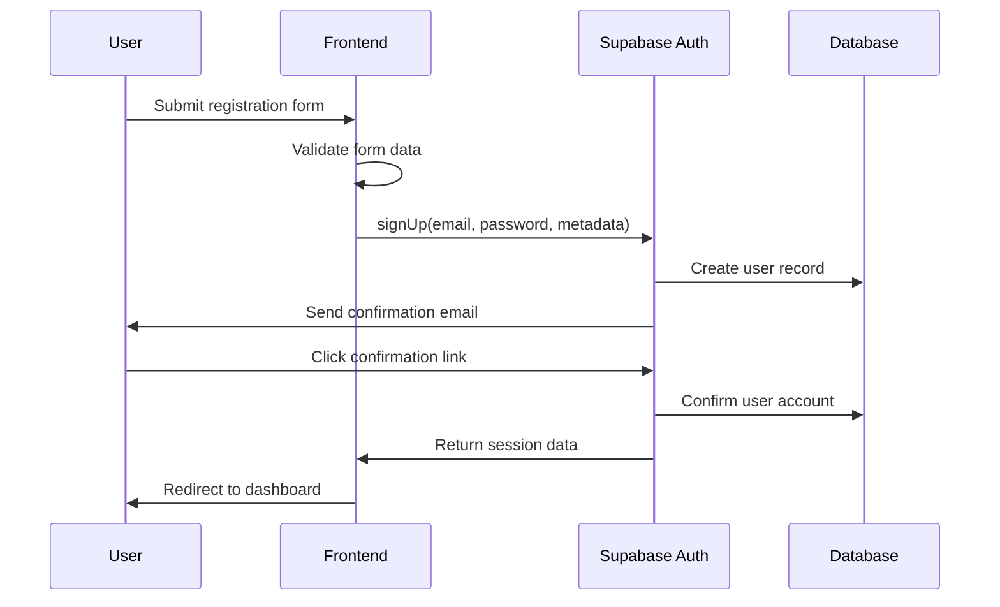

# P04 - Authentication Flow Architecture Analysis

## Executive Summary

This document provides a comprehensive analysis of the 7P Education Platform's authentication flow architecture, examining the current Supabase Auth implementation, security measures, user experience considerations, and providing detailed recommendations for enhancement and optimization of authentication processes.

## Current Authentication Architecture Assessment

### Technology Stack Analysis

**Current Implementation:**
- **Authentication Provider**: Supabase Auth (PostgreSQL-based)
- **Frontend Integration**: Next.js App Router with Supabase client
- **Session Management**: JWT tokens with refresh token rotation
- **Social Authentication**: Google, GitHub, Discord integration
- **Multi-factor Authentication**: TOTP support via Supabase
- **Password Security**: bcrypt hashing with configurable rounds

### Current Authentication Flow

**Primary Authentication Components:**
```typescript
// Current Supabase Auth setup
import { createClient } from '@supabase/supabase-js'

const supabase = createClient(
  process.env.NEXT_PUBLIC_SUPABASE_URL!,
  process.env.NEXT_PUBLIC_SUPABASE_ANON_KEY!,
  {
    auth: {
      autoRefreshToken: true,
      persistSession: true,
      detectSessionInUrl: true
    }
  }
)
```

**Current User Registration Flow:**


## Detailed Authentication Analysis

### 1. User Registration Process

**Current Strengths:**
- Email verification required before account activation
- Password strength validation
- Duplicate email prevention
- Basic user metadata collection

**Identified Issues:**

1. **Limited User Profile Data Collection:**
```typescript
// Current: Basic registration
const { data, error } = await supabase.auth.signUp({
  email,
  password,
  options: {
    data: {
      name: fullName,
    }
  }
})
```

**Recommended Enhanced Registration:**

```typescript
// Enhanced registration with comprehensive data collection
interface RegistrationData {
  email: string;
  password: string;
  firstName: string;
  lastName: string;
  dateOfBirth?: string;
  phoneNumber?: string;
  timezone: string;
  language: string;
  marketingConsent: boolean;
  termsAccepted: boolean;
  privacyPolicyAccepted: boolean;
  referralCode?: string;
  intendedRole: 'student' | 'instructor';
  areasOfInterest: string[];
}

export class EnhancedRegistrationService {
  static async registerUser(registrationData: RegistrationData): Promise<AuthResult> {
    try {
      // Input validation
      const validatedData = registrationSchema.parse(registrationData);
      
      // Check for existing user
      const existingUser = await this.checkExistingUser(validatedData.email);
      if (existingUser) {
        throw new AuthError('User already exists', 'USER_ALREADY_EXISTS');
      }
      
      // Password strength validation
      const passwordStrength = this.validatePasswordStrength(validatedData.password);
      if (passwordStrength.score < 3) {
        throw new AuthError('Password is too weak', 'WEAK_PASSWORD', {
          suggestions: passwordStrength.suggestions
        });
      }
      
      // Create user account
      const { data, error } = await supabase.auth.signUp({
        email: validatedData.email,
        password: validatedData.password,
        options: {
          data: {
            first_name: validatedData.firstName,
            last_name: validatedData.lastName,
            phone: validatedData.phoneNumber,
            timezone: validatedData.timezone,
            language: validatedData.language,
            intended_role: validatedData.intendedRole,
            registration_source: 'web',
            registration_timestamp: new Date().toISOString(),
            marketing_consent: validatedData.marketingConsent,
            terms_version: await this.getCurrentTermsVersion(),
            privacy_policy_version: await this.getCurrentPrivacyVersion()
          },
          emailRedirectTo: `${process.env.NEXT_PUBLIC_APP_URL}/auth/callback`
        }
      });
      
      if (error) throw error;
      
      // Create extended user profile
      if (data.user) {
        await this.createUserProfile(data.user.id, validatedData);
        
        // Track registration event
        await this.trackRegistrationEvent(data.user.id, validatedData);
        
        // Handle referral if applicable
        if (validatedData.referralCode) {
          await this.processReferral(data.user.id, validatedData.referralCode);
        }
      }
      
      return {
        success: true,
        user: data.user,
        message: 'Registration successful. Please check your email to verify your account.'
      };
      
    } catch (error) {
      await this.logRegistrationError(error, registrationData.email);
      throw error;
    }
  }
  
  private static async createUserProfile(
    userId: string, 
    registrationData: RegistrationData
  ): Promise<void> {
    const profileData = {
      user_id: userId,
      areas_of_interest: registrationData.areasOfInterest,
      onboarding_status: 'pending',
      profile_completion: this.calculateProfileCompletion(registrationData),
      communication_preferences: {
        email_notifications: true,
        course_updates: true,
        marketing_emails: registrationData.marketingConsent,
        assignment_reminders: true
      }
    };
    
    await supabase.from('user_profiles').insert(profileData);
  }
}
```

### 2. Login Process Enhancement

**Current Login Flow Analysis:**

```typescript
// Current: Basic login implementation
const { data, error } = await supabase.auth.signInWithPassword({
  email,
  password,
})
```

**Enhanced Login with Security Features:**

```typescript
export class SecureLoginService {
  private static readonly MAX_LOGIN_ATTEMPTS = 5;
  private static readonly LOCKOUT_DURATION = 15 * 60 * 1000; // 15 minutes
  
  static async authenticateUser(credentials: LoginCredentials): Promise<AuthResult> {
    try {
      // Rate limiting check
      await this.checkRateLimit(credentials.email, credentials.ipAddress);
      
      // Account lockout check
      const lockoutStatus = await this.checkAccountLockout(credentials.email);
      if (lockoutStatus.isLocked) {
        throw new AuthError(
          `Account temporarily locked. Try again in ${lockoutStatus.remainingTime} minutes.`,
          'ACCOUNT_LOCKED'
        );
      }
      
      // Device fingerprinting for security
      const deviceFingerprint = this.generateDeviceFingerprint(credentials);
      
      // Attempt authentication
      const { data, error } = await supabase.auth.signInWithPassword({
        email: credentials.email.toLowerCase().trim(),
        password: credentials.password,
      });
      
      if (error) {
        await this.handleFailedLogin(credentials.email, credentials.ipAddress, error);
        throw new AuthError('Invalid email or password', 'INVALID_CREDENTIALS');
      }
      
      // Security checks for successful login
      await this.performSecurityChecks(data.user!, credentials, deviceFingerprint);
      
      // Update login tracking
      await this.updateLoginTracking(data.user!.id, credentials);
      
      // Check if MFA is required
      const mfaRequired = await this.checkMfaRequirement(data.user!);
      if (mfaRequired) {
        return {
          success: false,
          requiresMfa: true,
          mfaToken: await this.generateMfaToken(data.user!.id),
          message: 'Multi-factor authentication required'
        };
      }
      
      return {
        success: true,
        user: data.user,
        session: data.session,
        message: 'Login successful'
      };
      
    } catch (error) {
      await this.logSecurityEvent('login_failure', {
        email: credentials.email,
        ipAddress: credentials.ipAddress,
        userAgent: credentials.userAgent,
        error: error.message
      });
      throw error;
    }
  }
  
  private static async performSecurityChecks(
    user: User,
    credentials: LoginCredentials,
    deviceFingerprint: string
  ): Promise<void> {
    // Suspicious activity detection
    const suspiciousActivity = await this.detectSuspiciousActivity(
      user.id,
      credentials.ipAddress,
      deviceFingerprint
    );
    
    if (suspiciousActivity.riskLevel === 'high') {
      // Trigger additional verification
      await this.triggerAdditionalVerification(user.id, suspiciousActivity);
    }
    
    // Geolocation check
    const locationCheck = await this.performLocationCheck(
      user.id,
      credentials.ipAddress
    );
    
    if (locationCheck.isNewLocation) {
      await this.notifyNewLocationLogin(user, locationCheck.location);
    }
    
    // Device trust check
    const deviceTrust = await this.checkDeviceTrust(user.id, deviceFingerprint);
    if (!deviceTrust.isTrusted) {
      await this.initiateDeviceVerification(user.id, deviceFingerprint);
    }
  }
  
  private static async checkAccountLockout(email: string): Promise<LockoutStatus> {
    const { data } = await supabase
      .from('login_attempts')
      .select('*')
      .eq('email', email)
      .gte('attempted_at', new Date(Date.now() - this.LOCKOUT_DURATION).toISOString())
      .order('attempted_at', { ascending: false });
    
    const failedAttempts = data?.filter(attempt => !attempt.successful) || [];
    
    if (failedAttempts.length >= this.MAX_LOGIN_ATTEMPTS) {
      const lastAttempt = failedAttempts[0];
      const lockoutEnd = new Date(lastAttempt.attempted_at).getTime() + this.LOCKOUT_DURATION;
      const remainingTime = Math.ceil((lockoutEnd - Date.now()) / (60 * 1000));
      
      return {
        isLocked: remainingTime > 0,
        remainingTime: Math.max(0, remainingTime)
      };
    }
    
    return { isLocked: false, remainingTime: 0 };
  }
}
```

### 3. Multi-Factor Authentication Implementation

**Enhanced MFA Architecture:**

```typescript
export class MfaService {
  static async setupMfa(userId: string, method: MfaMethod): Promise<MfaSetupResult> {
    try {
      switch (method) {
        case 'totp':
          return await this.setupTotpMfa(userId);
        case 'sms':
          return await this.setupSmsMfa(userId);
        case 'email':
          return await this.setupEmailMfa(userId);
        case 'backup_codes':
          return await this.generateBackupCodes(userId);
        default:
          throw new Error('Unsupported MFA method');
      }
    } catch (error) {
      await this.logMfaEvent('setup_failed', userId, { method, error: error.message });
      throw error;
    }
  }
  
  private static async setupTotpMfa(userId: string): Promise<TotpSetupResult> {
    // Generate secret key
    const secret = speakeasy.generateSecret({
      name: '7P Education',
      account: await this.getUserEmail(userId),
      length: 32
    });
    
    // Store encrypted secret
    await this.storeMfaSecret(userId, 'totp', secret.base32);
    
    // Generate QR code
    const qrCodeUrl = await QRCode.toDataURL(secret.otpauth_url!);
    
    return {
      secret: secret.base32,
      qrCode: qrCodeUrl,
      backupCodes: await this.generateBackupCodes(userId),
      setupToken: await this.generateMfaSetupToken(userId, 'totp')
    };
  }
  
  static async verifyMfa(
    userId: string,
    token: string,
    method: MfaMethod
  ): Promise<MfaVerificationResult> {
    try {
      const isValid = await this.validateMfaToken(userId, token, method);
      
      if (!isValid) {
        await this.incrementMfaFailure(userId);
        const failures = await this.getMfaFailureCount(userId);
        
        if (failures >= 3) {
          await this.lockMfaAccount(userId);
          throw new AuthError('Too many failed MFA attempts. Account temporarily locked.', 'MFA_LOCKED');
        }
        
        throw new AuthError('Invalid MFA token', 'INVALID_MFA_TOKEN');
      }
      
      // Reset failure count on successful verification
      await this.resetMfaFailureCount(userId);
      
      // Generate authenticated session
      const sessionToken = await this.generateAuthenticatedSession(userId);
      
      await this.logMfaEvent('verification_success', userId, { method });
      
      return {
        success: true,
        sessionToken,
        expiresAt: new Date(Date.now() + 24 * 60 * 60 * 1000) // 24 hours
      };
      
    } catch (error) {
      await this.logMfaEvent('verification_failed', userId, { method, error: error.message });
      throw error;
    }
  }
  
  private static async validateMfaToken(
    userId: string,
    token: string,
    method: MfaMethod
  ): Promise<boolean> {
    switch (method) {
      case 'totp':
        return await this.validateTotpToken(userId, token);
      case 'sms':
        return await this.validateSmsToken(userId, token);
      case 'email':
        return await this.validateEmailToken(userId, token);
      case 'backup_codes':
        return await this.validateBackupCode(userId, token);
      default:
        return false;
    }
  }
  
  private static async validateTotpToken(userId: string, token: string): Promise<boolean> {
    const secret = await this.getMfaSecret(userId, 'totp');
    if (!secret) return false;
    
    return speakeasy.totp.verify({
      secret: secret,
      encoding: 'base32',
      token: token,
      window: 2 // Allow 2 time steps of tolerance
    });
  }
}
```

### 4. Social Authentication Integration

**Enhanced Social Auth Implementation:**

```typescript
export class SocialAuthService {
  static async initiateSocialAuth(
    provider: SocialProvider,
    options: SocialAuthOptions = {}
  ): Promise<SocialAuthResult> {
    try {
      // Validate provider
      if (!this.isSupportedProvider(provider)) {
        throw new AuthError('Unsupported social provider', 'UNSUPPORTED_PROVIDER');
      }
      
      // Generate state parameter for CSRF protection
      const state = this.generateSecureState();
      
      // Store state for verification
      await this.storeAuthState(state, {
        provider,
        redirectUrl: options.redirectUrl,
        invitationCode: options.invitationCode
      });
      
      // Provider-specific configuration
      const providerConfig = this.getProviderConfig(provider, options);
      
      const { data, error } = await supabase.auth.signInWithOAuth({
        provider,
        options: {
          redirectTo: `${process.env.NEXT_PUBLIC_APP_URL}/auth/callback`,
          scopes: providerConfig.scopes,
          queryParams: {
            state,
            ...providerConfig.additionalParams
          }
        }
      });
      
      if (error) throw error;
      
      return {
        success: true,
        authUrl: data.url,
        state
      };
      
    } catch (error) {
      await this.logSocialAuthEvent('initiation_failed', {
        provider,
        error: error.message
      });
      throw error;
    }
  }
  
  static async handleSocialAuthCallback(
    code: string,
    state: string,
    provider: SocialProvider
  ): Promise<AuthResult> {
    try {
      // Verify state parameter
      const storedState = await this.verifyAuthState(state);
      if (!storedState) {
        throw new AuthError('Invalid or expired authentication state', 'INVALID_STATE');
      }
      
      // Exchange code for session
      const { data, error } = await supabase.auth.exchangeCodeForSession(code);
      if (error) throw error;
      
      const user = data.user;
      if (!user) throw new AuthError('No user data received', 'NO_USER_DATA');
      
      // Check if this is a new user
      const isNewUser = await this.isNewUser(user.id);
      
      if (isNewUser) {
        // Create user profile from social data
        await this.createSocialUserProfile(user, provider, storedState);
        
        // Handle invitation if applicable
        if (storedState.invitationCode) {
          await this.processInvitation(user.id, storedState.invitationCode);
        }
        
        // Trigger welcome workflow
        await this.triggerWelcomeWorkflow(user.id);
      } else {
        // Link social account if not already linked
        await this.linkSocialAccount(user.id, provider, user.user_metadata);
      }
      
      // Update login tracking
      await this.updateSocialLoginTracking(user.id, provider);
      
      return {
        success: true,
        user,
        session: data.session,
        isNewUser,
        message: isNewUser ? 'Account created successfully' : 'Login successful'
      };
      
    } catch (error) {
      await this.logSocialAuthEvent('callback_failed', {
        provider,
        state,
        error: error.message
      });
      throw error;
    }
  }
  
  private static getProviderConfig(
    provider: SocialProvider,
    options: SocialAuthOptions
  ): ProviderConfig {
    const baseConfig = {
      google: {
        scopes: 'email profile',
        additionalParams: {
          access_type: 'offline',
          prompt: 'consent'
        }
      },
      github: {
        scopes: 'user:email',
        additionalParams: {}
      },
      discord: {
        scopes: 'identify email',
        additionalParams: {}
      }
    };
    
    return baseConfig[provider] || { scopes: '', additionalParams: {} };
  }
  
  private static async createSocialUserProfile(
    user: User,
    provider: SocialProvider,
    authState: StoredAuthState
  ): Promise<void> {
    const metadata = user.user_metadata;
    
    const profileData = {
      user_id: user.id,
      first_name: metadata.given_name || metadata.name?.split(' ')[0] || '',
      last_name: metadata.family_name || metadata.name?.split(' ').slice(1).join(' ') || '',
      avatar_url: metadata.avatar_url || metadata.picture,
      provider_data: {
        [provider]: {
          provider_id: metadata.provider_id,
          username: metadata.preferred_username || metadata.login,
          profile_url: metadata.profile_url || metadata.html_url
        }
      },
      registration_source: `social_${provider}`,
      email_verified: user.email_confirmed_at !== null,
      onboarding_status: 'pending'
    };
    
    await supabase.from('user_profiles').insert(profileData);
  }
}
```

### 5. Session Management

**Advanced Session Handling:**

```typescript
export class SessionManager {
  private static readonly SESSION_TIMEOUT = 24 * 60 * 60 * 1000; // 24 hours
  private static readonly REFRESH_THRESHOLD = 5 * 60 * 1000; // 5 minutes
  
  static async validateSession(sessionToken: string): Promise<SessionValidation> {
    try {
      const { data: { user }, error } = await supabase.auth.getUser(sessionToken);
      
      if (error || !user) {
        return { isValid: false, reason: 'INVALID_TOKEN' };
      }
      
      // Check if session is still active in database
      const sessionRecord = await this.getSessionRecord(user.id, sessionToken);
      if (!sessionRecord) {
        return { isValid: false, reason: 'SESSION_NOT_FOUND' };
      }
      
      // Check if session has expired
      if (new Date(sessionRecord.expires_at) < new Date()) {
        await this.invalidateSession(sessionRecord.id);
        return { isValid: false, reason: 'SESSION_EXPIRED' };
      }
      
      // Check for suspicious activity
      const suspiciousActivity = await this.checkSessionSecurity(sessionRecord);
      if (suspiciousActivity) {
        await this.invalidateSession(sessionRecord.id);
        return { isValid: false, reason: 'SECURITY_VIOLATION' };
      }
      
      // Update last activity
      await this.updateSessionActivity(sessionRecord.id);
      
      return {
        isValid: true,
        user,
        session: sessionRecord,
        shouldRefresh: this.shouldRefreshSession(sessionRecord)
      };
      
    } catch (error) {
      await this.logSessionEvent('validation_error', { error: error.message });
      return { isValid: false, reason: 'VALIDATION_ERROR' };
    }
  }
  
  static async refreshSession(refreshToken: string): Promise<RefreshResult> {
    try {
      const { data, error } = await supabase.auth.refreshSession({
        refresh_token: refreshToken
      });
      
      if (error || !data.session) {
        throw new AuthError('Unable to refresh session', 'REFRESH_FAILED');
      }
      
      // Update session record
      await this.updateSessionRecord(data.session);
      
      return {
        success: true,
        session: data.session,
        user: data.user
      };
      
    } catch (error) {
      await this.logSessionEvent('refresh_failed', { error: error.message });
      throw error;
    }
  }
  
  static async invalidateAllUserSessions(userId: string): Promise<void> {
    try {
      // Invalidate all sessions for the user
      await supabase
        .from('user_sessions')
        .update({ 
          is_active: false,
          invalidated_at: new Date().toISOString(),
          invalidation_reason: 'user_initiated'
        })
        .eq('user_id', userId)
        .eq('is_active', true);
      
      // Log security event
      await this.logSessionEvent('all_sessions_invalidated', { userId });
      
    } catch (error) {
      await this.logSessionEvent('invalidation_failed', { userId, error: error.message });
      throw error;
    }
  }
  
  private static async checkSessionSecurity(session: SessionRecord): Promise<boolean> {
    // IP address change detection
    const recentSessions = await this.getRecentSessions(session.user_id, 5);
    const ipAddresses = recentSessions.map(s => s.ip_address);
    const uniqueIPs = new Set(ipAddresses);
    
    if (uniqueIPs.size > 3) {
      return true; // Suspicious: too many different IP addresses
    }
    
    // Geolocation change detection
    const locationChange = await this.detectLocationChange(session);
    if (locationChange.isSignificant) {
      return true; // Suspicious: significant location change
    }
    
    // Device fingerprint validation
    const deviceMatch = await this.validateDeviceFingerprint(session);
    if (!deviceMatch) {
      return true; // Suspicious: device fingerprint mismatch
    }
    
    return false;
  }
}
```

## Security Enhancements

### 1. Advanced Threat Detection

**Real-time Security Monitoring:**

```typescript
export class SecurityMonitor {
  static async detectAnomalousActivity(
    userId: string,
    activity: ActivityEvent
  ): Promise<ThreatAssessment> {
    const riskFactors = await Promise.all([
      this.analyzeLoginPatterns(userId, activity),
      this.checkDeviceFingerprint(userId, activity),
      this.analyzeGeolocation(userId, activity),
      this.checkVelocityAbuse(userId, activity),
      this.scanForKnownThreats(activity)
    ]);
    
    const riskScore = this.calculateRiskScore(riskFactors);
    const threatLevel = this.categorizeThreatLevel(riskScore);
    
    if (threatLevel >= ThreatLevel.HIGH) {
      await this.triggerSecurityResponse(userId, threatLevel, riskFactors);
    }
    
    return {
      riskScore,
      threatLevel,
      riskFactors,
      recommendedActions: this.getRecommendedActions(threatLevel)
    };
  }
  
  private static async analyzeLoginPatterns(
    userId: string,
    activity: ActivityEvent
  ): Promise<RiskFactor> {
    const userHistory = await this.getUserLoginHistory(userId, 30); // 30 days
    
    // Analyze patterns
    const patterns = {
      timeOfDay: this.analyzeTimePatterns(userHistory, activity.timestamp),
      dayOfWeek: this.analyzeDayPatterns(userHistory, activity.timestamp),
      frequency: this.analyzeFrequencyPatterns(userHistory),
      location: this.analyzeLocationPatterns(userHistory, activity.location)
    };
    
    const anomalyScore = this.calculatePatternAnomalyScore(patterns);
    
    return {
      type: 'LOGIN_PATTERN',
      score: anomalyScore,
      confidence: 0.85,
      details: patterns
    };
  }
}
```

### 2. Password Security Enhancement

**Advanced Password Management:**

```typescript
export class PasswordSecurityService {
  private static readonly MIN_PASSWORD_LENGTH = 12;
  private static readonly MAX_PASSWORD_AGE = 90 * 24 * 60 * 60 * 1000; // 90 days
  
  static async validatePasswordStrength(password: string): Promise<PasswordValidation> {
    const checks = {
      length: password.length >= this.MIN_PASSWORD_LENGTH,
      uppercase: /[A-Z]/.test(password),
      lowercase: /[a-z]/.test(password),
      numbers: /\d/.test(password),
      symbols: /[!@#$%^&*()_+\-=\[\]{};':"\\|,.<>\/?]/.test(password),
      commonPassword: !(await this.isCommonPassword(password)),
      personalInfo: !(await this.containsPersonalInfo(password)),
      dictionary: !(await this.isDictionaryWord(password))
    };
    
    const score = this.calculatePasswordScore(checks);
    const suggestions = this.generatePasswordSuggestions(checks);
    
    return {
      isValid: score >= 80,
      score,
      checks,
      suggestions,
      estimatedCrackTime: this.estimateCrackTime(password, score)
    };
  }
  
  static async checkPasswordHistory(
    userId: string,
    newPassword: string
  ): Promise<boolean> {
    const passwordHistory = await this.getPasswordHistory(userId, 12); // Last 12 passwords
    
    for (const historicalPassword of passwordHistory) {
      const isSame = await bcrypt.compare(newPassword, historicalPassword.hash);
      if (isSame) {
        return false; // Password was used before
      }
    }
    
    return true; // New password is acceptable
  }
  
  static async enforcePasswordPolicy(
    userId: string,
    currentPassword: string,
    newPassword: string
  ): Promise<PolicyValidation> {
    const validations = await Promise.all([
      this.validatePasswordStrength(newPassword),
      this.checkPasswordHistory(userId, newPassword),
      this.verifyCurrentPassword(userId, currentPassword),
      this.checkPasswordAge(userId)
    ]);
    
    const isValid = validations.every(v => v.isValid);
    const errors = validations.filter(v => !v.isValid).map(v => v.error);
    
    return {
      isValid,
      errors,
      warnings: this.generatePasswordWarnings(validations)
    };
  }
}
```

## Performance Optimization

### 1. Authentication Caching Strategy

**Optimized Authentication Performance:**

```typescript
export class AuthCacheService {
  private static readonly CACHE_TTL = {
    USER_SESSION: 15 * 60, // 15 minutes
    USER_PERMISSIONS: 30 * 60, // 30 minutes
    MFA_STATUS: 60 * 60, // 1 hour
    DEVICE_TRUST: 24 * 60 * 60 // 24 hours
  };
  
  static async getCachedUserSession(userId: string): Promise<CachedSession | null> {
    try {
      const cacheKey = `user_session:${userId}`;
      const cached = await redis.get(cacheKey);
      
      if (cached) {
        const session = JSON.parse(cached);
        
        // Validate cache freshness
        if (this.isCacheValid(session)) {
          return session;
        }
      }
      
      return null;
    } catch (error) {
      console.error('Cache retrieval error:', error);
      return null;
    }
  }
  
  static async cacheUserSession(
    userId: string,
    session: UserSession
  ): Promise<void> {
    try {
      const cacheKey = `user_session:${userId}`;
      const cacheData = {
        ...session,
        cached_at: Date.now(),
        expires_at: Date.now() + (this.CACHE_TTL.USER_SESSION * 1000)
      };
      
      await redis.setex(
        cacheKey,
        this.CACHE_TTL.USER_SESSION,
        JSON.stringify(cacheData)
      );
    } catch (error) {
      console.error('Cache storage error:', error);
    }
  }
  
  static async invalidateUserCache(userId: string): Promise<void> {
    try {
      const patterns = [
        `user_session:${userId}`,
        `user_permissions:${userId}`,
        `mfa_status:${userId}`,
        `device_trust:${userId}:*`
      ];
      
      for (const pattern of patterns) {
        if (pattern.includes('*')) {
          const keys = await redis.keys(pattern);
          if (keys.length > 0) {
            await redis.del(...keys);
          }
        } else {
          await redis.del(pattern);
        }
      }
    } catch (error) {
      console.error('Cache invalidation error:', error);
    }
  }
}
```

## Monitoring and Analytics

### 1. Authentication Analytics

**Comprehensive Auth Monitoring:**

```typescript
export class AuthAnalytics {
  static async trackAuthEvent(
    eventType: AuthEventType,
    userId: string | null,
    metadata: AuthEventMetadata
  ): Promise<void> {
    try {
      const event = {
        id: uuidv4(),
        type: eventType,
        user_id: userId,
        timestamp: new Date().toISOString(),
        ip_address: metadata.ipAddress,
        user_agent: metadata.userAgent,
        device_fingerprint: metadata.deviceFingerprint,
        location: metadata.location,
        success: metadata.success,
        error_code: metadata.errorCode,
        error_message: metadata.errorMessage,
        additional_data: metadata.additionalData
      };
      
      // Store in database
      await supabase.from('auth_events').insert(event);
      
      // Send to analytics service
      await this.sendToAnalytics(event);
      
      // Check for security alerts
      await this.checkSecurityAlerts(event);
      
    } catch (error) {
      console.error('Auth event tracking error:', error);
    }
  }
  
  static async generateAuthReport(
    timeRange: TimeRange
  ): Promise<AuthReport> {
    const [
      loginStats,
      registrationStats,
      securityEvents,
      mfaUsage,
      socialAuthStats
    ] = await Promise.all([
      this.getLoginStatistics(timeRange),
      this.getRegistrationStatistics(timeRange),
      this.getSecurityEvents(timeRange),
      this.getMfaUsageStats(timeRange),
      this.getSocialAuthStats(timeRange)
    ]);
    
    return {
      period: timeRange,
      generatedAt: new Date(),
      summary: {
        totalLogins: loginStats.total,
        successfulLogins: loginStats.successful,
        failedLogins: loginStats.failed,
        loginSuccessRate: loginStats.successRate,
        totalRegistrations: registrationStats.total,
        mfaAdoptionRate: mfaUsage.adoptionRate,
        securityIncidents: securityEvents.incidents.length
      },
      trends: {
        loginTrends: loginStats.trends,
        registrationTrends: registrationStats.trends,
        securityTrends: securityEvents.trends
      },
      insights: this.generateAuthInsights({
        loginStats,
        registrationStats,
        securityEvents,
        mfaUsage,
        socialAuthStats
      })
    };
  }
}
```

## Recommendations and Implementation Roadmap

### Immediate Priorities (1-2 weeks)

1. **Enhanced Input Validation**
   - Implement comprehensive password strength validation
   - Add email format and domain validation
   - Deploy rate limiting for authentication endpoints

2. **Security Monitoring**
   - Set up failed login attempt tracking
   - Implement basic suspicious activity detection
   - Add login notification system

3. **Session Security**
   - Implement secure session invalidation
   - Add concurrent session limiting
   - Deploy session activity monitoring

### Medium-term Goals (2-4 weeks)

1. **Multi-Factor Authentication**
   - Deploy TOTP-based MFA system
   - Implement backup code generation
   - Add MFA enforcement policies

2. **Advanced Threat Detection**
   - Implement device fingerprinting
   - Deploy geolocation-based security
   - Add behavioral analysis

3. **Social Authentication Enhancement**
   - Improve social profile data collection
   - Add social account linking
   - Implement social auth security checks

### Long-term Objectives (1-3 months)

1. **Advanced Security Features**
   - Deploy machine learning-based threat detection
   - Implement adaptive authentication
   - Add biometric authentication support

2. **Enterprise Features**
   - Single Sign-On (SSO) integration
   - LDAP/Active Directory support
   - Advanced role-based access control

3. **Compliance and Audit**
   - GDPR compliance enhancements
   - SOC 2 Type II preparation
   - Comprehensive audit logging

## Conclusion

The current authentication flow architecture provides a solid foundation with room for significant security and user experience improvements. The recommended enhancements focus on advanced threat detection, enhanced user verification, and comprehensive monitoring while maintaining usability and performance.

Key success metrics include:
- Reduced authentication-related security incidents (target: <0.1%)
- Improved user registration completion rate (target: >85%)
- Enhanced login success rate (target: >98%)
- Faster authentication response times (target: <500ms)
- Increased MFA adoption (target: >60%)

The phased implementation approach ensures security improvements are deployed systematically while maintaining system stability and user experience quality.