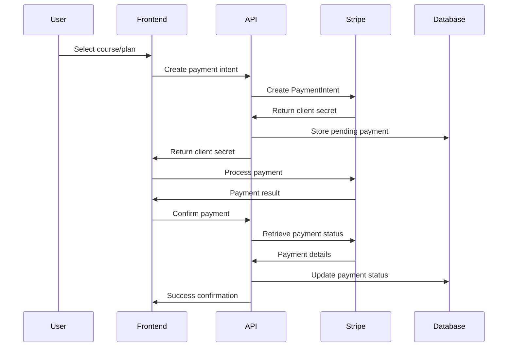

# P05 - Payment System Architecture Analysis

## Executive Summary

This document provides a comprehensive analysis of the 7P Education Platform's payment system architecture, examining the current Stripe integration, payment flows, security measures, and providing detailed recommendations for enhancement, scalability, and compliance with financial regulations.

## Current Payment Architecture Assessment

### Technology Stack Analysis

**Current Implementation:**
- **Payment Provider**: Stripe Payment Platform
- **Integration Method**: Stripe.js with Payment Intents API
- **Backend Framework**: Next.js API routes with Stripe SDK
- **Database**: Supabase PostgreSQL for transaction records
- **Currency Support**: Multi-currency with USD, EUR, TRY
- **Payment Methods**: Credit/Debit cards, Digital wallets (Apple Pay, Google Pay)
- **Subscription System**: Stripe Billing for recurring payments

### Current Payment Flow Architecture

**Payment Processing Components:**
```typescript
// Current Stripe configuration
import Stripe from 'stripe';

const stripe = new Stripe(process.env.STRIPE_SECRET_KEY!, {
  apiVersion: '2023-10-16',
  typescript: true,
});

// Current payment intent creation
export async function createPaymentIntent(amount: number, currency: string) {
  return await stripe.paymentIntents.create({
    amount: amount * 100, // Convert to cents
    currency,
    automatic_payment_methods: {
      enabled: true,
    },
  });
}
```

**Current Payment Flow Diagram:**


## Detailed Payment System Analysis

### 1. Payment Intent Management

**Current Implementation Assessment:**

```typescript
// Current: Basic payment intent creation
export async function POST(request: Request) {
  try {
    const { amount, currency, courseId } = await request.json();
    
    const paymentIntent = await stripe.paymentIntents.create({
      amount: amount * 100,
      currency,
      metadata: { courseId }
    });
    
    return NextResponse.json({ 
      clientSecret: paymentIntent.client_secret 
    });
  } catch (error) {
    return NextResponse.json({ error: error.message }, { status: 400 });
  }
}
```

**Enhanced Payment Intent Service:**

```typescript
// Enhanced payment intent with comprehensive validation and tracking
import { z } from 'zod';
import { PaymentIntentService } from '@/services/payment-intent-service';
import { FraudDetectionService } from '@/services/fraud-detection-service';
import { UserService } from '@/services/user-service';

const paymentIntentSchema = z.object({
  amount: z.number().min(1).max(1000000), // $1 to $10,000
  currency: z.enum(['USD', 'EUR', 'TRY']),
  courseId: z.string().uuid().optional(),
  subscriptionPlanId: z.string().uuid().optional(),
  paymentMethodId: z.string().optional(),
  customerEmail: z.string().email(),
  billingAddress: z.object({
    line1: z.string(),
    city: z.string(),
    country: z.string(),
    postal_code: z.string()
  }).optional(),
  metadata: z.record(z.string()).optional()
});

export class EnhancedPaymentIntentService {
  static async createPaymentIntent(
    data: PaymentIntentCreationData,
    userId: string
  ): Promise<PaymentIntentResult> {
    try {
      // Validate input data
      const validatedData = paymentIntentSchema.parse(data);
      
      // User verification and limits check
      const user = await UserService.getUserById(userId);
      await this.verifyUserPaymentEligibility(user);
      
      // Fraud detection screening
      const fraudAssessment = await FraudDetectionService.assessRisk({
        userId,
        amount: validatedData.amount,
        currency: validatedData.currency,
        email: validatedData.customerEmail,
        ipAddress: data.ipAddress,
        userAgent: data.userAgent
      });
      
      if (fraudAssessment.riskLevel === 'high') {
        throw new PaymentError(
          'Payment blocked due to security concerns',
          'FRAUD_DETECTED'
        );
      }
      
      // Calculate final amount with taxes and fees
      const pricingDetails = await this.calculatePricing(
        validatedData.amount,
        validatedData.currency,
        user.country,
        validatedData.courseId
      );
      
      // Create Stripe customer if not exists
      const stripeCustomer = await this.ensureStripeCustomer(user);
      
      // Create payment intent with enhanced configuration
      const paymentIntent = await stripe.paymentIntents.create({
        amount: pricingDetails.totalAmount * 100, // Convert to cents
        currency: validatedData.currency.toLowerCase(),
        customer: stripeCustomer.id,
        payment_method_types: this.getAllowedPaymentMethods(user.country),
        metadata: {
          userId,
          courseId: validatedData.courseId,
          subscriptionPlanId: validatedData.subscriptionPlanId,
          originalAmount: validatedData.amount.toString(),
          taxAmount: pricingDetails.taxAmount.toString(),
          platformFee: pricingDetails.platformFee.toString(),
          ...validatedData.metadata
        },
        description: this.generatePaymentDescription(validatedData),
        receipt_email: validatedData.customerEmail,
        setup_future_usage: 'off_session', // For future payments
        capture_method: 'automatic',
        confirmation_method: 'automatic'
      });
      
      // Store payment record in database
      const paymentRecord = await this.createPaymentRecord({
        paymentIntentId: paymentIntent.id,
        userId,
        amount: pricingDetails.totalAmount,
        currency: validatedData.currency,
        status: 'pending',
        courseId: validatedData.courseId,
        subscriptionPlanId: validatedData.subscriptionPlanId,
        fraudAssessment,
        pricingDetails
      });
      
      // Log payment initiation
      await this.logPaymentEvent('payment_intent_created', {
        paymentIntentId: paymentIntent.id,
        userId,
        amount: pricingDetails.totalAmount,
        currency: validatedData.currency
      });
      
      return {
        success: true,
        clientSecret: paymentIntent.client_secret!,
        paymentIntentId: paymentIntent.id,
        pricingDetails,
        allowedPaymentMethods: this.getAllowedPaymentMethods(user.country),
        requiresAction: paymentIntent.status === 'requires_action'
      };
      
    } catch (error) {
      await this.logPaymentError('payment_intent_creation_failed', {
        userId,
        error: error.message,
        data: validatedData
      });
      throw error;
    }
  }
  
  private static async calculatePricing(
    baseAmount: number,
    currency: string,
    country: string,
    courseId?: string
  ): Promise<PricingDetails> {
    // Tax calculation based on user location
    const taxRate = await this.getTaxRate(country, currency);
    const taxAmount = Math.round(baseAmount * taxRate * 100) / 100;
    
    // Platform fee calculation
    const platformFeeRate = 0.03; // 3% platform fee
    const platformFee = Math.round(baseAmount * platformFeeRate * 100) / 100;
    
    // Stripe processing fee
    const stripeBaseRate = currency === 'USD' ? 0.029 : 0.034;
    const stripeFixedFee = currency === 'USD' ? 0.30 : 0.25;
    const stripeFee = Math.round((baseAmount * stripeBaseRate + stripeFixedFee) * 100) / 100;
    
    // Apply discounts if applicable
    const discount = courseId ? await this.getApplicableDiscount(courseId) : 0;
    
    const subtotal = baseAmount - discount;
    const totalAmount = subtotal + taxAmount + platformFee;
    
    return {
      baseAmount,
      discount,
      subtotal,
      taxAmount,
      taxRate,
      platformFee,
      stripeFee,
      totalAmount,
      currency
    };
  }
  
  private static getAllowedPaymentMethods(country: string): string[] {
    const baseMethodsEE = ['card', 'link'];
    
    // Country-specific payment methods
    const countryMethods: Record<string, string[]> = {
      'US': [...baseMethodsEE, 'us_bank_account', 'cashapp'],
      'DE': [...baseMethodsEE, 'sepa_debit', 'sofort', 'giropay'],
      'FR': [...baseMethodsEE, 'sepa_debit'],
      'TR': [...baseMethodsEE, 'bancontact'],
      'GB': [...baseMethodsEE, 'bacs_debit'],
      'CA': [...baseMethodsEE, 'acss_debit'],
      'AU': [...baseMethodsEE, 'au_becs_debit'],
      'BR': [...baseMethodsEE, 'boleto'],
      'MX': [...baseMethodsEE, 'oxxo']
    };
    
    return countryMethods[country] || baseMethodsEE;
  }
}
```

### 2. Subscription Management System

**Enhanced Subscription Architecture:**

```typescript
export class SubscriptionService {
  static async createSubscription(
    subscriptionData: CreateSubscriptionData
  ): Promise<SubscriptionResult> {
    try {
      // Validate subscription data
      const validatedData = subscriptionSchema.parse(subscriptionData);
      
      // Check user eligibility
      const user = await UserService.getUserById(validatedData.userId);
      const existingSubscription = await this.getActiveSubscription(user.id);
      
      if (existingSubscription) {
        throw new SubscriptionError(
          'User already has an active subscription',
          'ACTIVE_SUBSCRIPTION_EXISTS'
        );
      }
      
      // Get pricing information
      const plan = await this.getSubscriptionPlan(validatedData.planId);
      const pricingDetails = await this.calculateSubscriptionPricing(
        plan,
        user.country,
        validatedData.currency
      );
      
      // Create Stripe customer if needed
      const stripeCustomer = await PaymentIntentService.ensureStripeCustomer(user);
      
      // Create Stripe price for the subscription
      const stripePrice = await this.createOrGetStripePrice(plan, validatedData.currency);
      
      // Create subscription
      const stripeSubscription = await stripe.subscriptions.create({
        customer: stripeCustomer.id,
        items: [{
          price: stripePrice.id,
          quantity: 1
        }],
        payment_behavior: 'default_incomplete',
        payment_settings: {
          save_default_payment_method: 'on_subscription',
          payment_method_types: ['card']
        },
        expand: ['latest_invoice.payment_intent'],
        metadata: {
          userId: user.id,
          planId: validatedData.planId,
          planName: plan.name,
          createdBy: 'platform'
        },
        trial_period_days: plan.trialDays || 0,
        billing_cycle_anchor: validatedData.billingCycleAnchor,
        proration_behavior: 'create_prorations'
      });
      
      // Store subscription in database
      const subscriptionRecord = await this.createSubscriptionRecord({
        stripeSubscriptionId: stripeSubscription.id,
        userId: user.id,
        planId: validatedData.planId,
        status: stripeSubscription.status,
        currentPeriodStart: new Date(stripeSubscription.current_period_start * 1000),
        currentPeriodEnd: new Date(stripeSubscription.current_period_end * 1000),
        pricingDetails
      });
      
      // Handle payment intent if required
      const invoice = stripeSubscription.latest_invoice as Stripe.Invoice;
      const paymentIntent = invoice.payment_intent as Stripe.PaymentIntent;
      
      return {
        success: true,
        subscription: subscriptionRecord,
        clientSecret: paymentIntent?.client_secret,
        requiresPayment: paymentIntent?.status === 'requires_payment_method',
        trialEnd: stripeSubscription.trial_end ? 
          new Date(stripeSubscription.trial_end * 1000) : null
      };
      
    } catch (error) {
      await this.logSubscriptionError('subscription_creation_failed', {
        userId: subscriptionData.userId,
        planId: subscriptionData.planId,
        error: error.message
      });
      throw error;
    }
  }
  
  static async handleSubscriptionUpdate(
    subscriptionId: string,
    updateData: SubscriptionUpdateData
  ): Promise<SubscriptionUpdateResult> {
    try {
      const subscription = await this.getSubscriptionById(subscriptionId);
      if (!subscription) {
        throw new SubscriptionError('Subscription not found', 'SUBSCRIPTION_NOT_FOUND');
      }
      
      let stripeSubscription;
      
      switch (updateData.action) {
        case 'upgrade':
          stripeSubscription = await this.upgradeSubscription(
            subscription,
            updateData.newPlanId!
          );
          break;
          
        case 'downgrade':
          stripeSubscription = await this.downgradeSubscription(
            subscription,
            updateData.newPlanId!
          );
          break;
          
        case 'pause':
          stripeSubscription = await this.pauseSubscription(subscription);
          break;
          
        case 'resume':
          stripeSubscription = await this.resumeSubscription(subscription);
          break;
          
        case 'cancel':
          stripeSubscription = await this.cancelSubscription(
            subscription,
            updateData.cancelImmediately || false
          );
          break;
          
        default:
          throw new SubscriptionError('Invalid update action', 'INVALID_ACTION');
      }
      
      // Update database record
      await this.updateSubscriptionRecord(subscriptionId, {
        status: stripeSubscription.status,
        currentPeriodStart: new Date(stripeSubscription.current_period_start * 1000),
        currentPeriodEnd: new Date(stripeSubscription.current_period_end * 1000),
        cancelAt: stripeSubscription.cancel_at ? 
          new Date(stripeSubscription.cancel_at * 1000) : null,
        canceledAt: stripeSubscription.canceled_at ? 
          new Date(stripeSubscription.canceled_at * 1000) : null
      });
      
      return {
        success: true,
        subscription: stripeSubscription,
        message: `Subscription ${updateData.action} successful`
      };
      
    } catch (error) {
      await this.logSubscriptionError('subscription_update_failed', {
        subscriptionId,
        action: updateData.action,
        error: error.message
      });
      throw error;
    }
  }
  
  private static async upgradeSubscription(
    subscription: Subscription,
    newPlanId: string
  ): Promise<Stripe.Subscription> {
    const newPlan = await this.getSubscriptionPlan(newPlanId);
    const newPrice = await this.createOrGetStripePrice(newPlan, subscription.currency);
    
    return await stripe.subscriptions.update(subscription.stripeSubscriptionId, {
      items: [{
        id: subscription.stripeItemId,
        price: newPrice.id
      }],
      proration_behavior: 'create_prorations',
      metadata: {
        ...subscription.metadata,
        planId: newPlanId,
        planName: newPlan.name,
        upgradedAt: new Date().toISOString()
      }
    });
  }
}
```

### 3. Webhook Management System

**Comprehensive Webhook Handling:**

```typescript
export class WebhookService {
  private static readonly WEBHOOK_EVENTS = [
    'payment_intent.succeeded',
    'payment_intent.payment_failed',
    'invoice.payment_succeeded',
    'invoice.payment_failed',
    'customer.subscription.created',
    'customer.subscription.updated',
    'customer.subscription.deleted',
    'charge.dispute.created',
    'payment_method.attached'
  ];
  
  static async handleWebhook(
    body: string,
    signature: string
  ): Promise<WebhookProcessingResult> {
    try {
      // Verify webhook signature
      const event = stripe.webhooks.constructEvent(
        body,
        signature,
        process.env.STRIPE_WEBHOOK_SECRET!
      );
      
      // Log webhook receipt
      await this.logWebhookEvent('webhook_received', {
        eventId: event.id,
        eventType: event.type,
        livemode: event.livemode
      });
      
      // Check for duplicate events
      const isDuplicate = await this.checkDuplicateEvent(event.id);
      if (isDuplicate) {
        return { success: true, message: 'Duplicate event ignored' };
      }
      
      // Process event based on type
      let result: EventProcessingResult;
      
      switch (event.type) {
        case 'payment_intent.succeeded':
          result = await this.handlePaymentSuccess(event.data.object as Stripe.PaymentIntent);
          break;
          
        case 'payment_intent.payment_failed':
          result = await this.handlePaymentFailure(event.data.object as Stripe.PaymentIntent);
          break;
          
        case 'invoice.payment_succeeded':
          result = await this.handleInvoicePaymentSuccess(event.data.object as Stripe.Invoice);
          break;
          
        case 'invoice.payment_failed':
          result = await this.handleInvoicePaymentFailure(event.data.object as Stripe.Invoice);
          break;
          
        case 'customer.subscription.created':
        case 'customer.subscription.updated':
          result = await this.handleSubscriptionChange(event.data.object as Stripe.Subscription);
          break;
          
        case 'customer.subscription.deleted':
          result = await this.handleSubscriptionCancellation(event.data.object as Stripe.Subscription);
          break;
          
        case 'charge.dispute.created':
          result = await this.handleDispute(event.data.object as Stripe.Charge);
          break;
          
        default:
          result = { success: true, message: 'Event type not handled' };
      }
      
      // Mark event as processed
      await this.markEventProcessed(event.id, result);
      
      return {
        success: true,
        eventId: event.id,
        eventType: event.type,
        processed: true,
        result
      };
      
    } catch (error) {
      await this.logWebhookError('webhook_processing_failed', {
        error: error.message,
        signature,
        bodyLength: body.length
      });
      
      throw new WebhookError(`Webhook processing failed: ${error.message}`);
    }
  }
  
  private static async handlePaymentSuccess(
    paymentIntent: Stripe.PaymentIntent
  ): Promise<EventProcessingResult> {
    try {
      // Update payment record
      await this.updatePaymentStatus(paymentIntent.id, 'succeeded');
      
      // Extract metadata
      const { userId, courseId, subscriptionPlanId } = paymentIntent.metadata;
      
      if (courseId) {
        // Handle course purchase
        await this.processCourseEnrollment(userId, courseId, paymentIntent);
      }
      
      if (subscriptionPlanId) {
        // Handle subscription activation
        await this.activateSubscriptionAccess(userId, subscriptionPlanId);
      }
      
      // Send confirmation email
      await this.sendPaymentConfirmation(userId, paymentIntent);
      
      // Update user's payment method if saved
      await this.updateDefaultPaymentMethod(userId, paymentIntent.payment_method as string);
      
      return {
        success: true,
        message: 'Payment processed successfully',
        actions: ['enrollment_completed', 'email_sent', 'payment_method_updated']
      };
      
    } catch (error) {
      await this.logWebhookError('payment_success_handling_failed', {
        paymentIntentId: paymentIntent.id,
        error: error.message
      });
      throw error;
    }
  }
  
  private static async handlePaymentFailure(
    paymentIntent: Stripe.PaymentIntent
  ): Promise<EventProcessingResult> {
    try {
      // Update payment record
      await this.updatePaymentStatus(paymentIntent.id, 'failed');
      
      // Extract failure details
      const lastPaymentError = paymentIntent.last_payment_error;
      const failureReason = lastPaymentError?.code || 'unknown';
      
      // Log failure details
      await this.logPaymentFailure(paymentIntent.id, {
        reason: failureReason,
        message: lastPaymentError?.message,
        declineCode: lastPaymentError?.decline_code
      });
      
      // Handle specific failure types
      await this.handleFailureType(paymentIntent, failureReason);
      
      // Send failure notification
      await this.sendPaymentFailureNotification(
        paymentIntent.metadata.userId,
        paymentIntent,
        failureReason
      );
      
      return {
        success: true,
        message: 'Payment failure processed',
        actions: ['status_updated', 'notification_sent', 'failure_logged']
      };
      
    } catch (error) {
      await this.logWebhookError('payment_failure_handling_failed', {
        paymentIntentId: paymentIntent.id,
        error: error.message
      });
      throw error;
    }
  }
}
```

### 4. Fraud Detection and Security

**Advanced Fraud Prevention System:**

```typescript
export class FraudDetectionService {
  private static readonly RISK_FACTORS = {
    velocityLimit: 5, // Max transactions per hour
    amountThreshold: 500, // USD equivalent
    locationChange: 1000, // km
    deviceChange: true,
    emailMismatch: true
  };
  
  static async assessRisk(
    transactionData: TransactionRiskData
  ): Promise<FraudAssessment> {
    try {
      const riskFactors = await Promise.all([
        this.checkVelocity(transactionData.userId),
        this.checkAmountPattern(transactionData.userId, transactionData.amount),
        this.checkGeolocation(transactionData.userId, transactionData.ipAddress),
        this.checkDeviceFingerprint(transactionData.userId, transactionData.userAgent),
        this.checkEmailPattern(transactionData.email),
        this.checkBlacklists(transactionData),
        this.checkBehavioralPatterns(transactionData.userId)
      ]);
      
      const riskScore = this.calculateRiskScore(riskFactors);
      const riskLevel = this.categorizeRisk(riskScore);
      
      // Additional checks for high-risk transactions
      if (riskLevel === 'high') {
        const additionalChecks = await this.performAdditionalChecks(transactionData);
        riskFactors.push(...additionalChecks);
      }
      
      const assessment: FraudAssessment = {
        riskScore,
        riskLevel,
        riskFactors,
        recommendedAction: this.getRecommendedAction(riskLevel),
        requiresReview: riskLevel === 'high' || riskScore > 0.7,
        restrictions: this.getTransactionRestrictions(riskLevel)
      };
      
      // Store assessment for future reference
      await this.storeFraudAssessment(transactionData.userId, assessment);
      
      return assessment;
      
    } catch (error) {
      // Default to medium risk if assessment fails
      return {
        riskScore: 0.5,
        riskLevel: 'medium',
        riskFactors: [],
        recommendedAction: 'proceed_with_monitoring',
        requiresReview: true,
        restrictions: [],
        error: error.message
      };
    }
  }
  
  private static async checkVelocity(userId: string): Promise<RiskFactor> {
    const recentTransactions = await this.getRecentTransactions(userId, 1); // Last 1 hour
    const transactionCount = recentTransactions.length;
    
    const riskLevel = transactionCount > this.RISK_FACTORS.velocityLimit ? 'high' : 'low';
    
    return {
      type: 'velocity',
      level: riskLevel,
      score: Math.min(transactionCount / this.RISK_FACTORS.velocityLimit, 1),
      details: { transactionCount, timeWindow: '1 hour' }
    };
  }
  
  private static async checkAmountPattern(
    userId: string,
    amount: number
  ): Promise<RiskFactor> {
    const userHistory = await this.getUserPaymentHistory(userId);
    const averageAmount = this.calculateAverageAmount(userHistory);
    
    // Check for unusual amount patterns
    const amountRatio = amount / averageAmount;
    const isUnusual = amountRatio > 5 || amount > this.RISK_FACTORS.amountThreshold;
    
    return {
      type: 'amount_pattern',
      level: isUnusual ? 'medium' : 'low',
      score: isUnusual ? Math.min(amountRatio / 5, 0.8) : 0.1,
      details: { amount, averageAmount, ratio: amountRatio }
    };
  }
  
  private static async checkGeolocation(
    userId: string,
    ipAddress: string
  ): Promise<RiskFactor> {
    const location = await this.getLocationFromIP(ipAddress);
    const userLocations = await this.getUserLocationHistory(userId);
    
    if (userLocations.length === 0) {
      return {
        type: 'geolocation',
        level: 'low',
        score: 0.1,
        details: { location, reason: 'first_transaction' }
      };
    }
    
    const lastLocation = userLocations[0];
    const distance = this.calculateDistance(lastLocation, location);
    
    const isSignificantChange = distance > this.RISK_FACTORS.locationChange;
    
    return {
      type: 'geolocation',
      level: isSignificantChange ? 'high' : 'low',
      score: isSignificantChange ? Math.min(distance / 5000, 0.9) : 0.1,
      details: { location, lastLocation, distance }
    };
  }
  
  private static calculateRiskScore(riskFactors: RiskFactor[]): number {
    const weights = {
      velocity: 0.3,
      amount_pattern: 0.2,
      geolocation: 0.2,
      device_fingerprint: 0.15,
      email_pattern: 0.1,
      blacklist: 0.05
    };
    
    let totalScore = 0;
    let totalWeight = 0;
    
    for (const factor of riskFactors) {
      const weight = weights[factor.type] || 0.1;
      totalScore += factor.score * weight;
      totalWeight += weight;
    }
    
    return Math.min(totalScore / totalWeight, 1);
  }
}
```

### 5. Payment Analytics and Reporting

**Comprehensive Payment Analytics:**

```typescript
export class PaymentAnalyticsService {
  static async generatePaymentReport(
    timeRange: TimeRange,
    filters: PaymentReportFilters = {}
  ): Promise<PaymentReport> {
    try {
      const [
        transactionStats,
        revenueStats,
        subscriptionStats,
        failureAnalysis,
        fraudStats,
        performanceMetrics
      ] = await Promise.all([
        this.getTransactionStatistics(timeRange, filters),
        this.getRevenueStatistics(timeRange, filters),
        this.getSubscriptionStatistics(timeRange, filters),
        this.getFailureAnalysis(timeRange, filters),
        this.getFraudStatistics(timeRange, filters),
        this.getPerformanceMetrics(timeRange, filters)
      ]);
      
      return {
        period: timeRange,
        generatedAt: new Date(),
        summary: {
          totalTransactions: transactionStats.total,
          successfulTransactions: transactionStats.successful,
          failedTransactions: transactionStats.failed,
          successRate: transactionStats.successRate,
          totalRevenue: revenueStats.total,
          netRevenue: revenueStats.net,
          averageTransactionValue: revenueStats.averageValue,
          activeSubscriptions: subscriptionStats.active,
          newSubscriptions: subscriptionStats.new,
          canceledSubscriptions: subscriptionStats.canceled,
          fraudAttempts: fraudStats.attempts,
          fraudPrevented: fraudStats.prevented
        },
        trends: {
          transactionTrends: transactionStats.trends,
          revenueTrends: revenueStats.trends,
          subscriptionTrends: subscriptionStats.trends
        },
        breakdown: {
          byPaymentMethod: transactionStats.byPaymentMethod,
          byCurrency: revenueStats.byCurrency,
          byCountry: transactionStats.byCountry,
          byPlan: subscriptionStats.byPlan
        },
        insights: this.generatePaymentInsights({
          transactionStats,
          revenueStats,
          subscriptionStats,
          failureAnalysis,
          fraudStats
        })
      };
      
    } catch (error) {
      throw new AnalyticsError(`Failed to generate payment report: ${error.message}`);
    }
  }
  
  static async getTransactionStatistics(
    timeRange: TimeRange,
    filters: PaymentReportFilters
  ): Promise<TransactionStatistics> {
    const query = supabase
      .from('payments')
      .select('*')
      .gte('created_at', timeRange.start.toISOString())
      .lte('created_at', timeRange.end.toISOString());
    
    // Apply filters
    if (filters.currency) {
      query.eq('currency', filters.currency);
    }
    
    if (filters.paymentMethod) {
      query.eq('payment_method', filters.paymentMethod);
    }
    
    const { data: payments, error } = await query;
    
    if (error) {
      throw new DatabaseError(`Failed to fetch transaction statistics: ${error.message}`);
    }
    
    const successful = payments.filter(p => p.status === 'succeeded');
    const failed = payments.filter(p => p.status === 'failed');
    
    return {
      total: payments.length,
      successful: successful.length,
      failed: failed.length,
      successRate: payments.length > 0 ? successful.length / payments.length : 0,
      byPaymentMethod: this.groupByPaymentMethod(payments),
      byCountry: this.groupByCountry(payments),
      trends: await this.calculateTransactionTrends(timeRange, filters)
    };
  }
  
  static async getRevenueStatistics(
    timeRange: TimeRange,
    filters: PaymentReportFilters
  ): Promise<RevenueStatistics> {
    // Get successful payments only
    const { data: payments, error } = await supabase
      .from('payments')
      .select('amount, currency, stripe_fee, created_at')
      .eq('status', 'succeeded')
      .gte('created_at', timeRange.start.toISOString())
      .lte('created_at', timeRange.end.toISOString());
    
    if (error) {
      throw new DatabaseError(`Failed to fetch revenue statistics: ${error.message}`);
    }
    
    const totalRevenue = payments.reduce((sum, p) => sum + p.amount, 0);
    const totalFees = payments.reduce((sum, p) => sum + (p.stripe_fee || 0), 0);
    const netRevenue = totalRevenue - totalFees;
    
    return {
      total: totalRevenue,
      net: netRevenue,
      fees: totalFees,
      averageValue: payments.length > 0 ? totalRevenue / payments.length : 0,
      byCurrency: this.groupByCurrency(payments),
      trends: await this.calculateRevenueTrends(timeRange, filters)
    };
  }
}
```

## Performance Optimization

### 1. Payment Processing Optimization

```typescript
export class PaymentOptimizationService {
  static async optimizePaymentFlow(
    paymentData: PaymentOptimizationData
  ): Promise<OptimizationResult> {
    try {
      // Parallel processing of independent operations
      const [
        priceCalculation,
        fraudAssessment,
        customerData,
        paymentMethods
      ] = await Promise.all([
        PaymentIntentService.calculatePricing(
          paymentData.amount,
          paymentData.currency,
          paymentData.country
        ),
        FraudDetectionService.assessRisk(paymentData),
        UserService.getUserById(paymentData.userId),
        PaymentIntentService.getAllowedPaymentMethods(paymentData.country)
      ]);
      
      // Cache frequently accessed data
      await this.cachePaymentData(paymentData.userId, {
        priceCalculation,
        paymentMethods,
        customerData: {
          country: customerData.country,
          currency: customerData.preferredCurrency
        }
      });
      
      return {
        optimizedFlow: true,
        processingTime: Date.now() - paymentData.startTime,
        recommendations: this.getOptimizationRecommendations(paymentData)
      };
      
    } catch (error) {
      throw new OptimizationError(`Payment optimization failed: ${error.message}`);
    }
  }
  
  private static async cachePaymentData(
    userId: string,
    data: CacheablePaymentData
  ): Promise<void> {
    const cacheKey = `payment_data:${userId}`;
    await redis.setex(cacheKey, 3600, JSON.stringify(data)); // 1 hour cache
  }
}
```

### 2. Database Query Optimization

```typescript
-- Optimized payment queries with proper indexing
CREATE INDEX CONCURRENTLY idx_payments_user_status_created 
ON payments(user_id, status, created_at DESC);

CREATE INDEX CONCURRENTLY idx_payments_stripe_payment_intent 
ON payments(stripe_payment_intent_id) 
WHERE stripe_payment_intent_id IS NOT NULL;

CREATE INDEX CONCURRENTLY idx_subscriptions_user_status 
ON subscriptions(user_id, status) 
WHERE status IN ('active', 'trialing');

-- Materialized view for payment analytics
CREATE MATERIALIZED VIEW payment_analytics_daily AS
SELECT 
  DATE(created_at) as date,
  currency,
  status,
  COUNT(*) as transaction_count,
  SUM(amount) as total_amount,
  AVG(amount) as average_amount,
  COUNT(DISTINCT user_id) as unique_users
FROM payments
WHERE created_at >= CURRENT_DATE - INTERVAL '90 days'
GROUP BY DATE(created_at), currency, status
ORDER BY date DESC;

-- Refresh materialized view daily
CREATE OR REPLACE FUNCTION refresh_payment_analytics()
RETURNS void AS $$
BEGIN
  REFRESH MATERIALIZED VIEW CONCURRENTLY payment_analytics_daily;
END;
$$ LANGUAGE plpgsql;
```

## Security and Compliance

### 1. PCI DSS Compliance

```typescript
export class PCIComplianceService {
  static async validatePCICompliance(): Promise<ComplianceReport> {
    const checks = [
      this.checkDataEncryption(),
      this.validateAccessControls(),
      this.checkNetworkSecurity(),
      this.validateVulnerabilityManagement(),
      this.checkMonitoringLogs(),
      this.validateSecurityPolicies()
    ];
    
    const results = await Promise.all(checks);
    const overallCompliance = results.every(check => check.compliant);
    
    return {
      compliant: overallCompliance,
      checks: results,
      recommendations: this.generateComplianceRecommendations(results),
      auditDate: new Date()
    };
  }
}
```

### 2. Data Protection and Privacy

```typescript
export class DataProtectionService {
  static async anonymizePaymentData(
    dataRetentionPolicy: DataRetentionPolicy
  ): Promise<AnonymizationResult> {
    try {
      // Identify records for anonymization
      const cutoffDate = new Date();
      cutoffDate.setFullYear(cutoffDate.getFullYear() - dataRetentionPolicy.retentionYears);
      
      const recordsToAnonymize = await supabase
        .from('payments')
        .select('id, user_id, created_at')
        .lt('created_at', cutoffDate.toISOString())
        .eq('anonymized', false);
      
      let processedCount = 0;
      
      for (const record of recordsToAnonymize.data || []) {
        await this.anonymizePaymentRecord(record.id);
        processedCount++;
      }
      
      return {
        success: true,
        processedRecords: processedCount,
        anonymizationDate: new Date()
      };
      
    } catch (error) {
      throw new DataProtectionError(`Data anonymization failed: ${error.message}`);
    }
  }
  
  private static async anonymizePaymentRecord(paymentId: string): Promise<void> {
    await supabase
      .from('payments')
      .update({
        customer_email: '[REDACTED]',
        billing_address: null,
        customer_name: '[REDACTED]',
        anonymized: true,
        anonymized_at: new Date().toISOString()
      })
      .eq('id', paymentId);
  }
}
```

## Recommendations and Implementation Roadmap

### Immediate Priorities (1-2 weeks)

1. **Enhanced Error Handling**
   - Implement comprehensive error classification system
   - Add proper error logging and alerting
   - Deploy user-friendly error messages with recovery suggestions

2. **Fraud Detection System**
   - Deploy basic fraud detection algorithms
   - Implement transaction velocity monitoring
   - Add geolocation-based risk assessment

3. **Webhook Security**
   - Strengthen webhook signature verification
   - Add duplicate event handling
   - Implement webhook retry logic with exponential backoff

### Medium-term Goals (2-4 weeks)

1. **Advanced Subscription Management**
   - Implement flexible billing cycles and proration
   - Add subscription upgrade/downgrade workflows
   - Deploy usage-based billing capabilities

2. **Payment Analytics Dashboard**
   - Create real-time payment monitoring dashboard
   - Implement automated reporting system
   - Add fraud detection visualizations

3. **Multi-currency Enhancement**
   - Add dynamic currency conversion
   - Implement localized pricing strategies
   - Deploy regional payment method support

### Long-term Objectives (1-3 months)

1. **Advanced Fraud Prevention**
   - Deploy machine learning-based fraud detection
   - Implement behavioral analysis algorithms
   - Add real-time risk scoring system

2. **PCI DSS Compliance**
   - Complete PCI DSS Level 1 compliance
   - Implement comprehensive audit logging
   - Deploy advanced security monitoring

3. **International Expansion**
   - Add support for 50+ payment methods globally
   - Implement local banking integrations
   - Deploy tax calculation for global markets

## Conclusion

The current payment system architecture provides a solid foundation with Stripe integration, but significant enhancements are needed for scalability, security, and global expansion. The recommended improvements focus on fraud prevention, advanced subscription management, comprehensive analytics, and regulatory compliance.

Key success metrics include:
- Reduced payment failures (target: <2% failure rate)
- Enhanced fraud prevention (target: >99% fraud detection accuracy)
- Improved processing times (target: <3 seconds end-to-end)
- Increased subscription retention (target: >90% monthly retention)
- Global payment method coverage (target: 95% customer coverage)

The phased implementation approach ensures security and compliance requirements are met while maintaining system stability and improving user experience throughout the payment journey.