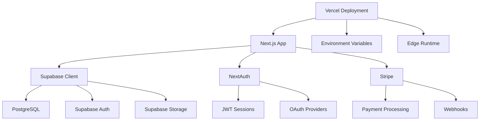

# 7P Education - Code Map

> Modül yapısı, bağımlılıklar ve proje organizasyonu

## 🎯 Kritik Bilgiler

- **Architecture**: Next.js 15 App Router + TypeScript
- **Package Manager**: npm (package-lock.json)  
- **Build System**: Next.js native + Sentry integration
- **Key Libraries**: Supabase, NextAuth, Stripe, Radix UI

## 🗺️ Proje Yapısı

```
7peducation/
├── src/                    # Ana kaynak kod
│   ├── app/               # Next.js App Router (pages + API)
│   ├── components/        # React bileşenleri
│   ├── lib/              # Utilities ve configs
│   ├── hooks/            # Custom React hooks
│   ├── services/         # Business logic services
│   └── types/            # TypeScript type definitions
├── docs/                  # Dokümantasyon (bu dizin)
├── supabase/             # Database migrations & functions
├── scripts/              # Build & deployment scripts
├── tests/                # Test suites
└── public/               # Static assets
```

## 📁 Modül Detayları

### Core Application (`src/app/`)

| Klasör | Amaç | Dosya Sayısı | Not |
|--------|------|-------------|-----|
| `app/` | Next.js App Router sayfaları | ~25 pages | Main UI routes |
| `app/api/` | REST API endpoints | ~40 routes | Server-side logic |
| `app/admin/` | Admin panel sayfaları | ~6 pages | Role-protected |
| `app/auth/` | Authentication pages | ~4 pages | Login/register/verify |

### Components (`src/components/`)

| Kategori | Klasör | Amaç | Dosya Sayısı |
|----------|--------|------|-------------|
| **UI** | `ui/` | Base UI components (shadcn/ui) | ~20 |
| **Layout** | `layout/` | App layout & navigation | ~6 |
| **Auth** | `auth/` | Auth-related components | ~4 |
| **Admin** | `admin/` | Admin-specific components | ~4 |
| **Payments** | `payments/` | Stripe integration UI | ~4 |

### Libraries (`src/lib/`)

| Modül | Dosya | Amaç | Bağımlılık |
|-------|-------|------|----------|
| `auth/` | ~12 files | NextAuth + Supabase integration | nextauth, supabase |
| `payment-guard.ts` | 1 file | Payment system control | stripe |
| `env.ts` | 1 file | Environment config & validation | - |
| `security.ts` | 1 file | Rate limiting & headers | - |
| `monitoring/` | ~3 files | Logging & observability | winston, sentry |

### Services (`src/services/`)

| Service | Amaç | Ana Metodlar |
|---------|------|-------------|
| `course-service.ts` | Course management | getCourses, createCourse |
| `enrollment-service.ts` | Course enrollment | enrollStudent, getEnrollments |
| `progress-service.ts` | Learning progress tracking | updateProgress, getStats |
| `assessment-service.ts` | Quiz & assessment system | submitAssessment, getResults |

## 🔗 Bağımlılık Haritası



## 📦 Önemli Bağımlılıklar

### Production Dependencies

| Package | Version | Amaç | Runtime |
|---------|---------|------|---------|
| `next` | 15.4.4 | Framework | Edge/Node |
| `@supabase/supabase-js` | 2.55.0 | Database client | Node.js |
| `next-auth` | 4.24.11 | Authentication | Node.js |
| `stripe` | 18.4.0 | Payments | Node.js |
| `@sentry/nextjs` | 10.5.0 | Error monitoring | Both |

### UI & Styling

| Package | Amaç | Notlar |
|---------|------|--------|
| `@radix-ui/*` | Accessible UI primitives | Headless components |
| `tailwindcss` | CSS framework | Utility-first |
| `lucide-react` | Icon set | SVG icons |
| `class-variance-authority` | Component variants | CSS-in-JS |

### Development Tools

| Package | Amaç |
|---------|------|
| `typescript` | Type safety |
| `@playwright/test` | E2E testing |
| `jest` | Unit testing |
| `eslint` | Code linting |

## 🏗️ Mimari Prensipler

### 1. Separation of Concerns
- **Pages**: UI rendering (`src/app/`)
- **API**: Business logic (`src/app/api/`)
- **Components**: Reusable UI (`src/components/`)
- **Services**: Data operations (`src/services/`)

### 2. Runtime Separation
- **Edge Runtime**: Static pages, simple API routes
- **Node.js Runtime**: Complex logic (auth, payments, database operations)

### 3. Security Layers
- **Middleware**: Route protection (`src/middleware.ts`)
- **RLS**: Database-level security (Supabase)
- **API Guards**: Endpoint protection (`src/lib/security.ts`)

### 4. Payment Control
- **Feature Flag**: `PAYMENTS_MODE=disabled/stripe`
- **Guard Middleware**: `withPaymentGuard()` wrapper
- **UI Adaptation**: `usePaymentMode()` hook

## 📊 Modül Karmaşıklığı

| Kategori | Dosya Sayısı | Karmaşıklık | Maintenance |
|----------|-------------|-------------|-------------|
| **API Routes** | ~40 | Orta | Weekly |
| **Auth System** | ~15 | Yüksek | Monthly |
| **UI Components** | ~60 | Düşük | As needed |
| **Database Layer** | ~12 migrations | Orta | Per release |

## 🔍 Önemli Dosyalar

### Configuration
- `next.config.ts` - Next.js config + security headers
- `src/lib/env.ts` - Environment variables & validation
- `src/middleware.ts` - Route protection & auth guards

### Core Logic
- `src/lib/auth/config.ts` - NextAuth configuration
- `src/lib/payment-guard.ts` - Payment system control
- `src/app/api/health/route.ts` - System health check

### Database
- `supabase/migrations/000_initial_schema.sql` - Base schema
- `supabase/migrations/*_rls_policies.sql` - Security policies

## 🚨 Critical Paths

### Authentication Flow
```
Login Page → NextAuth → Supabase Auth → JWT Session → Protected Routes
```

### Payment Flow (when enabled)
```
Course Purchase → Payment Guard → Stripe Checkout → Webhook → Enrollment
```

### Free Enrollment Flow
```
Course Page → Rate Limit Check → Authentication → Supabase Insert → Success
```

## 🔧 Development Guidelines

### Adding New Features
1. Create API route in `src/app/api/`
2. Add service in `src/services/`
3. Create UI components in `src/components/`
4. Update types in `src/types/`

### Runtime Decisions
- Use **Edge** for: Static content, simple API calls
- Use **Node.js** for: Database operations, auth, payments, file I/O

### Testing Strategy
- **Unit Tests**: Services & utilities (Jest)
- **Integration Tests**: API endpoints (Supertest)
- **E2E Tests**: User flows (Playwright)

---

**Related Docs**: [ROUTEMAP.md](./ROUTEMAP.md) | [RUNTIME.md](./RUNTIME.md) | [AUTH.md](./AUTH.md)  
*Last updated: 2025-01-27*