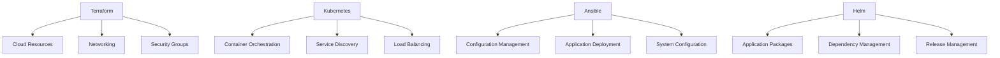

# Infrastructure as Code Implementation Guide for 7P Education Platform

## Overview and Philosophy

Infrastructure as Code (IaC) is fundamental to modern DevOps practices, enabling reproducible, version-controlled, and automated infrastructure management. The 7P Education Platform implements a comprehensive IaC strategy using Terraform for cloud resources, Kubernetes manifests for container orchestration, and Ansible for configuration management.

### IaC Benefits for Educational Platforms

**Consistency and Reproducibility**
- Identical infrastructure across development, staging, and production environments
- Eliminates configuration drift and manual setup errors
- Version-controlled infrastructure changes with audit trails
- Automated rollback capabilities for infrastructure changes

**Scalability and Efficiency**
- Rapid environment provisioning for new features and testing
- Automated scaling based on demand patterns
- Cost optimization through resource lifecycle management
- Simplified disaster recovery and multi-region deployments

**Collaboration and Governance**
- Infrastructure changes through peer-reviewed pull requests
- Compliance enforcement through policy as code
- Documentation embedded within infrastructure definitions
- Shared understanding of system architecture across teams

## IaC Architecture Strategy

### Multi-Tool IaC Approach



**Tool Responsibilities**
- **Terraform**: AWS infrastructure, VPCs, EKS clusters, RDS instances, S3 buckets
- **Kubernetes**: Container orchestration, services, ingress, persistent volumes
- **Ansible**: Server configuration, application deployment, system maintenance
- **Helm**: Application package management, complex deployments, dependency resolution

## Terraform Infrastructure

### AWS Infrastructure Setup

**Provider Configuration**
```hcl
# terraform/providers.tf
terraform {
  required_version = ">= 1.5"
  
  required_providers {
    aws = {
      source  = "hashicorp/aws"
      version = "~> 5.0"
    }
    kubernetes = {
      source  = "hashicorp/kubernetes"
      version = "~> 2.20"
    }
    helm = {
      source  = "hashicorp/helm"
      version = "~> 2.10"
    }
    random = {
      source  = "hashicorp/random"
      version = "~> 3.5"
    }
  }
  
  backend "s3" {
    bucket         = "education-platform-terraform-state"
    key            = "infrastructure/terraform.tfstate"
    region         = "us-east-1"
    encrypt        = true
    dynamodb_table = "terraform-state-lock"
    
    # Workspace support for multi-environment
    workspace_key_prefix = "environments"
  }
}

provider "aws" {
  region = var.aws_region
  
  default_tags {
    tags = {
      Project     = "education-platform"
      Environment = var.environment
      ManagedBy   = "terraform"
      Owner       = "devops-team"
      CostCenter  = "education-technology"
    }
  }
}

provider "kubernetes" {
  host                   = module.eks.cluster_endpoint
  cluster_ca_certificate = base64decode(module.eks.cluster_certificate_authority_data)
  
  exec {
    api_version = "client.authentication.k8s.io/v1beta1"
    command     = "aws"
    args        = ["eks", "get-token", "--cluster-name", module.eks.cluster_name]
  }
}

provider "helm" {
  kubernetes {
    host                   = module.eks.cluster_endpoint
    cluster_ca_certificate = base64decode(module.eks.cluster_certificate_authority_data)
    
    exec {
      api_version = "client.authentication.k8s.io/v1beta1"
      command     = "aws"
      args        = ["eks", "get-token", "--cluster-name", module.eks.cluster_name]
    }
  }
}
```

**Variables and Configuration**
```hcl
# terraform/variables.tf
variable "aws_region" {
  description = "AWS region for resources"
  type        = string
  default     = "us-east-1"
}

variable "environment" {
  description = "Environment name (dev, staging, prod)"
  type        = string
  
  validation {
    condition = contains(["dev", "staging", "prod"], var.environment)
    error_message = "Environment must be dev, staging, or prod."
  }
}

variable "vpc_cidr" {
  description = "CIDR block for VPC"
  type        = string
  default     = "10.0.0.0/16"
}

variable "availability_zones" {
  description = "Availability zones for resources"
  type        = list(string)
  default     = ["us-east-1a", "us-east-1b", "us-east-1c"]
}

variable "eks_cluster_version" {
  description = "Kubernetes version for EKS cluster"
  type        = string
  default     = "1.27"
}

variable "node_group_instance_types" {
  description = "Instance types for EKS node groups"
  type        = list(string)
  default     = ["t3.medium", "t3.large"]
}

variable "node_group_scaling_config" {
  description = "Scaling configuration for node groups"
  type = object({
    desired_size = number
    max_size     = number
    min_size     = number
  })
  default = {
    desired_size = 3
    max_size     = 10
    min_size     = 1
  }
}

variable "rds_instance_class" {
  description = "RDS instance class"
  type        = string
  default     = "db.t3.medium"
}

variable "rds_allocated_storage" {
  description = "RDS allocated storage in GB"
  type        = number
  default     = 100
}

variable "redis_node_type" {
  description = "ElastiCache Redis node type"
  type        = string
  default     = "cache.t3.micro"
}

variable "domain_name" {
  description = "Domain name for the application"
  type        = string
  default     = "education.example.com"
}

variable "certificate_arn" {
  description = "ACM certificate ARN for HTTPS"
  type        = string
  default     = ""
}

# Environment-specific configurations
locals {
  environment_configs = {
    dev = {
      node_group_instance_types = ["t3.small"]
      node_group_scaling_config = {
        desired_size = 2
        max_size     = 4
        min_size     = 1
      }
      rds_instance_class    = "db.t3.micro"
      rds_allocated_storage = 20
      redis_node_type      = "cache.t2.micro"
    }
    staging = {
      node_group_instance_types = ["t3.medium"]
      node_group_scaling_config = {
        desired_size = 2
        max_size     = 6
        min_size     = 1
      }
      rds_instance_class    = "db.t3.small"
      rds_allocated_storage = 50
      redis_node_type      = "cache.t3.micro"
    }
    prod = {
      node_group_instance_types = ["t3.large", "t3.xlarge"]
      node_group_scaling_config = {
        desired_size = 5
        max_size     = 20
        min_size     = 3
      }
      rds_instance_class    = "db.r6g.large"
      rds_allocated_storage = 200
      redis_node_type      = "cache.r6g.large"
    }
  }
  
  # Merge environment-specific configs with defaults
  config = merge(
    {
      node_group_instance_types = var.node_group_instance_types
      node_group_scaling_config = var.node_group_scaling_config
      rds_instance_class        = var.rds_instance_class
      rds_allocated_storage     = var.rds_allocated_storage
      redis_node_type           = var.redis_node_type
    },
    local.environment_configs[var.environment]
  )
}
```

### VPC and Networking

**VPC Infrastructure**
```hcl
# terraform/modules/networking/main.tf
module "vpc" {
  source = "terraform-aws-modules/vpc/aws"
  version = "~> 5.0"

  name = "${var.project_name}-${var.environment}-vpc"
  cidr = var.vpc_cidr

  azs             = var.availability_zones
  private_subnets = [for i, az in var.availability_zones : cidrsubnet(var.vpc_cidr, 8, i)]
  public_subnets  = [for i, az in var.availability_zones : cidrsubnet(var.vpc_cidr, 8, i + 100)]
  database_subnets = [for i, az in var.availability_zones : cidrsubnet(var.vpc_cidr, 8, i + 200)]

  enable_nat_gateway     = true
  single_nat_gateway     = var.environment == "dev" ? true : false
  enable_vpn_gateway     = false
  enable_dns_hostnames   = true
  enable_dns_support     = true

  # Internet Gateway
  create_igw = true

  # Public subnet configuration
  public_subnet_tags = {
    "kubernetes.io/role/elb" = "1"
    "kubernetes.io/cluster/${var.project_name}-${var.environment}" = "shared"
  }

  # Private subnet configuration
  private_subnet_tags = {
    "kubernetes.io/role/internal-elb" = "1"
    "kubernetes.io/cluster/${var.project_name}-${var.environment}" = "shared"
  }

  # Database subnet configuration
  database_subnet_tags = {
    "Type" = "database"
  }

  tags = merge(var.common_tags, {
    "kubernetes.io/cluster/${var.project_name}-${var.environment}" = "shared"
  })
}

# Security Groups
resource "aws_security_group" "eks_cluster" {
  name_prefix = "${var.project_name}-${var.environment}-eks-cluster"
  vpc_id      = module.vpc.vpc_id

  ingress {
    description = "HTTPS"
    from_port   = 443
    to_port     = 443
    protocol    = "tcp"
    cidr_blocks = [module.vpc.vpc_cidr_block]
  }

  egress {
    description = "All outbound traffic"
    from_port   = 0
    to_port     = 0
    protocol    = "-1"
    cidr_blocks = ["0.0.0.0/0"]
  }

  tags = merge(var.common_tags, {
    Name = "${var.project_name}-${var.environment}-eks-cluster-sg"
  })
}

resource "aws_security_group" "eks_nodes" {
  name_prefix = "${var.project_name}-${var.environment}-eks-nodes"
  vpc_id      = module.vpc.vpc_id

  ingress {
    description = "Node to node communication"
    from_port   = 0
    to_port     = 65535
    protocol    = "tcp"
    self        = true
  }

  ingress {
    description     = "Cluster to node communication"
    from_port       = 1025
    to_port         = 65535
    protocol        = "tcp"
    security_groups = [aws_security_group.eks_cluster.id]
  }

  ingress {
    description     = "Cluster API to node communication"
    from_port       = 443
    to_port         = 443
    protocol        = "tcp"
    security_groups = [aws_security_group.eks_cluster.id]
  }

  egress {
    description = "All outbound traffic"
    from_port   = 0
    to_port     = 0
    protocol    = "-1"
    cidr_blocks = ["0.0.0.0/0"]
  }

  tags = merge(var.common_tags, {
    Name = "${var.project_name}-${var.environment}-eks-nodes-sg"
  })
}

resource "aws_security_group" "rds" {
  name_prefix = "${var.project_name}-${var.environment}-rds"
  vpc_id      = module.vpc.vpc_id

  ingress {
    description     = "PostgreSQL from EKS nodes"
    from_port       = 5432
    to_port         = 5432
    protocol        = "tcp"
    security_groups = [aws_security_group.eks_nodes.id]
  }

  ingress {
    description = "PostgreSQL from private subnets"
    from_port   = 5432
    to_port     = 5432
    protocol    = "tcp"
    cidr_blocks = module.vpc.private_subnets_cidr_blocks
  }

  egress {
    description = "All outbound traffic"
    from_port   = 0
    to_port     = 0
    protocol    = "-1"
    cidr_blocks = ["0.0.0.0/0"]
  }

  tags = merge(var.common_tags, {
    Name = "${var.project_name}-${var.environment}-rds-sg"
  })
}

resource "aws_security_group" "redis" {
  name_prefix = "${var.project_name}-${var.environment}-redis"
  vpc_id      = module.vpc.vpc_id

  ingress {
    description     = "Redis from EKS nodes"
    from_port       = 6379
    to_port         = 6379
    protocol        = "tcp"
    security_groups = [aws_security_group.eks_nodes.id]
  }

  ingress {
    description = "Redis from private subnets"
    from_port   = 6379
    to_port     = 6379
    protocol    = "tcp"
    cidr_blocks = module.vpc.private_subnets_cidr_blocks
  }

  tags = merge(var.common_tags, {
    Name = "${var.project_name}-${var.environment}-redis-sg"
  })
}

# VPC Endpoints for cost optimization
resource "aws_vpc_endpoint" "s3" {
  vpc_id       = module.vpc.vpc_id
  service_name = "com.amazonaws.${var.aws_region}.s3"
  
  tags = merge(var.common_tags, {
    Name = "${var.project_name}-${var.environment}-s3-endpoint"
  })
}

resource "aws_vpc_endpoint" "ecr_api" {
  vpc_id              = module.vpc.vpc_id
  service_name        = "com.amazonaws.${var.aws_region}.ecr.api"
  vpc_endpoint_type   = "Interface"
  subnet_ids          = module.vpc.private_subnets
  security_group_ids  = [aws_security_group.vpc_endpoint.id]
  
  tags = merge(var.common_tags, {
    Name = "${var.project_name}-${var.environment}-ecr-api-endpoint"
  })
}

resource "aws_vpc_endpoint" "ecr_dkr" {
  vpc_id              = module.vpc.vpc_id
  service_name        = "com.amazonaws.${var.aws_region}.ecr.dkr"
  vpc_endpoint_type   = "Interface"
  subnet_ids          = module.vpc.private_subnets
  security_group_ids  = [aws_security_group.vpc_endpoint.id]
  
  tags = merge(var.common_tags, {
    Name = "${var.project_name}-${var.environment}-ecr-dkr-endpoint"
  })
}

resource "aws_security_group" "vpc_endpoint" {
  name_prefix = "${var.project_name}-${var.environment}-vpc-endpoint"
  vpc_id      = module.vpc.vpc_id

  ingress {
    description = "HTTPS from VPC"
    from_port   = 443
    to_port     = 443
    protocol    = "tcp"
    cidr_blocks = [module.vpc.vpc_cidr_block]
  }

  tags = merge(var.common_tags, {
    Name = "${var.project_name}-${var.environment}-vpc-endpoint-sg"
  })
}
```

### EKS Cluster Configuration

**EKS Cluster Setup**
```hcl
# terraform/modules/eks/main.tf
module "eks" {
  source = "terraform-aws-modules/eks/aws"
  version = "~> 19.0"

  cluster_name    = "${var.project_name}-${var.environment}"
  cluster_version = var.eks_cluster_version

  # VPC Configuration
  vpc_id                          = var.vpc_id
  subnet_ids                      = var.private_subnet_ids
  cluster_endpoint_public_access  = true
  cluster_endpoint_private_access = true

  # Cluster endpoint access configuration
  cluster_endpoint_public_access_cidrs = var.environment == "prod" ? ["0.0.0.0/0"] : ["0.0.0.0/0"]

  # Cluster security group
  cluster_security_group_id = var.cluster_security_group_id

  # Cluster addons
  cluster_addons = {
    coredns = {
      most_recent = true
      configuration_values = jsonencode({
        computeType = "Fargate"
        resources = {
          limits = {
            cpu    = "0.25"
            memory = "256M"
          }
          requests = {
            cpu    = "0.25"
            memory = "256M"
          }
        }
      })
    }
    kube-proxy = {
      most_recent = true
    }
    vpc-cni = {
      most_recent = true
      configuration_values = jsonencode({
        env = {
          ENABLE_PREFIX_DELEGATION = "true"
          WARM_PREFIX_TARGET       = "1"
        }
      })
    }
    aws-ebs-csi-driver = {
      most_recent = true
      service_account_role_arn = module.ebs_csi_irsa_role.iam_role_arn
    }
  }

  # EKS Managed Node Groups
  eks_managed_node_groups = {
    # Main node group for application workloads
    main = {
      name = "main-nodes"
      
      instance_types = var.node_group_instance_types
      capacity_type  = "ON_DEMAND"
      
      min_size     = var.node_group_scaling_config.min_size
      max_size     = var.node_group_scaling_config.max_size
      desired_size = var.node_group_scaling_config.desired_size

      # Launch template configuration
      create_launch_template = true
      launch_template_name   = "${var.project_name}-${var.environment}-main"
      
      # Instance configuration
      ami_type        = "AL2_x86_64"
      platform        = "linux"
      disk_size       = 50
      disk_type       = "gp3"
      disk_throughput = 150
      disk_iops       = 3000

      # Node group update configuration
      update_config = {
        max_unavailable_percentage = 25
      }

      # Kubernetes labels and taints
      labels = {
        Environment = var.environment
        NodeGroup   = "main"
      }

      taints = []

      # Node group network configuration
      subnet_ids = var.private_subnet_ids

      # Security groups
      vpc_security_group_ids = [var.node_security_group_id]

      # User data for additional node configuration
      pre_bootstrap_user_data = <<-EOT
        #!/bin/bash
        # Configure CloudWatch agent
        wget https://s3.amazonaws.com/amazoncloudwatch-agent/amazon_linux/amd64/latest/amazon-cloudwatch-agent.rpm
        rpm -U ./amazon-cloudwatch-agent.rpm
        
        # Configure log rotation
        cat > /etc/logrotate.d/kubernetes <<EOF
        /var/log/pods/*/*/*.log {
            daily
            missingok
            rotate 5
            compress
            notifempty
            create 644 root root
        }
        EOF
      EOT

      tags = merge(var.common_tags, {
        "k8s.io/cluster-autoscaler/enabled" = "true"
        "k8s.io/cluster-autoscaler/${var.project_name}-${var.environment}" = "owned"
      })
    }

    # Spot instance node group for non-critical workloads
    spot = {
      name = "spot-nodes"
      
      instance_types = ["t3.medium", "t3.large", "t3a.medium", "t3a.large"]
      capacity_type  = "SPOT"
      
      min_size     = 0
      max_size     = var.environment == "prod" ? 10 : 5
      desired_size = var.environment == "prod" ? 2 : 0

      # Launch template configuration
      create_launch_template = true
      launch_template_name   = "${var.project_name}-${var.environment}-spot"
      
      # Instance configuration
      ami_type   = "AL2_x86_64"
      platform   = "linux"
      disk_size  = 30
      disk_type  = "gp3"

      # Node group update configuration
      update_config = {
        max_unavailable_percentage = 50
      }

      # Kubernetes labels and taints
      labels = {
        Environment = var.environment
        NodeGroup   = "spot"
        CapacityType = "SPOT"
      }

      taints = [
        {
          key    = "spot-instance"
          value  = "true"
          effect = "NO_SCHEDULE"
        }
      ]

      # Node group network configuration
      subnet_ids = var.private_subnet_ids

      # Security groups
      vpc_security_group_ids = [var.node_security_group_id]

      tags = merge(var.common_tags, {
        "k8s.io/cluster-autoscaler/enabled" = "true"
        "k8s.io/cluster-autoscaler/${var.project_name}-${var.environment}" = "owned"
        "k8s.io/cluster-autoscaler/node-template/label/CapacityType" = "SPOT"
        "k8s.io/cluster-autoscaler/node-template/taint/spot-instance" = "true:NoSchedule"
      })
    }
  }

  # Fargate profiles for serverless workloads
  fargate_profiles = {
    kube-system = {
      name = "kube-system"
      selectors = [
        {
          namespace = "kube-system"
          labels = {
            "app.kubernetes.io/name" = "coredns"
          }
        }
      ]

      tags = merge(var.common_tags, {
        Profile = "kube-system"
      })
    }

    monitoring = {
      name = "monitoring"
      selectors = [
        {
          namespace = "monitoring"
        }
      ]

      tags = merge(var.common_tags, {
        Profile = "monitoring"
      })
    }
  }

  # IAM role for cluster service account
  manage_aws_auth_configmap = true

  aws_auth_roles = [
    {
      rolearn  = module.eks_admins_iam_role.iam_role_arn
      username = "eks-admin"
      groups   = ["system:masters"]
    },
  ]

  aws_auth_users = var.aws_auth_users

  aws_auth_accounts = [
    data.aws_caller_identity.current.account_id
  ]

  tags = var.common_tags
}

# IAM role for EBS CSI driver
module "ebs_csi_irsa_role" {
  source = "terraform-aws-modules/iam/aws//modules/iam-role-for-service-accounts-eks"
  version = "~> 5.0"

  role_name             = "${var.project_name}-${var.environment}-ebs-csi"
  attach_ebs_csi_policy = true

  oidc_providers = {
    ex = {
      provider_arn               = module.eks.oidc_provider_arn
      namespace_service_accounts = ["kube-system:ebs-csi-controller-sa"]
    }
  }

  tags = var.common_tags
}

# IAM role for cluster autoscaler
module "cluster_autoscaler_irsa_role" {
  source = "terraform-aws-modules/iam/aws//modules/iam-role-for-service-accounts-eks"
  version = "~> 5.0"

  role_name                        = "${var.project_name}-${var.environment}-cluster-autoscaler"
  attach_cluster_autoscaler_policy = true
  cluster_autoscaler_cluster_names = [module.eks.cluster_name]

  oidc_providers = {
    ex = {
      provider_arn               = module.eks.oidc_provider_arn
      namespace_service_accounts = ["kube-system:cluster-autoscaler"]
    }
  }

  tags = var.common_tags
}

# IAM role for AWS Load Balancer Controller
module "load_balancer_controller_irsa_role" {
  source = "terraform-aws-modules/iam/aws//modules/iam-role-for-service-accounts-eks"
  version = "~> 5.0"

  role_name                              = "${var.project_name}-${var.environment}-aws-load-balancer-controller"
  attach_load_balancer_controller_policy = true

  oidc_providers = {
    ex = {
      provider_arn               = module.eks.oidc_provider_arn
      namespace_service_accounts = ["kube-system:aws-load-balancer-controller"]
    }
  }

  tags = var.common_tags
}

# IAM role for EKS administrators
module "eks_admins_iam_role" {
  source = "terraform-aws-modules/iam/aws//modules/iam-role-for-service-accounts-eks"
  version = "~> 5.0"

  role_name = "${var.project_name}-${var.environment}-eks-admin"

  role_policy_arns = [
    "arn:aws:iam::aws:policy/AmazonEKSClusterPolicy",
    "arn:aws:iam::aws:policy/AmazonEKSWorkerNodePolicy",
  ]

  tags = var.common_tags
}

# CloudWatch Log Group for EKS cluster
resource "aws_cloudwatch_log_group" "eks_cluster" {
  name              = "/aws/eks/${var.project_name}-${var.environment}/cluster"
  retention_in_days = var.environment == "prod" ? 30 : 7
  kms_key_id        = aws_kms_key.eks_logs.arn

  tags = var.common_tags
}

# KMS key for EKS logs encryption
resource "aws_kms_key" "eks_logs" {
  description             = "KMS key for EKS cluster logs encryption"
  deletion_window_in_days = 7
  enable_key_rotation     = true

  tags = merge(var.common_tags, {
    Name = "${var.project_name}-${var.environment}-eks-logs"
  })
}

resource "aws_kms_alias" "eks_logs" {
  name          = "alias/${var.project_name}-${var.environment}-eks-logs"
  target_key_id = aws_kms_key.eks_logs.key_id
}
```

### RDS Database Configuration

**PostgreSQL Database Setup**
```hcl
# terraform/modules/rds/main.tf
# Random password for RDS master user
resource "random_password" "master_password" {
  length  = 32
  special = true
}

# KMS key for RDS encryption
resource "aws_kms_key" "rds" {
  description             = "KMS key for RDS encryption"
  deletion_window_in_days = 7
  enable_key_rotation     = true

  tags = merge(var.common_tags, {
    Name = "${var.project_name}-${var.environment}-rds"
  })
}

resource "aws_kms_alias" "rds" {
  name          = "alias/${var.project_name}-${var.environment}-rds"
  target_key_id = aws_kms_key.rds.key_id
}

# RDS subnet group
resource "aws_db_subnet_group" "main" {
  name       = "${var.project_name}-${var.environment}-db-subnet-group"
  subnet_ids = var.database_subnet_ids

  tags = merge(var.common_tags, {
    Name = "${var.project_name}-${var.environment}-db-subnet-group"
  })
}

# RDS parameter group
resource "aws_db_parameter_group" "main" {
  family = "postgres15"
  name   = "${var.project_name}-${var.environment}-postgres15"

  # Performance parameters
  parameter {
    name  = "shared_buffers"
    value = var.environment == "prod" ? "256000" : "128000"  # 256MB for prod, 128MB for others
  }

  parameter {
    name  = "effective_cache_size"
    value = var.environment == "prod" ? "1000000" : "500000"  # 1GB for prod, 500MB for others
  }

  parameter {
    name  = "maintenance_work_mem"
    value = "65536"  # 64MB
  }

  parameter {
    name  = "checkpoint_completion_target"
    value = "0.9"
  }

  parameter {
    name  = "wal_buffers"
    value = "16384"  # 16MB
  }

  parameter {
    name  = "default_statistics_target"
    value = "100"
  }

  parameter {
    name  = "random_page_cost"
    value = "1.1"
  }

  parameter {
    name  = "effective_io_concurrency"
    value = "200"
  }

  # Logging parameters
  parameter {
    name  = "log_statement"
    value = var.environment == "prod" ? "mod" : "all"
  }

  parameter {
    name  = "log_min_duration_statement"
    value = var.environment == "prod" ? "1000" : "500"  # Log slow queries
  }

  parameter {
    name  = "log_connections"
    value = "1"
  }

  parameter {
    name  = "log_disconnections"
    value = "1"
  }

  # Connection parameters
  parameter {
    name  = "max_connections"
    value = var.environment == "prod" ? "200" : "100"
  }

  tags = var.common_tags
}

# RDS option group
resource "aws_db_option_group" "main" {
  name                     = "${var.project_name}-${var.environment}-postgres15"
  option_group_description = "Option group for ${var.project_name} ${var.environment}"
  engine_name              = "postgres"
  major_engine_version     = "15"

  tags = var.common_tags
}

# Main RDS instance
resource "aws_db_instance" "main" {
  identifier     = "${var.project_name}-${var.environment}-postgres"
  engine         = "postgres"
  engine_version = "15.4"
  instance_class = var.rds_instance_class

  # Storage configuration
  allocated_storage     = var.rds_allocated_storage
  max_allocated_storage = var.rds_allocated_storage * 2
  storage_type          = "gp3"
  storage_encrypted     = true
  kms_key_id           = aws_kms_key.rds.arn

  # Database configuration
  db_name  = "education_platform"
  username = "postgres"
  password = random_password.master_password.result
  port     = 5432

  # Network configuration
  db_subnet_group_name   = aws_db_subnet_group.main.name
  vpc_security_group_ids = [var.rds_security_group_id]
  publicly_accessible    = false

  # Parameter and option groups
  parameter_group_name = aws_db_parameter_group.main.name
  option_group_name    = aws_db_option_group.main.name

  # Backup configuration
  backup_retention_period = var.environment == "prod" ? 30 : 7
  backup_window          = "03:00-04:00"  # UTC
  maintenance_window     = "sun:04:00-sun:05:00"  # UTC
  copy_tags_to_snapshot  = true

  # Multi-AZ configuration
  multi_az = var.environment == "prod" ? true : false

  # Monitoring configuration
  monitoring_interval = var.environment == "prod" ? 60 : 0
  monitoring_role_arn = var.environment == "prod" ? aws_iam_role.rds_monitoring[0].arn : null

  # Performance Insights
  performance_insights_enabled          = var.environment == "prod" ? true : false
  performance_insights_retention_period = var.environment == "prod" ? 7 : 0
  performance_insights_kms_key_id      = var.environment == "prod" ? aws_kms_key.rds.arn : null

  # Enable enhanced monitoring for production
  enabled_cloudwatch_logs_exports = ["postgresql"]

  # Deletion protection
  deletion_protection       = var.environment == "prod" ? true : false
  skip_final_snapshot      = var.environment == "prod" ? false : true
  final_snapshot_identifier = var.environment == "prod" ? "${var.project_name}-${var.environment}-final-snapshot-${formatdate("YYYY-MM-DD-hhmm", timestamp())}" : null

  # Auto minor version upgrade
  auto_minor_version_upgrade = var.environment == "prod" ? false : true

  tags = merge(var.common_tags, {
    Name = "${var.project_name}-${var.environment}-postgres"
  })

  lifecycle {
    ignore_changes = [
      password,  # Ignore password changes to prevent recreation
      final_snapshot_identifier  # Ignore changes to final snapshot identifier
    ]
  }
}

# Read replica for production
resource "aws_db_instance" "read_replica" {
  count = var.environment == "prod" ? 1 : 0

  identifier     = "${var.project_name}-${var.environment}-postgres-replica"
  replicate_source_db = aws_db_instance.main.id

  instance_class = var.rds_instance_class
  publicly_accessible = false

  # Storage configuration (inherited from source)
  storage_encrypted = true

  # Monitoring configuration
  monitoring_interval = 60
  monitoring_role_arn = aws_iam_role.rds_monitoring[0].arn

  # Performance Insights
  performance_insights_enabled = true
  performance_insights_retention_period = 7
  performance_insights_kms_key_id = aws_kms_key.rds.arn

  # Auto minor version upgrade
  auto_minor_version_upgrade = false

  tags = merge(var.common_tags, {
    Name = "${var.project_name}-${var.environment}-postgres-replica"
  })
}

# IAM role for RDS enhanced monitoring
resource "aws_iam_role" "rds_monitoring" {
  count = var.environment == "prod" ? 1 : 0
  
  name = "${var.project_name}-${var.environment}-rds-monitoring"

  assume_role_policy = jsonencode({
    Version = "2012-10-17"
    Statement = [
      {
        Action = "sts:AssumeRole"
        Effect = "Allow"
        Principal = {
          Service = "monitoring.rds.amazonaws.com"
        }
      }
    ]
  })

  tags = var.common_tags
}

resource "aws_iam_role_policy_attachment" "rds_monitoring" {
  count = var.environment == "prod" ? 1 : 0
  
  role       = aws_iam_role.rds_monitoring[0].name
  policy_arn = "arn:aws:iam::aws:policy/service-role/AmazonRDSEnhancedMonitoringRole"
}

# Store database credentials in AWS Secrets Manager
resource "aws_secretsmanager_secret" "db_credentials" {
  name        = "${var.project_name}/${var.environment}/database/credentials"
  description = "Database credentials for ${var.project_name} ${var.environment}"

  kms_key_id = aws_kms_key.rds.arn

  tags = var.common_tags
}

resource "aws_secretsmanager_secret_version" "db_credentials" {
  secret_id = aws_secretsmanager_secret.db_credentials.id
  
  secret_string = jsonencode({
    engine   = "postgres"
    host     = aws_db_instance.main.endpoint
    port     = aws_db_instance.main.port
    database = aws_db_instance.main.db_name
    username = aws_db_instance.main.username
    password = random_password.master_password.result
    url      = "postgresql://${aws_db_instance.main.username}:${random_password.master_password.result}@${aws_db_instance.main.endpoint}:${aws_db_instance.main.port}/${aws_db_instance.main.db_name}"
  })
}

# CloudWatch alarms for RDS monitoring
resource "aws_cloudwatch_metric_alarm" "database_cpu" {
  alarm_name          = "${var.project_name}-${var.environment}-rds-cpu-utilization"
  comparison_operator = "GreaterThanThreshold"
  evaluation_periods  = "2"
  metric_name         = "CPUUtilization"
  namespace           = "AWS/RDS"
  period              = "120"
  statistic           = "Average"
  threshold           = "80"
  alarm_description   = "This metric monitors RDS CPU utilization"
  alarm_actions       = var.sns_topic_arn != "" ? [var.sns_topic_arn] : []

  dimensions = {
    DBInstanceIdentifier = aws_db_instance.main.id
  }

  tags = var.common_tags
}

resource "aws_cloudwatch_metric_alarm" "database_connections" {
  alarm_name          = "${var.project_name}-${var.environment}-rds-connection-count"
  comparison_operator = "GreaterThanThreshold"
  evaluation_periods  = "2"
  metric_name         = "DatabaseConnections"
  namespace           = "AWS/RDS"
  period              = "120"
  statistic           = "Average"
  threshold           = var.environment == "prod" ? "150" : "80"
  alarm_description   = "This metric monitors RDS connection count"
  alarm_actions       = var.sns_topic_arn != "" ? [var.sns_topic_arn] : []

  dimensions = {
    DBInstanceIdentifier = aws_db_instance.main.id
  }

  tags = var.common_tags
}
```

### Redis Configuration

**ElastiCache Redis Setup**
```hcl
# terraform/modules/redis/main.tf
# ElastiCache subnet group
resource "aws_elasticache_subnet_group" "main" {
  name       = "${var.project_name}-${var.environment}-redis-subnet-group"
  subnet_ids = var.private_subnet_ids

  tags = merge(var.common_tags, {
    Name = "${var.project_name}-${var.environment}-redis-subnet-group"
  })
}

# ElastiCache parameter group
resource "aws_elasticache_parameter_group" "main" {
  family = "redis7.x"
  name   = "${var.project_name}-${var.environment}-redis7"

  # Memory management
  parameter {
    name  = "maxmemory-policy"
    value = "allkeys-lru"
  }

  # Performance parameters
  parameter {
    name  = "timeout"
    value = "300"
  }

  parameter {
    name  = "tcp-keepalive"
    value = "60"
  }

  # Persistence configuration
  parameter {
    name  = "save"
    value = "900 1 300 10 60 10000"
  }

  tags = var.common_tags
}

# Generate auth token for Redis
resource "random_password" "redis_auth_token" {
  length  = 32
  special = false  # Redis auth token cannot contain special characters
}

# ElastiCache replication group
resource "aws_elasticache_replication_group" "main" {
  replication_group_id       = "${var.project_name}-${var.environment}-redis"
  description                = "Redis cluster for ${var.project_name} ${var.environment}"

  # Node configuration
  node_type               = var.redis_node_type
  port                   = 6379
  parameter_group_name   = aws_elasticache_parameter_group.main.name

  # Cluster configuration
  num_cache_clusters      = var.environment == "prod" ? 3 : 1
  automatic_failover_enabled = var.environment == "prod" ? true : false
  multi_az_enabled       = var.environment == "prod" ? true : false

  # Network configuration
  subnet_group_name = aws_elasticache_subnet_group.main.name
  security_group_ids = [var.redis_security_group_id]

  # Security configuration
  at_rest_encryption_enabled = true
  transit_encryption_enabled = true
  auth_token                 = random_password.redis_auth_token.result

  # Backup configuration
  snapshot_retention_limit = var.environment == "prod" ? 7 : 1
  snapshot_window         = "03:00-05:00"  # UTC
  maintenance_window      = "sun:05:00-sun:07:00"  # UTC

  # Auto upgrade
  auto_minor_version_upgrade = var.environment == "prod" ? false : true

  # Logging
  log_delivery_configuration {
    destination      = aws_cloudwatch_log_group.redis_slow.name
    destination_type = "cloudwatch-logs"
    log_format       = "text"
    log_type         = "slow-log"
  }

  tags = merge(var.common_tags, {
    Name = "${var.project_name}-${var.environment}-redis"
  })

  lifecycle {
    ignore_changes = [auth_token]
  }
}

# CloudWatch log group for Redis slow logs
resource "aws_cloudwatch_log_group" "redis_slow" {
  name              = "/aws/elasticache/${var.project_name}-${var.environment}/redis/slow-log"
  retention_in_days = var.environment == "prod" ? 30 : 7

  tags = var.common_tags
}

# Store Redis credentials in AWS Secrets Manager
resource "aws_secretsmanager_secret" "redis_credentials" {
  name        = "${var.project_name}/${var.environment}/redis/credentials"
  description = "Redis credentials for ${var.project_name} ${var.environment}"

  tags = var.common_tags
}

resource "aws_secretsmanager_secret_version" "redis_credentials" {
  secret_id = aws_secretsmanager_secret.redis_credentials.id
  
  secret_string = jsonencode({
    host     = aws_elasticache_replication_group.main.configuration_endpoint_address != "" ? aws_elasticache_replication_group.main.configuration_endpoint_address : aws_elasticache_replication_group.main.primary_endpoint_address
    port     = aws_elasticache_replication_group.main.port
    password = random_password.redis_auth_token.result
    url      = "redis://:${random_password.redis_auth_token.result}@${aws_elasticache_replication_group.main.configuration_endpoint_address != "" ? aws_elasticache_replication_group.main.configuration_endpoint_address : aws_elasticache_replication_group.main.primary_endpoint_address}:${aws_elasticache_replication_group.main.port}"
  })
}

# CloudWatch alarms for Redis monitoring
resource "aws_cloudwatch_metric_alarm" "redis_cpu" {
  alarm_name          = "${var.project_name}-${var.environment}-redis-cpu-utilization"
  comparison_operator = "GreaterThanThreshold"
  evaluation_periods  = "2"
  metric_name         = "CPUUtilization"
  namespace           = "AWS/ElastiCache"
  period              = "120"
  statistic           = "Average"
  threshold           = "75"
  alarm_description   = "This metric monitors Redis CPU utilization"
  alarm_actions       = var.sns_topic_arn != "" ? [var.sns_topic_arn] : []

  dimensions = {
    CacheClusterId = aws_elasticache_replication_group.main.id
  }

  tags = var.common_tags
}

resource "aws_cloudwatch_metric_alarm" "redis_memory" {
  alarm_name          = "${var.project_name}-${var.environment}-redis-memory-usage"
  comparison_operator = "GreaterThanThreshold"
  evaluation_periods  = "2"
  metric_name         = "DatabaseMemoryUsagePercentage"
  namespace           = "AWS/ElastiCache"
  period              = "120"
  statistic           = "Average"
  threshold           = "85"
  alarm_description   = "This metric monitors Redis memory usage"
  alarm_actions       = var.sns_topic_arn != "" ? [var.sns_topic_arn] : []

  dimensions = {
    CacheClusterId = aws_elasticache_replication_group.main.id
  }

  tags = var.common_tags
}

resource "aws_cloudwatch_metric_alarm" "redis_connections" {
  alarm_name          = "${var.project_name}-${var.environment}-redis-current-connections"
  comparison_operator = "GreaterThanThreshold"
  evaluation_periods  = "2"
  metric_name         = "CurrConnections"
  namespace           = "AWS/ElastiCache"
  period              = "120"
  statistic           = "Average"
  threshold           = "1000"
  alarm_description   = "This metric monitors Redis current connections"
  alarm_actions       = var.sns_topic_arn != "" ? [var.sns_topic_arn] : []

  dimensions = {
    CacheClusterId = aws_elasticache_replication_group.main.id
  }

  tags = var.common_tags
}
```

## Kubernetes Manifests Management

### GitOps with ArgoCD

**ArgoCD Application Configuration**
```yaml
# k8s/argocd/applications/education-platform.yaml
apiVersion: argoproj.io/v1alpha1
kind: Application
metadata:
  name: education-platform-frontend
  namespace: argocd
  labels:
    app.kubernetes.io/name: education-platform
    app.kubernetes.io/component: frontend
spec:
  project: education-platform
  
  source:
    repoURL: https://github.com/education-platform/infrastructure
    targetRevision: HEAD
    path: k8s/overlays/production
    
  destination:
    server: https://kubernetes.default.svc
    namespace: education-platform
    
  syncPolicy:
    automated:
      prune: true
      selfHeal: true
      allowEmpty: false
    syncOptions:
    - CreateNamespace=true
    - PrunePropagationPolicy=foreground
    - PruneLast=true
    retry:
      limit: 5
      backoff:
        duration: 5s
        factor: 2
        maxDuration: 3m
        
  revisionHistoryLimit: 10
  
  ignoreDifferences:
  - group: apps
    kind: Deployment
    jsonPointers:
    - /spec/replicas
  - group: ""
    kind: Service
    jsonPointers:
    - /spec/clusterIP
---
apiVersion: argoproj.io/v1alpha1
kind: AppProject
metadata:
  name: education-platform
  namespace: argocd
spec:
  description: Education Platform Applications
  
  sourceRepos:
  - 'https://github.com/education-platform/*'
  - 'https://charts.helm.sh/stable'
  - 'https://kubernetes-sigs.github.io/aws-load-balancer-controller'
  
  destinations:
  - namespace: 'education-platform*'
    server: https://kubernetes.default.svc
  - namespace: 'monitoring'
    server: https://kubernetes.default.svc
  - namespace: 'backup-system'
    server: https://kubernetes.default.svc
    
  clusterResourceWhitelist:
  - group: ''
    kind: Namespace
  - group: 'rbac.authorization.k8s.io'
    kind: ClusterRole
  - group: 'rbac.authorization.k8s.io'
    kind: ClusterRoleBinding
  - group: 'apiextensions.k8s.io'
    kind: CustomResourceDefinition
    
  namespaceResourceWhitelist:
  - group: ''
    kind: ConfigMap
  - group: ''
    kind: Secret
  - group: ''
    kind: Service
  - group: ''
    kind: ServiceAccount
  - group: 'apps'
    kind: Deployment
  - group: 'apps'
    kind: StatefulSet
  - group: 'networking.k8s.io'
    kind: Ingress
  - group: 'batch'
    kind: CronJob
  - group: 'autoscaling'
    kind: HorizontalPodAutoscaler
    
  roles:
  - name: admin
    description: Admin access to education platform
    policies:
    - p, proj:education-platform:admin, applications, *, education-platform/*, allow
    - p, proj:education-platform:admin, repositories, *, *, allow
    groups:
    - education-platform:admins
    
  - name: developer
    description: Developer access to education platform
    policies:
    - p, proj:education-platform:developer, applications, get, education-platform/*, allow
    - p, proj:education-platform:developer, applications, sync, education-platform/*, allow
    groups:
    - education-platform:developers
```

### Kustomize Configuration

**Base Configuration**
```yaml
# k8s/base/kustomization.yaml
apiVersion: kustomize.config.k8s.io/v1beta1
kind: Kustomization

namespace: education-platform

resources:
- namespace.yaml
- configmap.yaml
- secret.yaml
- deployment.yaml
- service.yaml
- ingress.yaml
- hpa.yaml
- servicemonitor.yaml

commonLabels:
  app.kubernetes.io/name: education-platform
  app.kubernetes.io/version: "1.0.0"
  app.kubernetes.io/managed-by: kustomize

images:
- name: education-platform/frontend
  newTag: "latest"

configMapGenerator:
- name: frontend-config
  literals:
  - NODE_ENV=production
  - LOG_LEVEL=info
  - API_TIMEOUT=30000
  
secretGenerator:
- name: app-secrets
  literals:
  - JWT_SECRET=placeholder
  - ENCRYPTION_KEY=placeholder
```

**Environment-Specific Overlays**
```yaml
# k8s/overlays/production/kustomization.yaml
apiVersion: kustomize.config.k8s.io/v1beta1
kind: Kustomization

namespace: education-platform

resources:
- ../../base
- certificate.yaml
- backup-cronjobs.yaml
- monitoring-rules.yaml

patchesStrategicMerge:
- deployment-patch.yaml
- ingress-patch.yaml
- hpa-patch.yaml

images:
- name: education-platform/frontend
  newTag: "v1.2.3"

configMapGenerator:
- name: frontend-config
  behavior: merge
  literals:
  - NODE_ENV=production
  - REPLICAS=5
  - RESOURCES_LIMITS_CPU=1000m
  - RESOURCES_LIMITS_MEMORY=1Gi
  - DATABASE_POOL_SIZE=20
  - REDIS_POOL_SIZE=10

replicas:
- name: frontend
  count: 5
- name: api
  count: 3

commonLabels:
  environment: production
  
commonAnnotations:
  version: "v1.2.3"
  deployment.timestamp: "2024-01-15T10:30:00Z"
```

**Production Deployment Patches**
```yaml
# k8s/overlays/production/deployment-patch.yaml
apiVersion: apps/v1
kind: Deployment
metadata:
  name: frontend
spec:
  replicas: 5
  template:
    spec:
      containers:
      - name: frontend
        resources:
          requests:
            cpu: 500m
            memory: 512Mi
          limits:
            cpu: 1000m
            memory: 1Gi
        env:
        - name: NODE_ENV
          value: "production"
        - name: DATABASE_URL
          valueFrom:
            secretKeyRef:
              name: database-credentials
              key: url
        - name: REDIS_URL
          valueFrom:
            secretKeyRef:
              name: redis-credentials
              key: url
        livenessProbe:
          httpGet:
            path: /api/health
            port: 3000
          initialDelaySeconds: 30
          periodSeconds: 10
          timeoutSeconds: 5
          failureThreshold: 3
        readinessProbe:
          httpGet:
            path: /api/ready
            port: 3000
          initialDelaySeconds: 10
          periodSeconds: 5
          timeoutSeconds: 3
          failureThreshold: 2
        securityContext:
          allowPrivilegeEscalation: false
          readOnlyRootFilesystem: true
          runAsNonRoot: true
          runAsUser: 1001
          capabilities:
            drop:
            - ALL
      nodeSelector:
        node-type: application
      tolerations:
      - key: "application"
        operator: "Equal"
        value: "true"
        effect: "NoSchedule"
      affinity:
        podAntiAffinity:
          preferredDuringSchedulingIgnoredDuringExecution:
          - weight: 100
            podAffinityTerm:
              labelSelector:
                matchExpressions:
                - key: app.kubernetes.io/name
                  operator: In
                  values:
                  - education-platform
              topologyKey: kubernetes.io/hostname
```

## Ansible Configuration Management

### Ansible Playbook Structure

**Main Playbook**
```yaml
# ansible/site.yml
---
- name: Configure Education Platform Infrastructure
  hosts: all
  become: yes
  gather_facts: yes
  
  vars:
    ansible_python_interpreter: /usr/bin/python3
    
  roles:
    - common
    - security
    - monitoring
    - application
    
  post_tasks:
    - name: Verify deployment
      uri:
        url: "https://{{ domain_name }}/api/health"
        method: GET
        status_code: 200
      register: health_check
      
    - name: Display deployment status
      debug:
        msg: "Deployment successful: {{ health_check.status == 200 }}"
```

**Common Role Configuration**
```yaml
# ansible/roles/common/tasks/main.yml
---
- name: Update system packages
  package:
    name: "*"
    state: latest
  when: ansible_os_family == "RedHat" or ansible_os_family == "Debian"

- name: Install required packages
  package:
    name:
      - curl
      - wget
      - unzip
      - git
      - htop
      - vim
      - awscli
      - kubectl
      - helm
    state: present

- name: Configure timezone
  timezone:
    name: "{{ timezone | default('UTC') }}"

- name: Create application user
  user:
    name: app
    shell: /bin/bash
    home: /home/app
    create_home: yes
    system: no

- name: Configure log rotation
  template:
    src: logrotate.conf.j2
    dest: /etc/logrotate.d/application
    mode: '0644'

- name: Set up cron jobs
  cron:
    name: "{{ item.name }}"
    minute: "{{ item.minute | default('0') }}"
    hour: "{{ item.hour | default('*') }}"
    day: "{{ item.day | default('*') }}"
    month: "{{ item.month | default('*') }}"
    weekday: "{{ item.weekday | default('*') }}"
    job: "{{ item.job }}"
    user: "{{ item.user | default('root') }}"
  loop: "{{ cron_jobs | default([]) }}"
```

**Security Hardening Role**
```yaml
# ansible/roles/security/tasks/main.yml
---
- name: Configure firewall
  ufw:
    rule: "{{ item.rule }}"
    port: "{{ item.port | default(omit) }}"
    proto: "{{ item.proto | default(omit) }}"
    src: "{{ item.src | default(omit) }}"
    dest: "{{ item.dest | default(omit) }}"
    comment: "{{ item.comment | default(omit) }}"
  loop:
    - { rule: 'allow', port: '22', proto: 'tcp', comment: 'SSH' }
    - { rule: 'allow', port: '80', proto: 'tcp', comment: 'HTTP' }
    - { rule: 'allow', port: '443', proto: 'tcp', comment: 'HTTPS' }
    - { rule: 'deny', comment: 'Default deny' }

- name: Enable firewall
  ufw:
    state: enabled

- name: Configure SSH security
  lineinfile:
    path: /etc/ssh/sshd_config
    regexp: "{{ item.regexp }}"
    line: "{{ item.line }}"
    backup: yes
  loop:
    - { regexp: '^#?PermitRootLogin', line: 'PermitRootLogin no' }
    - { regexp: '^#?PasswordAuthentication', line: 'PasswordAuthentication no' }
    - { regexp: '^#?MaxAuthTries', line: 'MaxAuthTries 3' }
    - { regexp: '^#?ClientAliveInterval', line: 'ClientAliveInterval 300' }
    - { regexp: '^#?ClientAliveCountMax', line: 'ClientAliveCountMax 2' }
  notify: restart ssh

- name: Install fail2ban
  package:
    name: fail2ban
    state: present

- name: Configure fail2ban
  template:
    src: jail.local.j2
    dest: /etc/fail2ban/jail.local
    mode: '0644'
  notify: restart fail2ban

- name: Start and enable fail2ban
  service:
    name: fail2ban
    state: started
    enabled: yes

handlers:
  - name: restart ssh
    service:
      name: ssh
      state: restarted
      
  - name: restart fail2ban
    service:
      name: fail2ban
      state: restarted
```

## Helm Charts

### Application Helm Chart

**Chart Definition**
```yaml
# helm/education-platform/Chart.yaml
apiVersion: v2
name: education-platform
description: A Helm chart for Education Platform
type: application
version: 0.1.0
appVersion: "1.0.0"

keywords:
  - education
  - platform
  - learning
  - nextjs

maintainers:
  - name: DevOps Team
    email: devops@education.example.com

dependencies:
  - name: postgresql
    version: "12.x.x"
    repository: "https://charts.bitnami.com/bitnami"
    condition: postgresql.enabled
    
  - name: redis
    version: "17.x.x"
    repository: "https://charts.bitnami.com/bitnami"
    condition: redis.enabled
    
  - name: ingress-nginx
    version: "4.x.x"
    repository: "https://kubernetes.github.io/ingress-nginx"
    condition: ingress.enabled
```

**Values Configuration**
```yaml
# helm/education-platform/values.yaml
# Global configuration
global:
  imageRegistry: ""
  imagePullSecrets: []
  storageClass: ""

# Application configuration
app:
  name: education-platform
  version: "1.0.0"
  
image:
  registry: ghcr.io
  repository: education-platform/frontend
  tag: "latest"
  pullPolicy: IfNotPresent
  pullSecrets: []

# Deployment configuration
deployment:
  replicaCount: 3
  strategy:
    type: RollingUpdate
    rollingUpdate:
      maxSurge: 1
      maxUnavailable: 0
      
  annotations: {}
  labels: {}
  
  # Pod configuration
  podAnnotations:
    prometheus.io/scrape: "true"
    prometheus.io/port: "3000"
    prometheus.io/path: "/api/metrics"
    
  podLabels: {}
  
  # Security context
  podSecurityContext:
    runAsNonRoot: true
    runAsUser: 1001
    fsGroup: 1001
    
  securityContext:
    allowPrivilegeEscalation: false
    readOnlyRootFilesystem: true
    capabilities:
      drop:
      - ALL

# Container configuration
container:
  port: 3000
  
  # Environment variables
  env:
    NODE_ENV: production
    PORT: 3000
    LOG_LEVEL: info
    
  # Environment variables from secrets/configmaps
  envFrom: []
  
  # Resource limits
  resources:
    limits:
      cpu: 1000m
      memory: 1Gi
    requests:
      cpu: 500m
      memory: 512Mi
      
  # Health checks
  livenessProbe:
    httpGet:
      path: /api/health
      port: 3000
    initialDelaySeconds: 30
    periodSeconds: 10
    timeoutSeconds: 5
    failureThreshold: 3
    
  readinessProbe:
    httpGet:
      path: /api/ready
      port: 3000
    initialDelaySeconds: 10
    periodSeconds: 5
    timeoutSeconds: 3
    failureThreshold: 2
    
  startupProbe:
    httpGet:
      path: /api/health
      port: 3000
    initialDelaySeconds: 10
    periodSeconds: 5
    timeoutSeconds: 3
    failureThreshold: 10

# Service configuration
service:
  type: ClusterIP
  port: 80
  targetPort: 3000
  annotations: {}
  labels: {}

# Ingress configuration
ingress:
  enabled: true
  className: nginx
  annotations:
    cert-manager.io/cluster-issuer: letsencrypt-prod
    nginx.ingress.kubernetes.io/ssl-redirect: "true"
    nginx.ingress.kubernetes.io/force-ssl-redirect: "true"
    nginx.ingress.kubernetes.io/rate-limit: "100"
    nginx.ingress.kubernetes.io/rate-limit-window: "1m"
  hosts:
    - host: education.example.com
      paths:
        - path: /
          pathType: Prefix
  tls:
    - secretName: education-platform-tls
      hosts:
        - education.example.com

# Horizontal Pod Autoscaler
autoscaling:
  enabled: true
  minReplicas: 3
  maxReplicas: 20
  targetCPUUtilizationPercentage: 70
  targetMemoryUtilizationPercentage: 80

# Pod Disruption Budget
podDisruptionBudget:
  enabled: true
  minAvailable: 2

# ConfigMaps
configMaps:
  app-config:
    data:
      api-url: "https://api.education.example.com"
      max-file-size: "10485760"
      session-timeout: "3600"

# Secrets (references to external secrets)
secrets:
  database-credentials:
    type: external
    name: database-credentials
    
  redis-credentials:
    type: external
    name: redis-credentials

# Persistent volumes
persistence:
  enabled: true
  storageClass: ""
  accessMode: ReadWriteOnce
  size: 10Gi
  annotations: {}

# Node selection
nodeSelector: {}

tolerations: []

affinity:
  podAntiAffinity:
    preferredDuringSchedulingIgnoredDuringExecution:
    - weight: 100
      podAffinityTerm:
        labelSelector:
          matchExpressions:
          - key: app.kubernetes.io/name
            operator: In
            values:
            - education-platform
        topologyKey: kubernetes.io/hostname

# Service Account
serviceAccount:
  create: true
  annotations: {}
  name: ""

# RBAC
rbac:
  create: true

# Monitoring
monitoring:
  enabled: true
  serviceMonitor:
    enabled: true
    namespace: monitoring
    interval: 30s
    scrapeTimeout: 10s
    path: /api/metrics

# Dependencies
postgresql:
  enabled: false  # Use external RDS instance
  
redis:
  enabled: false  # Use external ElastiCache instance
```

**Deployment Template**
```yaml
# helm/education-platform/templates/deployment.yaml
apiVersion: apps/v1
kind: Deployment
metadata:
  name: {{ include "education-platform.fullname" . }}
  namespace: {{ .Release.Namespace }}
  labels:
    {{- include "education-platform.labels" . | nindent 4 }}
  {{- with .Values.deployment.annotations }}
  annotations:
    {{- toYaml . | nindent 4 }}
  {{- end }}
spec:
  replicas: {{ .Values.deployment.replicaCount }}
  strategy:
    {{- toYaml .Values.deployment.strategy | nindent 4 }}
  selector:
    matchLabels:
      {{- include "education-platform.selectorLabels" . | nindent 6 }}
  template:
    metadata:
      labels:
        {{- include "education-platform.selectorLabels" . | nindent 8 }}
        {{- with .Values.deployment.podLabels }}
        {{- toYaml . | nindent 8 }}
        {{- end }}
      annotations:
        checksum/config: {{ include (print $.Template.BasePath "/configmap.yaml") . | sha256sum }}
        {{- with .Values.deployment.podAnnotations }}
        {{- toYaml . | nindent 8 }}
        {{- end }}
    spec:
      {{- with .Values.image.pullSecrets }}
      imagePullSecrets:
        {{- toYaml . | nindent 8 }}
      {{- end }}
      serviceAccountName: {{ include "education-platform.serviceAccountName" . }}
      securityContext:
        {{- toYaml .Values.deployment.podSecurityContext | nindent 8 }}
      containers:
      - name: {{ .Chart.Name }}
        securityContext:
          {{- toYaml .Values.deployment.securityContext | nindent 10 }}
        image: "{{ .Values.image.registry }}/{{ .Values.image.repository }}:{{ .Values.image.tag | default .Chart.AppVersion }}"
        imagePullPolicy: {{ .Values.image.pullPolicy }}
        ports:
        - name: http
          containerPort: {{ .Values.container.port }}
          protocol: TCP
        env:
        {{- range $key, $value := .Values.container.env }}
        - name: {{ $key }}
          value: {{ $value | quote }}
        {{- end }}
        {{- with .Values.container.envFrom }}
        envFrom:
          {{- toYaml . | nindent 10 }}
        {{- end }}
        {{- with .Values.container.livenessProbe }}
        livenessProbe:
          {{- toYaml . | nindent 10 }}
        {{- end }}
        {{- with .Values.container.readinessProbe }}
        readinessProbe:
          {{- toYaml . | nindent 10 }}
        {{- end }}
        {{- with .Values.container.startupProbe }}
        startupProbe:
          {{- toYaml . | nindent 10 }}
        {{- end }}
        resources:
          {{- toYaml .Values.container.resources | nindent 10 }}
        volumeMounts:
        - name: tmp
          mountPath: /tmp
        {{- if .Values.persistence.enabled }}
        - name: data
          mountPath: /app/data
        {{- end }}
        {{- range $name, $config := .Values.configMaps }}
        - name: {{ $name }}
          mountPath: /app/config/{{ $name }}
          readOnly: true
        {{- end }}
      volumes:
      - name: tmp
        emptyDir: {}
      {{- if .Values.persistence.enabled }}
      - name: data
        persistentVolumeClaim:
          claimName: {{ include "education-platform.fullname" . }}-data
      {{- end }}
      {{- range $name, $config := .Values.configMaps }}
      - name: {{ $name }}
        configMap:
          name: {{ include "education-platform.fullname" $ }}-{{ $name }}
      {{- end }}
      {{- with .Values.nodeSelector }}
      nodeSelector:
        {{- toYaml . | nindent 8 }}
      {{- end }}
      {{- with .Values.affinity }}
      affinity:
        {{- toYaml . | nindent 8 }}
      {{- end }}
      {{- with .Values.tolerations }}
      tolerations:
        {{- toYaml . | nindent 8 }}
      {{- end }}
```

This comprehensive Infrastructure as Code implementation guide provides the complete foundation for managing the 7P Education Platform infrastructure through code, ensuring consistency, scalability, and maintainability across all environments and deployments.