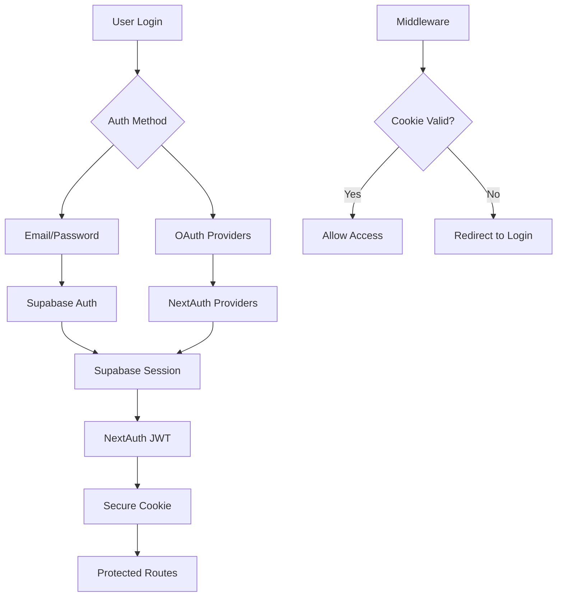
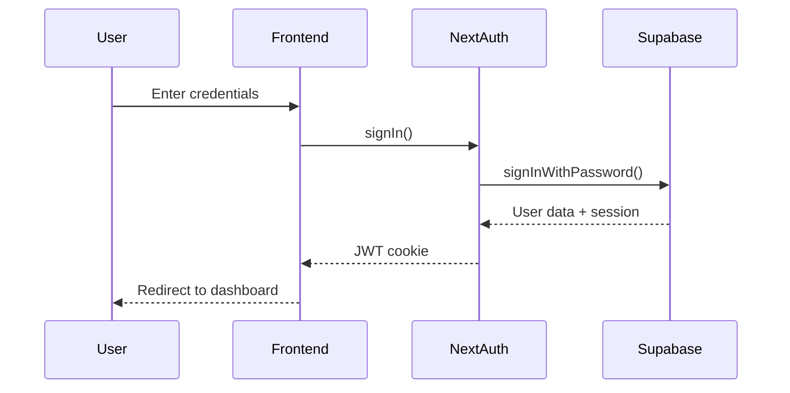

# 7P Education - Authentication System

> NextAuth.js + Supabase integration ile güvenli kimlik doğrulama sistemi

## 🎯 Kritik Bilgiler

- **Auth Provider**: NextAuth.js v4.24.11
- **Database**: Supabase Auth + custom user profiles
- **Session Management**: JWT with secure cookies  
- **Provider Strategy**: Credentials (Supabase) + OAuth ready
- **Role System**: student, instructor, admin

## 🔐 Authentication Flow



## 🔑 Core Components

### NextAuth Configuration (`src/lib/auth/config.ts`)

```typescript
export const authOptions: NextAuthOptions = {
  adapter: SupabaseAdapter({
    url: process.env.NEXT_PUBLIC_SUPABASE_URL!,
    secret: process.env.SUPABASE_SERVICE_KEY!,
  }),
  providers: [
    CredentialsProvider({
      name: "credentials",
      credentials: {
        email: { label: "Email", type: "email" },
        password: { label: "Password", type: "password" }
      },
      async authorize(credentials) {
        // Supabase auth logic
        const { data, error } = await supabase.auth.signInWithPassword({
          email: credentials.email,
          password: credentials.password,
        });
        
        return data.user ? {
          id: data.user.id,
          email: data.user.email,
          role: data.user.user_metadata?.role || 'student'
        } : null;
      }
    })
  ],
  session: { strategy: "jwt" },
  pages: {
    signIn: '/login',
    signOut: '/login',
    error: '/login'
  }
};
```

### Middleware Protection (`src/middleware.ts`)

```typescript
export function middleware(request: NextRequest) {
  const { pathname } = request.nextUrl;
  
  // Protected routes
  const isProtectedRoute = pathname.startsWith('/admin') || 
                          pathname.startsWith('/dashboard') ||
                          pathname.startsWith('/student');
  
  if (!isProtectedRoute) {
    return NextResponse.next();
  }

  // Check session cookie
  const sessionToken = request.cookies.get('next-auth.session-token') || 
                      request.cookies.get('__Secure-next-auth.session-token');

  if (!sessionToken) {
    const loginUrl = new URL('/login', request.url);
    loginUrl.searchParams.set('callbackUrl', pathname);
    return NextResponse.redirect(loginUrl);
  }

  return NextResponse.next();
}
```

## 🚪 Login/Logout Flow

### Login Process
1. **User Input**: Email + password on `/login`
2. **NextAuth**: Validates credentials via SupabaseCredentialsProvider
3. **Supabase Auth**: `signInWithPassword()` call
4. **JWT Generation**: NextAuth creates signed JWT
5. **Cookie Storage**: Secure HTTP-only cookie set
6. **Redirect**: User sent to dashboard or callback URL

### Logout Process  
1. **Logout Request**: `/api/auth/signout` call
2. **Session Cleanup**: NextAuth clears JWT
3. **Cookie Removal**: All auth cookies deleted
4. **Supabase Cleanup**: Optional `signOut()` call
5. **Redirect**: User sent to login page



## 👥 Role-Based Access Control

### Role Definitions

| Role | Capabilities | Routes | Database Access |
|------|-------------|--------|-----------------|
| **student** | View courses, enroll, track progress | `/dashboard`, `/student/*` | Own data only |
| **instructor** | Manage assigned courses, view analytics | `/instructor/*` | Assigned courses |
| **admin** | Full system access | `/admin/*` | All data |

### Role Check Implementation

```typescript
// Server-side role check
export async function checkRole(requiredRole: 'student' | 'instructor' | 'admin') {
  const session = await getServerSession(authOptions);
  
  if (!session?.user) {
    throw new Error('Authentication required');
  }
  
  const userRole = session.user.role || 'student';
  const roleHierarchy = { student: 0, instructor: 1, admin: 2 };
  
  if (roleHierarchy[userRole] < roleHierarchy[requiredRole]) {
    throw new Error('Insufficient permissions');
  }
  
  return session;
}

// Usage in API routes
export async function GET(request: NextRequest) {
  const session = await checkRole('admin');
  // Admin-only logic here
}
```

### Client-Side Role Usage

```typescript
// useAuth hook
export function useAuth() {
  const { data: session, status } = useSession();
  
  return {
    user: session?.user,
    role: session?.user?.role || 'student',
    isAuthenticated: status === 'authenticated',
    isLoading: status === 'loading',
    isAdmin: session?.user?.role === 'admin',
    isInstructor: session?.user?.role === 'instructor'
  };
}
```

## 🔒 Security Implementation

### JWT Security
```typescript
// NextAuth JWT configuration
jwt: {
  secret: process.env.NEXTAUTH_SECRET,
  maxAge: 30 * 24 * 60 * 60, // 30 days
  updateAge: 24 * 60 * 60,    // 24 hours
  encode: async ({ secret, token }) => {
    // Custom JWT encoding if needed
    return jwt.sign(token, secret, { algorithm: 'HS256' });
  }
}
```

### Session Security Enhancements
```typescript
// Secure cookie configuration  
cookies: {
  sessionToken: {
    name: process.env.NODE_ENV === 'production' 
      ? `__Secure-next-auth.session-token` 
      : `next-auth.session-token`,
    options: {
      httpOnly: true,
      sameSite: 'lax',
      path: '/',
      secure: process.env.NODE_ENV === 'production'
    }
  }
}
```

### Password Security
```typescript
// Password validation (registration)
export const passwordSchema = z.string()
  .min(8, 'Password must be at least 8 characters')
  .regex(/[A-Z]/, 'Password must contain uppercase letter')
  .regex(/[a-z]/, 'Password must contain lowercase letter')  
  .regex(/[0-9]/, 'Password must contain number')
  .regex(/[^A-Za-z0-9]/, 'Password must contain special character');
```

## 🔄 Auth State Management

### Session Handling
```typescript
// App-level session provider
import { SessionProvider } from 'next-auth/react';

export default function App({ Component, pageProps }: AppProps) {
  return (
    <SessionProvider session={pageProps.session}>
      <Component {...pageProps} />
    </SessionProvider>
  );
}
```

### Protected Page Pattern
```typescript
// Protected page component
export default function DashboardPage() {
  const { data: session, status } = useSession();
  
  if (status === 'loading') {
    return <LoadingSpinner />;
  }
  
  if (!session) {
    redirect('/login');
  }
  
  return (
    <div>
      <h1>Welcome, {session.user.email}</h1>
      {/* Dashboard content */}
    </div>
  );
}
```

## 🌐 OAuth Provider Setup (Ready)

### Google OAuth
```typescript
GoogleProvider({
  clientId: process.env.GOOGLE_CLIENT_ID!,
  clientSecret: process.env.GOOGLE_CLIENT_SECRET!,
  authorization: {
    params: {
      scope: 'openid email profile'
    }
  }
})
```

### Microsoft Azure
```typescript
AzureADProvider({
  clientId: process.env.AZURE_AD_CLIENT_ID!,
  clientSecret: process.env.AZURE_AD_CLIENT_SECRET!,
  tenantId: process.env.AZURE_AD_TENANT_ID!,
})
```

## 🚨 Fallback System (DEBUG ONLY)

⚠️ **UYARI**: Fallback sistem yalnızca geliştirme ve debug amaçlıdır. Production'da devre dışı bırakılmalıdır.

### localStorage Fallback (`src/lib/auth-fallback.ts`)
```typescript
// DEBUG ONLY - NOT FOR PRODUCTION
if (process.env.NODE_ENV === 'development' && !session) {
  const fallbackSession = localStorage.getItem('debug-session');
  if (fallbackSession) {
    return JSON.parse(fallbackSession);
  }
}
```

### Production Davranış
- **Fallback**: Tamamen kapalı
- **Session Check**: Yalnızca NextAuth cookies
- **Debugging**: Sentry error tracking

## 📊 Auth Analytics & Monitoring

### Session Metrics
```typescript
// Track auth events
export async function logAuthEvent(event: 'login' | 'logout' | 'signup', userId?: string) {
  await supabase
    .from('auth_events')
    .insert({
      event,
      user_id: userId,
      ip_address: request.headers.get('x-forwarded-for'),
      user_agent: request.headers.get('user-agent'),
      timestamp: new Date().toISOString()
    });
}
```

### Failed Login Tracking
```typescript
// Rate limiting for failed attempts
const MAX_LOGIN_ATTEMPTS = 5;
const LOCKOUT_DURATION = 15 * 60 * 1000; // 15 minutes

export async function checkLoginAttempts(email: string) {
  const attempts = await redis.get(`login_attempts:${email}`);
  if (attempts && attempts >= MAX_LOGIN_ATTEMPTS) {
    throw new Error('Account temporarily locked');
  }
}
```

## 🔧 Development & Testing

### Test User Creation
```bash
# Create test users via Supabase dashboard or API
POST /api/auth/register
{
  "email": "admin@test.com",
  "password": "TestPass123!",
  "role": "admin"
}
```

### Auth Testing
```typescript
// Jest test example
describe('Authentication', () => {
  it('should create session after login', async () => {
    const response = await signIn('credentials', {
      email: 'test@example.com',
      password: 'password123',
      redirect: false
    });
    
    expect(response?.ok).toBe(true);
    expect(response?.error).toBeNull();
  });
});
```

## 🚨 Common Issues & Solutions

### Issue 1: "Session callback error"
```bash
# Check NEXTAUTH_SECRET is set
echo $NEXTAUTH_SECRET

# Verify NEXTAUTH_URL matches domain
echo $NEXTAUTH_URL
```

### Issue 2: "CSRF token mismatch"  
```typescript
// Ensure proper domain configuration
export const authOptions = {
  trustHost: true, // For Vercel deployment
  useSecureCookies: process.env.NODE_ENV === 'production'
};
```

### Issue 3: "Supabase connection failed"
```bash
# Test Supabase credentials
npm run supabase:test

# Check service key permissions
# Should have 'service_role' permissions
```

## 📝 Best Practices

### Security Checklist
- ✅ Strong password requirements
- ✅ HTTP-only cookies
- ✅ CSRF protection enabled
- ✅ Secure cookie flags in production
- ✅ Rate limiting on auth endpoints
- ✅ Session timeout configuration
- ✅ Audit logging for auth events

### Performance Optimization
- ✅ JWT with reasonable expiry (30 days)
- ✅ Session update threshold (24 hours)
- ✅ Middleware cookie check (no DB call)
- ✅ Client-side session caching

---

**Related Docs**: [MIDDLEWARE.md](./MIDDLEWARE.md) | [SECURITY.md](./SECURITY.md) | [ENVIRONMENT.md](./ENVIRONMENT.md)  
*Last updated: 2025-01-27*