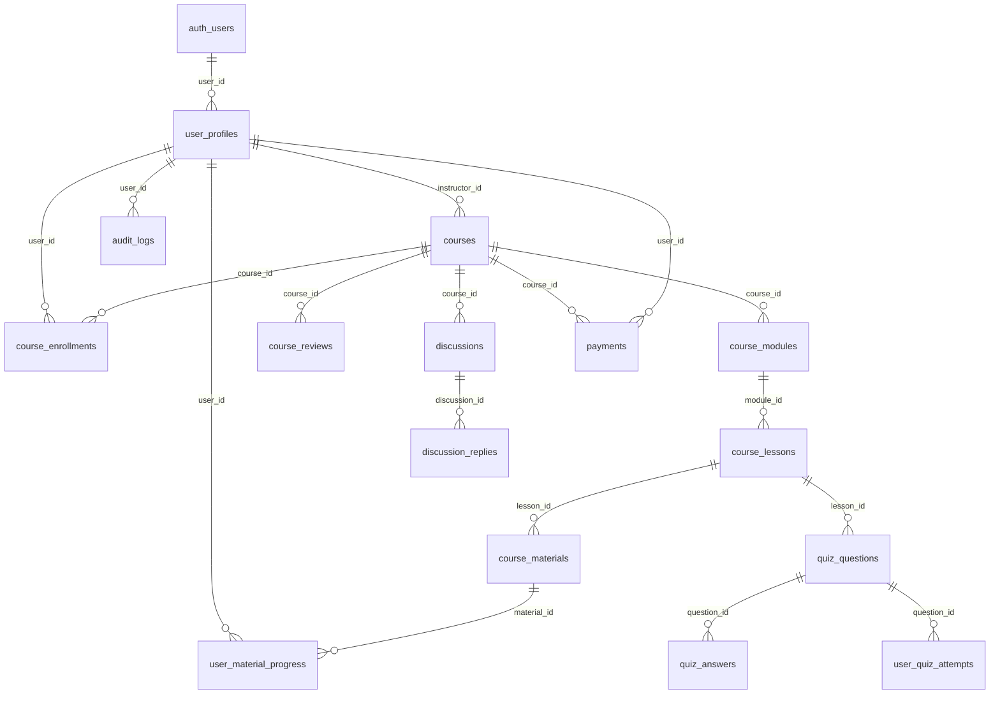

# 7P Education - Database Schema

> Supabase PostgreSQL şeması ve RLS politikaları

## 🎯 Kritik Bilgiler

- **Database**: Supabase PostgreSQL 15+
- **RLS**: Row Level Security enabled on all tables
- **Auth Integration**: Supabase Auth + custom user profiles
- **Migrations**: 10+ migration files in `supabase/migrations/`

## 📊 Core Tables

### Users & Profiles

| Table | Önemli Kolonlar | İlişkiler | RLS Policies |
|-------|----------------|-----------|--------------|
| `auth.users` | id, email, created_at | (Supabase managed) | Supabase default |
| `user_profiles` | user_id, role, name, avatar_url | → auth.users | User owns profile + admin view |

### Course System

| Table | Önemli Kolonlar | İlişkiler | RLS Policies |
|-------|----------------|-----------|--------------|
| `courses` | id, title, instructor_id, published | → user_profiles | Public read + instructor manage |
| `course_modules` | id, course_id, title, order_index | → courses | Course visibility inheritance |
| `course_lessons` | id, module_id, title, content, video_url | → course_modules | Course visibility inheritance |
| `course_materials` | id, lesson_id, file_url, file_type | → course_lessons | Course visibility inheritance |

### Enrollment & Progress

| Table | Önemli Kolonlar | İlişkiler | RLS Policies |
|-------|----------------|-----------|--------------|
| `course_enrollments` | user_id, course_id, enrolled_at, status | users ↔ courses | User owns enrollment |
| `user_material_progress` | user_id, material_id, completed_at, progress | users → materials | User owns progress |
| `lesson_progress` | user_id, lesson_id, is_completed | users → lessons | User owns progress |

### Q&A System

| Table | Önemli Kolonlar | İlişkiler | RLS Policies |
|-------|----------------|-----------|--------------|
| `discussions` | id, course_id, user_id, title, content | users → courses | Course members + instructors |
| `discussion_replies` | id, discussion_id, user_id, content | users → discussions | Course members + instructors |

### Assessment System

| Table | Önemli Kolonlar | İlişkiler | RLS Policies |
|-------|----------------|-----------|--------------|
| `quiz_questions` | id, lesson_id, question, type, options | → lessons | Course visibility inheritance |
| `quiz_answers` | id, question_id, answer_text, is_correct | → quiz_questions | Course visibility inheritance |
| `user_quiz_attempts` | user_id, question_id, selected_answer | users → questions | User owns attempts |

### Payment & Business

| Table | Önemli Kolonlar | İlişkiler | RLS Policies |
|-------|----------------|-----------|--------------|
| `payments` | id, user_id, course_id, stripe_session_id, amount, status | users → courses | User owns payments + admin view |
| `course_reviews` | user_id, course_id, rating, comment | users → courses | Public read + user owns review |

### System & Audit

| Table | Önemli Kolonlar | İlişkiler | RLS Policies |
|-------|----------------|-----------|--------------|
| `audit_logs` | user_id, action, resource_type, resource_id, details | → users | Admin only |

## 🗺️ Entity Relationship Diagram



## 🔐 Row Level Security (RLS) Policies

### User Profile Policies
```sql
-- Users can view own profile
CREATE POLICY "Users can view own profile" ON user_profiles
    FOR SELECT USING (auth.uid() = user_id);

-- Users can update own profile  
CREATE POLICY "Users can update own profile" ON user_profiles
    FOR UPDATE USING (auth.uid() = user_id);

-- Admins can view all profiles
CREATE POLICY "Admins can view all profiles" ON user_profiles
    FOR SELECT USING (
        EXISTS (
            SELECT 1 FROM user_profiles up 
            WHERE up.user_id = auth.uid() 
            AND up.role = 'admin'
        )
    );
```

### Course Policies
```sql
-- Published courses are publicly viewable
CREATE POLICY "Published courses are publicly viewable" ON courses
    FOR SELECT USING (published = true);

-- Instructors can view/edit their courses
CREATE POLICY "Instructors can manage their courses" ON courses
    FOR ALL USING (
        instructor_id = auth.uid() OR
        EXISTS (
            SELECT 1 FROM user_profiles up 
            WHERE up.user_id = auth.uid() 
            AND up.role = 'admin'
        )
    );
```

### Enrollment Policies  
```sql
-- Users can view their own enrollments
CREATE POLICY "Users can view own enrollments" ON course_enrollments
    FOR SELECT USING (user_id = auth.uid());

-- Users can create enrollments for themselves
CREATE POLICY "Users can enroll themselves" ON course_enrollments
    FOR INSERT WITH CHECK (user_id = auth.uid());

-- Instructors can view enrollments in their courses
CREATE POLICY "Instructors can view course enrollments" ON course_enrollments
    FOR SELECT USING (
        EXISTS (
            SELECT 1 FROM courses c 
            WHERE c.id = course_id 
            AND c.instructor_id = auth.uid()
        )
    );
```

### Progress Tracking Policies
```sql
-- Users own their progress data
CREATE POLICY "Users own their progress" ON user_material_progress
    FOR ALL USING (user_id = auth.uid());

-- Instructors can view progress in their courses
CREATE POLICY "Instructors can view course progress" ON user_material_progress
    FOR SELECT USING (
        EXISTS (
            SELECT 1 
            FROM course_materials cm
            JOIN course_lessons cl ON cm.lesson_id = cl.id
            JOIN course_modules mo ON cl.module_id = mo.id  
            JOIN courses c ON mo.course_id = c.id
            WHERE cm.id = material_id 
            AND c.instructor_id = auth.uid()
        )
    );
```

## 📁 Migration Files

### Key Migrations

| File | Purpose | Key Changes |
|------|---------|-------------|
| `000_initial_schema.sql` | Base schema | Core tables: users, courses, lessons |
| `20250819160304_latest_schema.sql` | Schema update | Module system, progress tracking |
| `20250819161200_course_reviews_system.sql` | Review system | Reviews, ratings |
| `20250820000001_email_verification_system.sql` | Email verification | Verification tokens |
| `20250823120001_material_management_system.sql` | Materials | File upload, material types |
| `20250823130001_progress_tracking_system.sql` | Progress tracking | Completion tracking |
| `20250826000001_comprehensive_rls_policies.sql` | Security policies | Complete RLS setup |
| `20250826000002_storage_setup.sql` | File storage | Supabase Storage buckets |

### Sample Migration
```sql
-- 20250823120001_material_management_system.sql
CREATE TABLE course_materials (
    id UUID PRIMARY KEY DEFAULT uuid_generate_v4(),
    lesson_id UUID REFERENCES course_lessons(id) ON DELETE CASCADE,
    title VARCHAR(255) NOT NULL,
    description TEXT,
    file_url TEXT,
    file_type VARCHAR(50),
    file_size INTEGER,
    mime_type VARCHAR(100),
    is_downloadable BOOLEAN DEFAULT true,
    order_index INTEGER NOT NULL,
    created_at TIMESTAMPTZ DEFAULT NOW(),
    updated_at TIMESTAMPTZ DEFAULT NOW()
);

-- Enable RLS
ALTER TABLE course_materials ENABLE ROW LEVEL SECURITY;

-- RLS Policy
CREATE POLICY "Materials visible to enrolled users" ON course_materials
    FOR SELECT USING (
        EXISTS (
            SELECT 1 
            FROM course_lessons cl
            JOIN course_modules cm ON cl.module_id = cm.id
            JOIN courses c ON cm.course_id = c.id
            LEFT JOIN course_enrollments ce ON c.id = ce.course_id
            WHERE cl.id = lesson_id
            AND (
                c.published = true OR  -- Published courses
                c.instructor_id = auth.uid() OR -- Course instructors  
                ce.user_id = auth.uid()  -- Enrolled students
            )
        )
    );
```

## 🔍 Database Functions & Triggers

### Auto-update Timestamps
```sql
CREATE OR REPLACE FUNCTION update_updated_at_column()
RETURNS TRIGGER AS $$
BEGIN
    NEW.updated_at = NOW();
    RETURN NEW;
END;
$$ language 'plpgsql';

-- Apply to tables
CREATE TRIGGER update_courses_updated_at 
    BEFORE UPDATE ON courses 
    FOR EACH ROW EXECUTE FUNCTION update_updated_at_column();
```

### Progress Calculation
```sql  
CREATE OR REPLACE FUNCTION calculate_course_progress(
    user_uuid UUID, 
    course_uuid UUID
) RETURNS INTEGER AS $$
DECLARE
    total_materials INTEGER;
    completed_materials INTEGER;
    progress_percentage INTEGER;
BEGIN
    -- Get total materials in course
    SELECT COUNT(*) INTO total_materials
    FROM course_materials cm
    JOIN course_lessons cl ON cm.lesson_id = cl.id
    JOIN course_modules mo ON cl.module_id = mo.id
    WHERE mo.course_id = course_uuid;
    
    -- Get completed materials  
    SELECT COUNT(*) INTO completed_materials
    FROM user_material_progress ump
    JOIN course_materials cm ON ump.material_id = cm.id
    JOIN course_lessons cl ON cm.lesson_id = cl.id
    JOIN course_modules mo ON cl.module_id = mo.id
    WHERE mo.course_id = course_uuid 
    AND ump.user_id = user_uuid
    AND ump.completed_at IS NOT NULL;
    
    -- Calculate percentage
    IF total_materials > 0 THEN
        progress_percentage := ROUND((completed_materials::DECIMAL / total_materials) * 100);
    ELSE
        progress_percentage := 0;
    END IF;
    
    RETURN progress_percentage;
END;
$$ LANGUAGE plpgsql;
```

## 🛠️ Database Operations

### Common Queries

#### Get User's Enrolled Courses
```sql
SELECT 
    c.id,
    c.title,
    c.description,
    ce.enrolled_at,
    up.name as instructor_name,
    calculate_course_progress(ce.user_id, c.id) as progress_percentage
FROM course_enrollments ce
JOIN courses c ON ce.course_id = c.id  
LEFT JOIN user_profiles up ON c.instructor_id = up.user_id
WHERE ce.user_id = $1
AND ce.status = 'active'
ORDER BY ce.enrolled_at DESC;
```

#### Get Course Content with Progress
```sql
SELECT 
    cm.id as module_id,
    cm.title as module_title,
    cl.id as lesson_id,
    cl.title as lesson_title,
    cl.video_url,
    mat.id as material_id,
    mat.title as material_title,
    mat.file_url,
    CASE WHEN ump.completed_at IS NOT NULL THEN true ELSE false END as completed
FROM course_modules cm
JOIN course_lessons cl ON cm.id = cl.module_id
LEFT JOIN course_materials mat ON cl.id = mat.lesson_id  
LEFT JOIN user_material_progress ump ON mat.id = ump.material_id AND ump.user_id = $1
WHERE cm.course_id = $2
ORDER BY cm.order_index, cl.order_index, mat.order_index;
```

## ⚙️ Development Commands

### Database Setup
```bash
# Test connection
npm run supabase:test

# Run migrations
npm run db:migrate

# Verify tables
npm run db:verify

# Check RLS policies  
npm run db:rls-test

# Reset database (DANGEROUS)
npm run db:clean:confirm
```

### TODO: Schema Unknowns

**🔍 Need Clarification:**
- **Subscription system**: Stripe subscription table structure
- **Course bundles**: Bundle pricing and enrollment logic  
- **Instructor payouts**: Payment distribution system
- **Course categories**: Taxonomy and filtering system
- **Content versioning**: Course content history
- **Advanced permissions**: Granular role permissions

**📝 Future Enhancements:**
- **Search indexing**: Full-text search on courses/content
- **Analytics tables**: Learning analytics and reporting  
- **Notification system**: Real-time notifications
- **Course prerequisites**: Course dependency system
- **Certificate system**: Completion certificates

---

**Related Docs**: [ROUTEMAP.md](../ROUTEMAP.md) | [AUTH.md](../AUTH.md) | [ENROLLMENT.md](../ENROLLMENT.md)  
*Last updated: 2025-01-27*