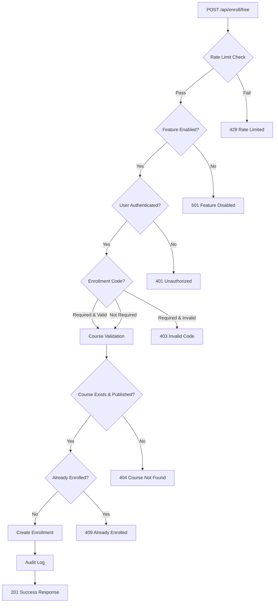

# 7P Education - Enrollment System

> Course enrollment system: Free enrollment API ve business logic

## 🎯 Kritik Bilgiler

- **Free Enrollment API**: `/api/enroll/free` (Node.js runtime)
- **Rate Limit**: 5 requests/minute per user+IP
- **Audit Logging**: Full enrollment tracking
- **Feature Flag**: `FEATURE_ENROLL_FREE=true`
- **Last Updated**: 2025-01-27
- **Optional Code**: `FREE_ENROLLMENT_CODE` for gated access

## 🆓 Free Enrollment Flow

### API Endpoint: `/api/enroll/free`

**File**: `src/app/api/enroll/free/route.ts`  
**Runtime**: `nodejs` (Supabase admin operations)  
**Methods**: `POST` only

### Request Flow


## 📝 Request/Response Specification

### Request Body
```typescript
interface EnrollFreeRequest {
  courseId: string;     // UUID format required
  code?: string;        // Optional enrollment code
}
```

### Success Response (201)
```typescript
interface EnrollFreeResponse {
  success: true;
  message: 'Successfully enrolled in course';
  enrollment: {
    id: string;         // Enrollment UUID
    courseId: string;   // Course UUID  
    userId: string;     // User UUID
    plan: 'free';       // Always 'free' for this endpoint
    status: 'active';   // Always 'active' 
    enrolledAt: string; // ISO timestamp
  };
}
```

### Error Responses
```typescript
// 429 Rate Limited
{ success: false, error: 'Rate limit exceeded. Please try again later.' }

// 501 Feature Disabled  
{ success: false, error: 'Free enrollment is not enabled' }

// 401 Unauthorized
{ success: false, error: 'Authentication required' }

// 403 Invalid Code
{ success: false, error: 'Invalid or missing enrollment code' }

// 400 Invalid Course ID
{ success: false, error: 'Invalid course ID format' }

// 404 Course Not Found
{ success: false, error: 'Course not found' }

// 409 Already Enrolled
{ success: false, error: 'Already enrolled in this course' }
```

## 🔒 Security & Validation

### Rate Limiting Implementation
```typescript
// 5 requests per minute per user+IP combination
const rateLimitResult = await rateLimit.check(
  request, 
  '/api/enroll/free', 
  { max: 5, window: '1m' }
);

if (!rateLimitResult.success) {
  return NextResponse.json(
    { success: false, error: 'Rate limit exceeded. Please try again later.' },
    { status: 429 }
  );
}
```

### Authentication Check
```typescript
const session = await getServerSession(authOptions);
if (!session?.user?.id) {
  return NextResponse.json(
    { success: false, error: 'Authentication required' },
    { status: 401 }
  );
}
```

### Course ID Validation
```typescript
// UUID format validation
if (!isValidUUID(courseId)) {
  return NextResponse.json(
    { success: false, error: 'Invalid course ID format' },
    { status: 400 }
  );
}
```

### Enrollment Code Validation
```typescript
// Optional code check
if (FREE_ENROLLMENT_CODE) {
  if (!code || code !== FREE_ENROLLMENT_CODE) {
    return NextResponse.json(
      { success: false, error: 'Invalid or missing enrollment code' },
      { status: 403 }
    );
  }
}
```

## 📊 Audit Logging System

### Audit Log Structure
```typescript
interface AuditLogEntry {
  user_id: string;
  action: 'enrollment_created';
  resource_type: 'course';
  resource_id: string;
  details: {
    enrollment_id: string;
    enrollment_type: 'free';
    course_title: string;
    enrollment_code_used: boolean;
  };
  ip_address: string;
  user_agent: string;
  created_at: string;
}
```

### Audit Implementation
```typescript
const auditData = {
  user_id: session.user.id,
  action: 'enrollment_created',
  resource_type: 'course',
  resource_id: courseId,
  details: {
    enrollment_id: enrollment.id,
    enrollment_type: 'free',
    course_title: course.title,
    enrollment_code_used: !!FREE_ENROLLMENT_CODE,
  },
  ip_address: request.headers.get('x-forwarded-for') || 'unknown',
  user_agent: request.headers.get('user-agent') || 'unknown',
  created_at: new Date().toISOString(),
};

await supabase.from('audit_logs').insert(auditData);
```

## 🎛️ Feature Configuration

### Environment Variables
```bash
# Enable free enrollment feature
FEATURE_ENROLL_FREE=true

# Optional enrollment code (if set, becomes required)
FREE_ENROLLMENT_CODE=BETA2025

# Core requirements (always needed)
NEXT_PUBLIC_SUPABASE_URL=https://your-project.supabase.co
SUPABASE_SERVICE_KEY=your_service_key
NEXTAUTH_SECRET=your_secret
```

### Feature Flag Behavior

| FEATURE_ENROLL_FREE | FREE_ENROLLMENT_CODE | Behavior |
|-------------------|-------------------|----------|
| `false` | Any | 501 Feature Disabled |
| `true` | `null` / `undefined` | Direct enrollment (no code) |
| `true` | `BETA2025` | Enrollment requires code |

## 🖥️ UI Integration

### usePaymentMode Hook Integration
```typescript
const { paymentsEnabled } = usePaymentMode();

// Course enrollment button
<Button 
  onClick={() => paymentsEnabled 
    ? handleStripeCheckout() 
    : handleFreeEnrollment()
  }
>
  {paymentsEnabled ? 'Purchase Course' : 'Enroll (Free/Test)'}
</Button>
```

### Frontend Implementation
```typescript
async function handleFreeEnrollment(courseId: string, code?: string) {
  try {
    const response = await fetch('/api/enroll/free', {
      method: 'POST',
      headers: { 'Content-Type': 'application/json' },
      body: JSON.stringify({ courseId, code })
    });
    
    const result = await response.json();
    
    if (result.success) {
      toast.success('Successfully enrolled in course!');
      router.push(`/student/courses/${courseId}`);
    } else {
      toast.error(result.error);
    }
  } catch (error) {
    toast.error('Enrollment failed. Please try again.');
  }
}
```

### Enrollment Code Modal
```typescript
function EnrollmentCodeModal({ courseId, onEnroll }) {
  const [code, setCode] = useState('');
  
  return (
    <Dialog>
      <DialogContent>
        <DialogHeader>
          <DialogTitle>Enter Enrollment Code</DialogTitle>
          <DialogDescription>
            This course requires an enrollment code to access.
          </DialogDescription>
        </DialogHeader>
        <div className="space-y-4">
          <Input
            placeholder="Enter enrollment code"
            value={code}
            onChange={(e) => setCode(e.target.value)}
          />
          <Button 
            onClick={() => onEnroll(courseId, code)}
            disabled={!code.trim()}
          >
            Enroll in Course
          </Button>
        </div>
      </DialogContent>
    </Dialog>
  );
}
```

## 📈 Database Schema

### Enrollments Table
```sql
CREATE TABLE enrollments (
    id UUID PRIMARY KEY DEFAULT uuid_generate_v4(),
    user_id UUID REFERENCES auth.users(id) ON DELETE CASCADE,
    course_id UUID REFERENCES courses(id) ON DELETE CASCADE,
    plan VARCHAR(50) NOT NULL DEFAULT 'free',
    status VARCHAR(50) NOT NULL DEFAULT 'active',
    enrolled_at TIMESTAMPTZ DEFAULT NOW(),
    payment_status VARCHAR(50) DEFAULT 'free',
    metadata JSONB DEFAULT '{}',
    UNIQUE(user_id, course_id)
);
```

### Sample Enrollment Record
```json
{
  "id": "123e4567-e89b-12d3-a456-426614174000",
  "user_id": "456e7890-e89b-12d3-a456-426614174001", 
  "course_id": "789e0123-e89b-12d3-a456-426614174002",
  "plan": "free",
  "status": "active",
  "enrolled_at": "2025-01-27T10:30:00.000Z",
  "payment_status": "free",
  "metadata": {
    "enrollment_type": "free",
    "enrollment_code_used": true,
    "created_via": "api/enroll/free"
  }
}
```

## 🧪 Testing

### API Testing with cURL
```bash
# Test free enrollment (no code required)
curl -X POST http://localhost:3000/api/enroll/free \
  -H "Content-Type: application/json" \
  -H "Cookie: next-auth.session-token=your_session_token" \
  -d '{
    "courseId": "123e4567-e89b-12d3-a456-426614174000"
  }'

# Test with enrollment code
curl -X POST http://localhost:3000/api/enroll/free \
  -H "Content-Type: application/json" \
  -H "Cookie: next-auth.session-token=your_session_token" \
  -d '{
    "courseId": "123e4567-e89b-12d3-a456-426614174000",
    "code": "BETA2025"
  }'
```

### Rate Limit Testing
```bash
# Test rate limiting (should fail after 5 requests)
for i in {1..7}; do
  echo "Request $i:"
  curl -X POST http://localhost:3000/api/enroll/free \
    -H "Content-Type: application/json" \
    -H "Cookie: next-auth.session-token=your_session_token" \
    -d '{"courseId": "test-id"}' \
    -w "Status: %{http_code}\n"
  sleep 1
done
```

### Unit Testing
```typescript
describe('/api/enroll/free', () => {
  it('should create free enrollment successfully', async () => {
    const response = await request(app)
      .post('/api/enroll/free')
      .set('Cookie', validSessionCookie)
      .send({ courseId: 'valid-course-id' })
      .expect(201);
    
    expect(response.body.success).toBe(true);
    expect(response.body.enrollment.plan).toBe('free');
  });
  
  it('should enforce rate limiting', async () => {
    // Make 6 requests rapidly
    for (let i = 0; i < 6; i++) {
      const response = await request(app)
        .post('/api/enroll/free')
        .set('Cookie', validSessionCookie)  
        .send({ courseId: 'valid-course-id' });
        
      if (i < 5) {
        expect(response.status).not.toBe(429);
      } else {
        expect(response.status).toBe(429);
      }
    }
  });
});
```

---

**Related Docs**: [PAYMENTS.md](./PAYMENTS.md) | [AUTH.md](./AUTH.md) | [API-REFERENCE.md](./API-REFERENCE.md)  
*Last updated: 2025-01-27*