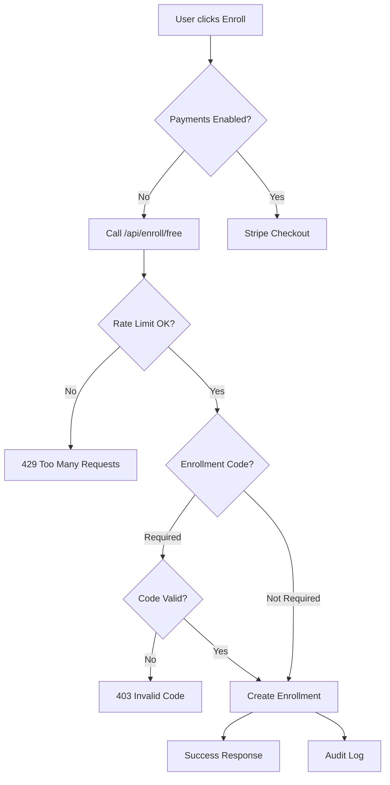

# 7P Education - Payment System

> Stripe entegrasyonu ve ödeme sistemi kontrolü

## 🎯 Kritik Bilgiler

- **Payment Guard**: `PAYMENTS_MODE=disabled/stripe` kontrolü
- **Stripe Version**: v18.4.0
- **Guard Strategy**: 501 responses when disabled
- **UI Adaptation**: Dynamic "Free/Test" rozeti sistemi

## 💳 Payment Modes

| Mode | API Behavior | UI Behavior | Use Case |
|------|-------------|-------------|----------|
| `disabled` | 501 responses | "TEST ÜCRETSİZ" rozet | Development, beta |
| `stripe` | Full payment flow | Normal pricing | Production |

## 🛡️ Payment Guard System

### Implementation (`src/lib/payment-guard.ts`)
```typescript
export function withPaymentGuard(handler) {
  return async (request, context) => {
    if (!STRIPE_ENABLED) {
      return NextResponse.json({
        success: false,
        message: 'payments_disabled',
        error: 'Payment processing is currently disabled'
      }, { status: 501 });
    }
    
    return handler(request, context);
  };
}
```

### Protected Routes
- `/api/payments/create-checkout-session`
- `/api/payments/create-payment-intent` 
- `/api/payments/customer-portal`
- `/api/payments/history`
- `/api/payments/subscriptions`

## 🎨 UI Adaptations

### usePaymentMode Hook (`src/hooks/usePaymentMode.ts`)
```typescript
export function usePaymentMode() {
  const [paymentMode, setPaymentMode] = useState({
    paymentsEnabled: false,
    mode: 'disabled',
    loading: true
  });

  useEffect(() => {
    const checkPaymentMode = async () => {
      const response = await fetch('/api/health');
      const healthData = await response.json();
      const stripeEnabled = healthData.checks?.stripe !== null;
      
      setPaymentMode({
        paymentsEnabled: stripeEnabled,
        mode: stripeEnabled ? 'stripe' : 'disabled',
        loading: false
      });
    };
    
    checkPaymentMode();
  }, []);

  return paymentMode;
}
```

### UI Component Changes

#### Course Cards
```typescript
// PAYMENTS_MODE=disabled
<CourseCard>
  <Badge variant="success">TEST ÜCRETSİZ</Badge>
  <Button>Enroll (Free/Test)</Button>
</CourseCard>

// PAYMENTS_MODE=stripe  
<CourseCard>
  <div className="price">$99.00</div>
  <Button>Purchase Course</Button>
</CourseCard>
```

#### Marketplace Cards
```typescript
const { paymentsEnabled } = usePaymentMode();

return (
  <MarketplaceCourseCard>
    {!paymentsEnabled && <Badge>TEST ÜCRETSİZ</Badge>}
    <Button>
      {paymentsEnabled ? 'Purchase' : 'Enroll (Free/Test)'}
    </Button>
  </MarketplaceCourseCard>
);
```

#### Purchase Pages
```typescript
// PAYMENTS_MODE=disabled → Redirect to course page
if (!paymentsEnabled) {
  router.push(`/courses/${courseId}?message=free_enrollment_available`);
  return;
}

// PAYMENTS_MODE=stripe → Show payment form
return <StripeCheckoutForm courseId={courseId} />;
```

## 💰 Stripe Integration (When Enabled)

### Environment Setup
```bash
# Required when PAYMENTS_MODE=stripe
PAYMENTS_MODE=stripe
NEXT_PUBLIC_STRIPE_PUBLISHABLE_KEY=pk_test_...
STRIPE_SECRET_KEY=sk_test_...
STRIPE_WEBHOOK_SECRET=whsec_...
```

### Checkout Session Creation
```typescript
// src/app/api/payments/create-checkout-session/route.ts
export const runtime = 'nodejs';

export const POST = withPaymentGuard(async (request) => {
  const { courseId, type } = await request.json();
  
  const session = await stripe.checkout.sessions.create({
    payment_method_types: ['card'],
    mode: type === 'subscription' ? 'subscription' : 'payment',
    line_items: [{
      price: await getCoursePrice(courseId),
      quantity: 1,
    }],
    success_url: `${process.env.NEXTAUTH_URL}/courses/${courseId}?payment=success`,
    cancel_url: `${process.env.NEXTAUTH_URL}/courses/${courseId}?payment=cancelled`,
  });

  return NextResponse.json({ sessionId: session.id });
});
```

### Webhook Handling
```typescript
// src/app/api/webhooks/stripe/route.ts
export const runtime = 'nodejs';

export async function POST(request: NextRequest) {
  const body = await request.text();
  const sig = request.headers.get('stripe-signature')!;
  
  let event: Stripe.Event;
  
  try {
    event = stripe.webhooks.constructEvent(body, sig, STRIPE_WEBHOOK_SECRET!);
  } catch (err) {
    return NextResponse.json({ error: 'Invalid signature' }, { status: 400 });
  }
  
  switch (event.type) {
    case 'checkout.session.completed':
      await handleSuccessfulPayment(event.data.object);
      break;
    case 'payment_intent.payment_failed':
      await handleFailedPayment(event.data.object);
      break;
  }
  
  return NextResponse.json({ received: true });
}
```

## 🆓 Free Enrollment Alternative

### When PAYMENTS_MODE=disabled
- Course purchase buttons → Redirect to `/api/enroll/free`
- Rate limited: 5 requests/minute per user
- Optional enrollment code: `FREE_ENROLLMENT_CODE`
- Audit logging enabled

### Free Enrollment Flow


## 🧪 Stripe CLI Testing

### Local Development Setup
```bash
# 1. Install Stripe CLI
curl -s https://packages.stripe.com/api/security/keypair/stripe-cli-gpg/public | gpg --dearmor | sudo tee /usr/share/keyrings/stripe.gpg
echo "deb [signed-by=/usr/share/keyrings/stripe.gpg] https://packages.stripe.com/stripe-cli-debian-local stable main" | sudo tee -a /etc/apt/sources.list.d/stripe.list
sudo apt update && sudo apt install stripe

# 2. Login to Stripe
stripe login

# 3. Forward webhooks to local server
stripe listen --forward-to localhost:3000/api/webhooks/stripe

# 4. Copy webhook secret to .env.local
# (Output from previous command)
STRIPE_WEBHOOK_SECRET=whsec_...
```

### Test Payment Flow
```bash
# 1. Enable payments
echo 'PAYMENTS_MODE=stripe' >> .env.local

# 2. Start development server
npm run dev

# 3. Test checkout session
curl -X POST http://localhost:3000/api/payments/create-checkout-session \
  -H "Content-Type: application/json" \
  -d '{"courseId":"test-course-id","type":"payment"}'

# 4. Test webhook delivery
stripe trigger checkout.session.completed
```

## 📊 Payment Analytics

### Health Check Integration
```typescript
// src/app/api/health/route.ts
export async function GET() {
  const healthData = {
    status: 'healthy',
    paymentsMode: process.env.PAYMENTS_MODE || 'disabled',
    checks: {
      stripe: STRIPE_ENABLED ? 'enabled' : null,
      // other checks...
    }
  };
  
  return NextResponse.json(healthData);
}
```

### Payment Monitoring
```typescript
// Track payment events
export async function logPaymentEvent(
  event: 'checkout_created' | 'payment_succeeded' | 'payment_failed',
  data: any
) {
  await supabase
    .from('payment_events')
    .insert({
      event,
      stripe_session_id: data.id,
      amount: data.amount_total,
      currency: data.currency,
      customer_email: data.customer_details?.email,
      created_at: new Date().toISOString()
    });
}
```

## 🔧 Configuration Management

### Feature Flag Check
```typescript
// Check payments enabled
export function isPaymentsEnabled(): boolean {
  return process.env.PAYMENTS_MODE === 'stripe';
}

// Payment mode info
export function getPaymentModeInfo() {
  return {
    enabled: STRIPE_ENABLED,
    mode: PAYMENTS_MODE,
    timestamp: new Date().toISOString()
  };
}
```

### Environment Validation
```typescript
// Validate payment configuration
export function validatePaymentConfig() {
  const errors = [];
  
  if (PAYMENTS_MODE === 'stripe') {
    if (!STRIPE_SECRET_KEY) errors.push('STRIPE_SECRET_KEY required');
    if (!NEXT_PUBLIC_STRIPE_PUBLISHABLE_KEY) errors.push('STRIPE_PUBLISHABLE_KEY required');
    if (!STRIPE_WEBHOOK_SECRET && process.env.NODE_ENV === 'production') {
      errors.push('STRIPE_WEBHOOK_SECRET required in production');
    }
  }
  
  return { valid: errors.length === 0, errors };
}
```

## 🚨 Common Issues & Solutions

### Issue 1: "Payments not working"
```bash
# Check payment mode
npm run check-env | grep PAYMENTS_MODE

# Should be 'stripe' for payment functionality
PAYMENTS_MODE=stripe
```

### Issue 2: "Stripe keys invalid"
```bash
# Check key format
echo $STRIPE_SECRET_KEY | head -c 8
# Should output: sk_test_ or sk_live_

echo $NEXT_PUBLIC_STRIPE_PUBLISHABLE_KEY | head -c 8  
# Should output: pk_test_ or pk_live_
```

### Issue 3: "Webhook signature invalid"
```bash
# Test webhook locally
stripe listen --forward-to localhost:3000/api/webhooks/stripe

# Copy the webhook signing secret displayed
STRIPE_WEBHOOK_SECRET=whsec_...
```

### Issue 4: "UI showing wrong payment state"
```typescript
// Clear payment mode cache
const { paymentsEnabled, loading } = usePaymentMode();

if (loading) {
  return <LoadingSpinner />;
}

// Ensure UI reflects current mode
console.log('Payments enabled:', paymentsEnabled);
```

## 🚀 Production Deployment

### Stripe Live Keys Setup
```bash
# Production environment variables
PAYMENTS_MODE=stripe
NEXT_PUBLIC_STRIPE_PUBLISHABLE_KEY=pk_live_...
STRIPE_SECRET_KEY=sk_live_...
STRIPE_WEBHOOK_SECRET=whsec_...
```

### Webhook Endpoint Registration
```bash
# Add webhook endpoint in Stripe Dashboard:
# URL: https://your-domain.vercel.app/api/webhooks/stripe
# Events: checkout.session.completed, payment_intent.payment_failed
```

### Payment Flow Validation
```bash
# Test production payment flow
TEST_URL=https://your-domain.vercel.app npm run test:payments
```

---

**Related Docs**: [ENVIRONMENT.md](./ENVIRONMENT.md) | [AUTH.md](./AUTH.md) | [API-REFERENCE.md](./API-REFERENCE.md)  
*Last updated: 2025-01-27*