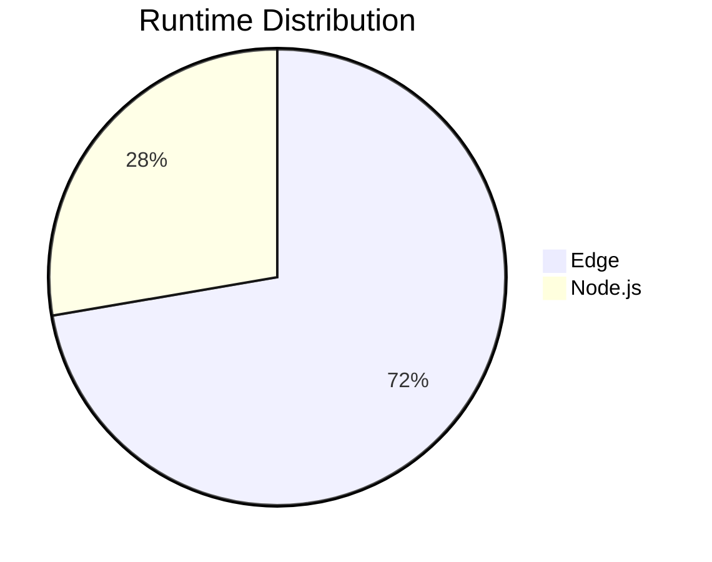
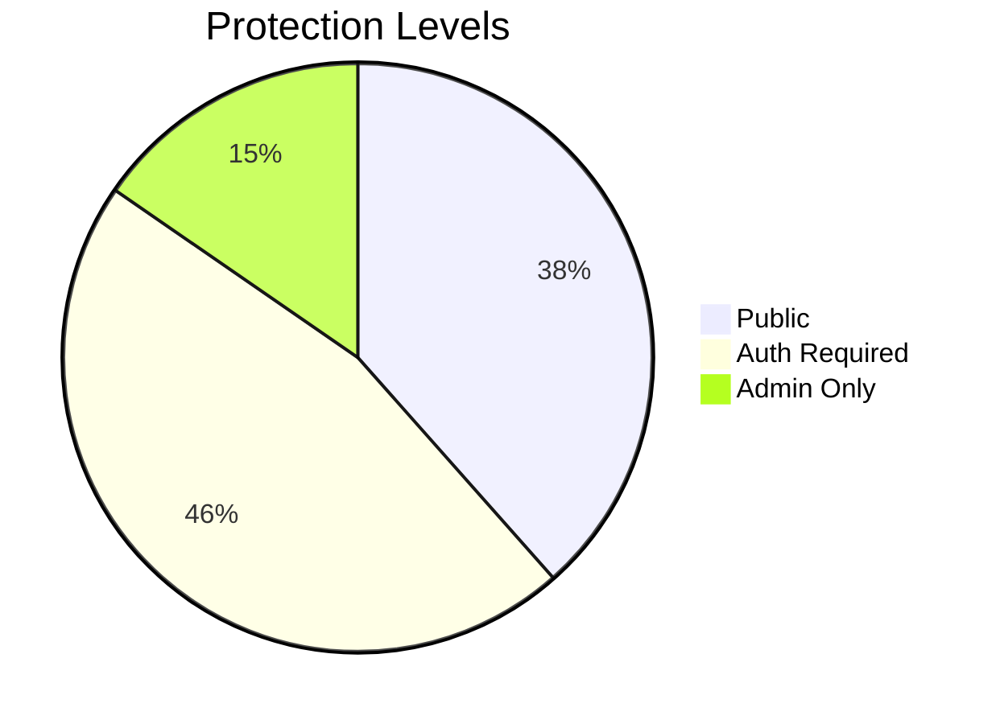

# 7P Education - Route Map

> Tüm sayfa ve API rotalarının kapsamlı haritası

## 🎯 Kritik Bilgiler

- **Total Routes**: ~65 (25 pages + 40 API endpoints)
- **Runtime Split**: 18 Node.js, geri kalanı Edge
- **Auth Protected**: 15+ routes (middleware + role checks)
- **Payment Protected**: 5 routes (withPaymentGuard)

## 📄 Page Routes

<!-- AUTO-GENERATED ROUTE TABLE START -->\n| Route | Type | Method | Runtime | Protection | File |
|-------|------|--------|---------|------------|------|
| `/` | Page | GET | Edge | Public | `src/app/page.tsx` |
| `/admin/courses` | Page | GET | Edge | Admin Only | `src/app/admin/courses/page.tsx` |
| `/admin/courses/[courseId]` | Page | GET | Edge | Admin Only | `src/app/admin/courses/[courseId]/page.tsx` |
| `/admin/courses/[courseId]/materials` | Page | GET | Edge | Admin Only | `src/app/admin/courses/[courseId]/materials/page.tsx` |
| `/admin/courses/new` | Page | GET | Edge | Admin Only | `src/app/admin/courses/new/page.tsx` |
| `/admin/dashboard` | Page | GET | Edge | Admin Only | `src/app/admin/dashboard/page.tsx` |
| `/admin/payments` | Page | GET | Node.js | Admin Only | `src/app/admin/payments/page.tsx` |
| `/admin/qna` | Page | GET | Edge | Admin Only | `src/app/admin/qna/page.tsx` |
| `/admin/settings` | Page | GET | Edge | Admin Only | `src/app/admin/settings/page.tsx` |
| `/admin/users` | Page | GET | Edge | Admin Only | `src/app/admin/users/page.tsx` |
| `/auth/reset-password` | Page | GET | Edge | Public | `src/app/auth/reset-password/page.tsx` |
| `/auth/verification-error` | Page | GET | Edge | Public | `src/app/auth/verification-error/page.tsx` |
| `/auth/verification-success` | Page | GET | Edge | Public | `src/app/auth/verification-success/page.tsx` |
| `/auth/verify-email` | Page | GET | Edge | Public | `src/app/auth/verify-email/page.tsx` |
| `/beta-test` | Page | GET | Edge | Middleware | `src/app/beta-test/page.tsx` |
| `/courses` | Page | GET | Edge | Public | `src/app/courses/page.tsx` |
| `/courses/[courseId]` | Page | GET | Edge | Middleware | `src/app/courses/[courseId]/page.tsx` |
| `/courses/[courseId]/modules` | Page | GET | Edge | Middleware | `src/app/courses/[courseId]/modules/page.tsx` |
| `/courses/[courseId]/modules/[moduleId]/lessons/[lessonId]` | Page | GET | Edge | Middleware | `src/app/courses/[courseId]/modules/[moduleId]/lessons/[lessonId]/page.tsx` |
| `/courses/[courseId]/purchase` | Page | GET | Node.js | Middleware | `src/app/courses/[courseId]/purchase/page.tsx` |
| `/dashboard` | Page | GET | Edge | Auth Required | `src/app/dashboard/page.tsx` |
| `/login` | Page | GET | Edge | Public | `src/app/login/page.tsx` |
| `/marketplace` | Page | GET | Edge | Public | `src/app/marketplace/page.tsx` |
| `/marketplace/[courseId]` | Page | GET | Edge | Middleware | `src/app/marketplace/[courseId]/page.tsx` |
| `/register` | Page | GET | Edge | Public | `src/app/register/page.tsx` |
| `/settings` | Page | GET | Edge | Middleware | `src/app/settings/page.tsx` |
| `/student` | Page | GET | Edge | Auth Required | `src/app/student/page.tsx` |
| `/student/materials` | Page | GET | Edge | Auth Required | `src/app/student/materials/page.tsx` |
| `/student/questions` | Page | GET | Edge | Auth Required | `src/app/student/questions/page.tsx` |
| `/api/api/admin/courses` | API | GET, POST, PUT | Edge | Auth Required | `src/app/api/admin/courses/route.ts` |
| `/api/api/admin/payments/refund` | API | POST | Edge | Admin Only | `src/app/api/admin/payments/refund/route.ts` |
| `/api/api/admin/qna` | API | GET | Edge | Admin Only | `src/app/api/admin/qna/route.ts` |
| `/api/api/admin/qna/[id]` | API | GET, DELETE, PATCH | Edge | Admin Only | `src/app/api/admin/qna/[id]/route.ts` |
| `/api/api/admin/qna/[id]/reply` | API | GET, POST | Edge | Admin Only | `src/app/api/admin/qna/[id]/reply/route.ts` |
| `/api/api/assessments` | API | GET, POST | Node.js | Auth Required | `src/app/api/assessments/route.ts` |
| `/api/api/assessments/[id]` | API | GET, PUT, DELETE | Node.js | Auth Required | `src/app/api/assessments/[id]/route.ts` |
| `/api/api/assessments/[id]/analytics` | API | GET | Node.js | Auth Required | `src/app/api/assessments/[id]/analytics/route.ts` |
| `/api/api/assessments/[id]/attempts` | API | GET | Node.js | Auth Required | `src/app/api/assessments/[id]/attempts/route.ts` |
| `/api/api/assessments/[id]/submit` | API | GET, POST | Node.js | Auth Required | `src/app/api/assessments/[id]/submit/route.ts` |
| `/api/api/auth/[...nextauth]` | API | GET | Node.js | Public | `src/app/api/auth/[...nextauth]/route.ts` |
| `/api/api/auth/login` | API | POST | Node.js | Public | `src/app/api/auth/login/route.ts` |
| `/api/api/auth/logout` | API | POST, DELETE | Node.js | Public | `src/app/api/auth/logout/route.ts` |
| `/api/api/auth/profile` | API | GET, PUT, DELETE, PATCH | Node.js | Auth Required | `src/app/api/auth/profile/route.ts` |
| `/api/api/auth/refresh` | API | GET, POST | Node.js | Auth Required | `src/app/api/auth/refresh/route.ts` |
| `/api/api/auth/register` | API | POST | Node.js | Auth Required | `src/app/api/auth/register/route.ts` |
| `/api/api/auth/request-password-reset` | API | GET, POST, PUT | Node.js | Public | `src/app/api/auth/request-password-reset/route.ts` |
| `/api/api/auth/reset-password` | API | GET, POST, PUT | Node.js | Auth Required | `src/app/api/auth/reset-password/route.ts` |
| `/api/api/auth/send-verification` | API | GET, POST | Node.js | Auth Required | `src/app/api/auth/send-verification/route.ts` |
| `/api/api/auth/verify-email` | API | GET, POST | Edge | Public | `src/app/api/auth/verify-email/route.ts` |
| `/api/api/courses` | API | GET, POST | Node.js | Auth Required | `src/app/api/courses/route.ts` |
| `/api/api/courses/[courseId]` | API | GET, PUT, DELETE | Node.js | Auth Required | `src/app/api/courses/[courseId]/route.ts` |
| `/api/api/courses/[courseId]/enroll` | API | GET, POST | Node.js | Auth Required | `src/app/api/courses/[courseId]/enroll/route.ts` |
| `/api/api/courses/[courseId]/progress` | API | GET, PUT | Edge | Auth Required | `src/app/api/courses/[courseId]/progress/route.ts` |
| `/api/api/courses/search` | API | GET | Edge | Public | `src/app/api/courses/search/route.ts` |
| `/api/api/courses/stats` | API | GET | Node.js | Auth Required | `src/app/api/courses/stats/route.ts` |
| `/api/api/diag` | API | GET | Node.js | Public | `src/app/api/diag/route.ts` |
| `/api/api/enroll/free` | API | GET, POST, PUT, DELETE | Node.js | Auth Required | `src/app/api/enroll/free/route.ts` |
| `/api/api/enrollments` | API | GET | Node.js | Auth Required | `src/app/api/enrollments/route.ts` |
| `/api/api/enrollments/[enrollmentId]` | API | DELETE, PATCH | Node.js | Auth Required | `src/app/api/enrollments/[enrollmentId]/route.ts` |
| `/api/api/health` | API | GET | Node.js | Public | `src/app/api/health/route.ts` |
| `/api/api/health/simple` | API | GET | Node.js | Public | `src/app/api/health/simple/route.ts` |
| `/api/api/instructor/progress/[courseId]` | API | GET | Node.js | Auth Required | `src/app/api/instructor/progress/[courseId]/route.ts` |
| `/api/api/materials/[id]/download` | API | GET, POST | Edge | Auth Required | `src/app/api/materials/[id]/download/route.ts` |
| `/api/api/materials/upload` | API | GET, POST, DELETE | Edge | Auth Required | `src/app/api/materials/upload/route.ts` |
| `/api/api/payments/create-checkout-session` | API | GET | Node.js | Auth Required | `src/app/api/payments/create-checkout-session/route.ts` |
| `/api/api/payments/create-payment-intent` | API | GET | Node.js | Auth Required | `src/app/api/payments/create-payment-intent/route.ts` |
| `/api/api/payments/customer-portal` | API | GET | Node.js | Auth Required | `src/app/api/payments/customer-portal/route.ts` |
| `/api/api/payments/history` | API | GET | Edge | Auth Required | `src/app/api/payments/history/route.ts` |
| `/api/api/payments/subscriptions` | API | GET | Node.js | Auth Required | `src/app/api/payments/subscriptions/route.ts` |
| `/api/api/progress/course-stats` | API | GET | Edge | Auth Required | `src/app/api/progress/course-stats/route.ts` |
| `/api/api/progress/update` | API | GET, POST | Edge | Auth Required | `src/app/api/progress/update/route.ts` |
| `/api/api/student/achievements` | API | GET | Node.js | Auth Required | `src/app/api/student/achievements/route.ts` |
| `/api/api/student/enroll` | API | GET, POST, DELETE | Edge | Auth Required | `src/app/api/student/enroll/route.ts` |
| `/api/api/student/progress` | API | GET | Node.js | Auth Required | `src/app/api/student/progress/route.ts` |
| `/api/api/student/progress/course/[courseId]` | API | GET | Node.js | Auth Required | `src/app/api/student/progress/course/[courseId]/route.ts` |
| `/api/api/student/progress/lesson` | API | POST | Node.js | Auth Required | `src/app/api/student/progress/lesson/route.ts` |
| `/api/api/student/progress/quiz` | API | POST | Node.js | Auth Required | `src/app/api/student/progress/quiz/route.ts` |
| `/api/api/student/questions` | API | GET, POST | Edge | Public | `src/app/api/student/questions/route.ts` |
| `/api/api/test` | API | GET | Edge | Public | `src/app/api/test/route.ts` |
| `/api/api/test-public` | API | GET, POST | Edge | Public | `src/app/api/test-public/route.ts` |
| `/api/api/webhooks/stripe` | API | POST | Node.js | Public | `src/app/api/webhooks/stripe/route.ts` |
| `/api/monitoring/tunnel` | API | POST, OPTIONS | Edge | Public | `src/app/monitoring/tunnel/route.ts` |
| `/api/robots.txt` | API | GET | Node.js | Public | `src/app/robots.txt/route.ts` |
| `/api/sitemap-blog.xml` | API | GET | Edge | Public | `src/app/sitemap-blog.xml/route.ts` |
| `/api/sitemap-categories.xml` | API | GET | Edge | Public | `src/app/sitemap-categories.xml/route.ts` |
| `/api/sitemap-courses.xml` | API | GET | Edge | Public | `src/app/sitemap-courses.xml/route.ts` |
| `/api/sitemap-instructors.xml` | API | GET | Edge | Public | `src/app/sitemap-instructors.xml/route.ts` |
| `/api/sitemap-main.xml` | API | GET | Edge | Public | `src/app/sitemap-main.xml/route.ts` |
| `/api/sitemap-tags.xml` | API | GET | Edge | Public | `src/app/sitemap-tags.xml/route.ts` |
| `/api/sitemap.xml` | API | GET | Edge | Public | `src/app/sitemap.xml/route.ts` |
\n<!-- AUTO-GENERATED ROUTE TABLE END -->

## 🔌 API Routes

### Authentication (`/api/auth/*`)

| Path | Method | Runtime | Guard | Rate Limit | Kaynak Dosya | Not |
|------|--------|---------|-------|------------|---------------|-----|
| `/api/auth/[...nextauth]` | All | nodejs | ❌ | ❌ | `src/app/api/auth/[...nextauth]/route.ts` | NextAuth handler |
| `/api/auth/login` | POST | nodejs | ❌ | ✅ | `src/app/api/auth/login/route.ts` | Direct login |
| `/api/auth/register` | POST | nodejs | ❌ | ✅ | `src/app/api/auth/register/route.ts` | User registration |
| `/api/auth/logout` | POST | nodejs | ✅ | ❌ | `src/app/api/auth/logout/route.ts` | Session cleanup |
| `/api/auth/refresh` | POST | nodejs | ✅ | ❌ | `src/app/api/auth/refresh/route.ts` | Token refresh |
| `/api/auth/profile` | GET/PUT | nodejs | ✅ | ❌ | `src/app/api/auth/profile/route.ts` | User profile |
| `/api/auth/verify-email` | POST | nodejs | ❌ | ✅ | `src/app/api/auth/verify-email/route.ts` | Email verification |
| `/api/auth/reset-password` | POST | nodejs | ❌ | ✅ | `src/app/api/auth/reset-password/route.ts` | Password reset |

### Payments (`/api/payments/*`) - Payment Guard Protected

| Path | Method | Runtime | Guard | Rate Limit | Kaynak Dosya | Not |
|------|--------|---------|-------|------------|---------------|-----|
| `/api/payments/create-checkout-session` | POST | nodejs | ✅ PaymentGuard | ❌ | `src/app/api/payments/create-checkout-session/route.ts` | Stripe checkout |
| `/api/payments/create-payment-intent` | POST | nodejs | ✅ PaymentGuard | ❌ | `src/app/api/payments/create-payment-intent/route.ts` | Payment intent |
| `/api/payments/customer-portal` | POST | nodejs | ✅ PaymentGuard | ❌ | `src/app/api/payments/customer-portal/route.ts` | Stripe portal |
| `/api/payments/history` | GET | nodejs | ✅ PaymentGuard | ❌ | `src/app/api/payments/history/route.ts` | Payment history |
| `/api/payments/subscriptions` | GET | nodejs | ✅ PaymentGuard | ❌ | `src/app/api/payments/subscriptions/route.ts` | Sub management |

### Courses (`/api/courses/*`)

| Path | Method | Runtime | Guard | Rate Limit | Kaynak Dosya | Not |
|------|--------|---------|-------|------------|---------------|-----|
| `/api/courses` | GET/POST | edge | POST: ✅ | ❌ | `src/app/api/courses/route.ts` | Course CRUD |
| `/api/courses/[id]` | GET/PUT/DELETE | edge | Write: ✅ | ❌ | `src/app/api/courses/[courseId]/route.ts` | Course detail |
| `/api/courses/[id]/enroll` | POST | edge | ✅ | ❌ | `src/app/api/courses/[courseId]/enroll/route.ts` | Course enrollment |
| `/api/courses/[id]/progress` | GET/PUT | edge | ✅ | ❌ | `src/app/api/courses/[courseId]/progress/route.ts` | Progress tracking |
| `/api/courses/search` | GET | edge | ❌ | ❌ | `src/app/api/courses/search/route.ts` | Course search |
| `/api/courses/stats` | GET | edge | ✅ | ❌ | `src/app/api/courses/stats/route.ts` | Course statistics |

### Enrollment (`/api/enroll/*`)

| Path | Method | Runtime | Guard | Rate Limit | Kaynak Dosya | Not |
|------|--------|---------|-------|------------|---------------|-----|
| `/api/enroll/free` | POST | nodejs | ✅ | ✅ (5 req/min) | `src/app/api/enroll/free/route.ts` | Free enrollment |

### Student APIs (`/api/student/*`)

| Path | Method | Runtime | Guard | Rate Limit | Kaynak Dosya | Not |
|------|--------|---------|-------|------------|---------------|-----|
| `/api/student/progress` | GET/POST | edge | ✅ | ❌ | `src/app/api/student/progress/route.ts` | Student progress |
| `/api/student/progress/course/[id]` | GET | edge | ✅ | ❌ | `src/app/api/student/progress/course/[courseId]/route.ts` | Course progress |
| `/api/student/questions` | GET/POST | edge | ✅ | ❌ | `src/app/api/student/questions/route.ts` | Q&A system |
| `/api/student/achievements` | GET | edge | ✅ | ❌ | `src/app/api/student/achievements/route.ts` | Student achievements |
| `/api/student/enroll` | POST | edge | ✅ | ❌ | `src/app/api/student/enroll/route.ts` | Student enrollment |

### Admin APIs (`/api/admin/*`)

| Path | Method | Runtime | Guard | Rate Limit | Kaynak Dosya | Not |
|------|--------|---------|-------|------------|---------------|-----|
| `/api/admin/courses` | GET/POST | edge | ✅ (admin) | ❌ | `src/app/api/admin/courses/route.ts` | Admin course mgmt |
| `/api/admin/qna` | GET/POST | edge | ✅ (admin) | ❌ | `src/app/api/admin/qna/route.ts` | Q&A management |
| `/api/admin/qna/[id]/reply` | POST | edge | ✅ (admin) | ❌ | `src/app/api/admin/qna/[id]/reply/route.ts` | Admin replies |
| `/api/admin/payments/refund` | POST | nodejs | ✅ (admin) | ❌ | `src/app/api/admin/payments/refund/route.ts` | Payment refunds |

### System APIs

| Path | Method | Runtime | Guard | Rate Limit | Kaynak Dosya | Not |
|------|--------|---------|-------|------------|---------------|-----|
| `/api/health` | GET/HEAD | nodejs | ❌ | ❌ | `src/app/api/health/route.ts` | System health |
| `/api/health/simple` | GET | edge | ❌ | ❌ | `src/app/api/health/simple/route.ts` | Basic health |
| `/api/diag` | GET | nodejs | ❌ | ❌ | `src/app/api/diag/route.ts` | System diagnostics |
| `/api/test` | GET | nodejs | ❌ | ❌ | `src/app/api/test/route.ts` | Testing endpoint |
| `/api/test-public` | GET | edge | ❌ | ❌ | `src/app/api/test-public/route.ts` | Public test |

### Webhooks

| Path | Method | Runtime | Guard | Rate Limit | Kaynak Dosya | Not |
|------|--------|---------|-------|------------|---------------|-----|
| `/api/webhooks/stripe` | POST | nodejs | Stripe signature | ❌ | `src/app/api/webhooks/stripe/route.ts` | Stripe webhooks |

## 🛡️ Security Matrix

### Middleware Protection
- **Protected Routes**: `/dashboard`, `/admin/*`, `/student/*`, `/settings`  
- **Bypass Routes**: `/`, `/login`, `/register`, `/auth/*`, `/courses` (public)
- **Protection Method**: NextAuth session cookie check

### API Guards

| Guard Type | Routes | Implementation | Fallback |
|------------|--------|----------------|----------|
| **Auth Guard** | Most API routes | `getServerSession()` | 401 Unauthorized |
| **Admin Guard** | `/api/admin/*` | Role check in handler | 403 Forbidden |
| **Payment Guard** | `/api/payments/*` | `withPaymentGuard()` | 501 Not Implemented |
| **Rate Limit** | Auth endpoints | 5 req/min per IP | 429 Too Many Requests |

## 📊 Route Statistics

### Runtime Distribution

### Protection Levels

## 🔄 Payment Mode Impact

### PAYMENTS_MODE=disabled
- **Disabled Routes**: All `/api/payments/*` → 501 responses
- **UI Changes**: Course cards show "TEST ÜCRETSİZ" badges
- **Enrollment**: Redirects to `/api/enroll/free`

### PAYMENTS_MODE=stripe
- **Enabled Routes**: Full payment flow active
- **UI Changes**: Normal pricing and "Purchase" buttons
- **Enrollment**: Standard Stripe checkout process

## 🚨 Critical Routes

### Must-Work Routes (Production)
1. `/api/health` - Uptime monitoring
2. `/api/auth/[...nextauth]` - Authentication core
3. `/login` - User access
4. `/dashboard` - Main user interface
5. `/api/enroll/free` - Core business function (when payments disabled)

### Performance Critical
1. `/courses` - High traffic, needs caching
2. `/api/courses/search` - Search performance
3. `/student/materials` - File download handling

## 🔍 Debugging Routes

| Route | Purpose | When to Use |
|-------|---------|-------------|
| `/api/health` | Full system check | Production monitoring |
| `/api/diag` | Detailed diagnostics | Troubleshooting |
| `/api/test` | Development testing | Local debugging |
| `/beta-test` | Feature testing | New feature rollout |

---

**Related Docs**: [CODEMAP.md](./CODEMAP.md) | [AUTH.md](./AUTH.md) | [PAYMENTS.md](./PAYMENTS.md)  
*Last updated: 2025-01-27*