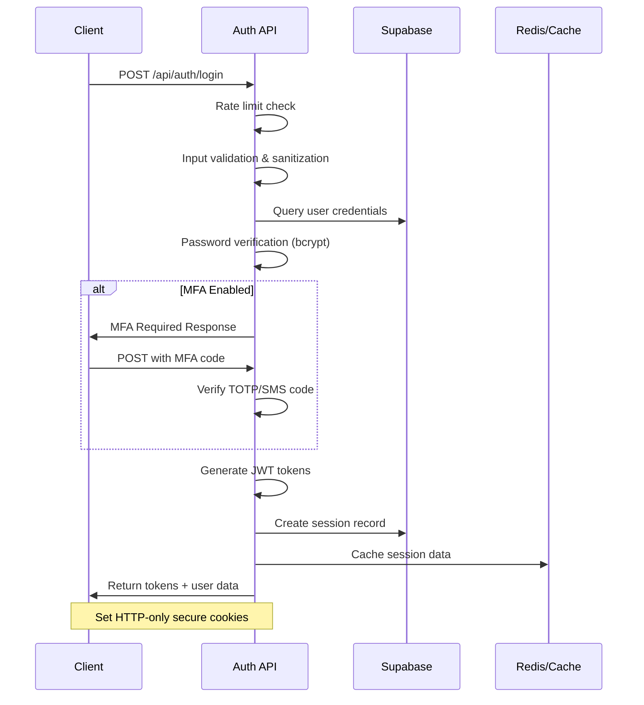

# Backend API Report - 7P Education Platform

## 🛠️ API Architecture Overview

7P Education Platform'un backend API'si, Next.js 15 App Router ile geliştirilmiş RESTful API tasarımına sahiptir. Sistem, modern güvenlik standartlarını karşılayan, scalable ve maintainable bir yapıda tasarlanmıştır.

## 🏗️ API Endpoint Structure

### API Directory Organization
```
src/app/api/
├── auth/                          # Authentication endpoints
│   ├── login/route.ts            # User login
│   ├── logout/route.ts           # User logout  
│   ├── register/route.ts         # User registration
│   ├── refresh/route.ts          # Token refresh
│   ├── reset-password/route.ts   # Password reset
│   ├── mfa/                      # Multi-factor authentication
│   │   ├── setup/route.ts        # MFA setup
│   │   ├── verify/route.ts       # MFA verification
│   │   └── verify-activate/route.ts # MFA activation
│   ├── sso/                      # Single Sign-On
│   │   ├── google/auth-url/route.ts
│   │   └── microsoft/auth-url/route.ts
│   ├── callback/                 # OAuth callbacks
│   │   ├── google/route.ts
│   │   └── microsoft/route.ts
│   └── sso-providers/route.ts    # SSO provider list
├── admin/                         # Admin-only endpoints
│   └── payments/
│       └── refund/route.ts       # Payment refund processing
├── courses/                       # Course management
│   ├── route.ts                  # Course listing
│   └── [courseId]/
│       ├── route.ts              # Course details
│       ├── enroll/route.ts       # Course enrollment
│       └── progress/route.ts     # Course progress tracking
├── lessons/                       # Lesson management
│   └── [lessonId]/
│       └── progress/route.ts     # Lesson progress update
├── marketplace/                   # Marketplace endpoints
│   └── route.ts                  # Marketplace course listing
├── payments/                      # Payment processing
│   ├── create-checkout-session/route.ts  # Stripe checkout
│   ├── create-payment-intent/route.ts    # Payment intent
│   ├── customer-portal/route.ts          # Customer portal
│   ├── history/route.ts                  # Payment history
│   └── subscriptions/route.ts            # Subscription management
└── webhooks/                      # External webhooks
    └── stripe/route.ts           # Stripe webhook handler
```

## 🔐 Authentication System Deep Dive

### JWT-Based Authentication Flow


### Security Implementation Details

#### Login Endpoint (`/api/auth/login`)
```typescript
// Enhanced security features
interface SecurityFeatures {
  // Rate limiting per IP
  rateLimit: {
    attempts: 5,
    window: '15m',
    lockoutDuration: '1h'
  },
  
  // Account lockout protection
  accountSecurity: {
    maxFailedAttempts: 5,
    lockoutDuration: '30m',
    progressive: true
  },
  
  // Input validation
  validation: {
    emailSanitization: true,
    passwordComplexity: true,
    sqlInjectionPrevention: true,
    xssPrevention: true
  },
  
  // Session management
  sessions: {
    jwtExpiration: '1h',
    refreshTokenExpiration: '7d',
    deviceFingerprinting: true,
    sessionTracking: true
  }
}

// Security audit trail
interface AuditLog {
  event: 'LOGIN_SUCCESS' | 'LOGIN_FAILED' | 'MFA_REQUIRED',
  userId?: string,
  ipAddress: string,
  userAgent: string,
  timestamp: string,
  metadata: {
    sessionId?: string,
    failureReason?: string,
    mfaUsed?: boolean
  }
}
```

#### MFA Implementation
```typescript
// Multi-Factor Authentication Support
export async function setupMFA(userId: string) {
  // Generate TOTP secret
  const secret = speakeasy.generateSecret({
    name: '7P Education',
    account: user.email,
    issuer: '7P Education Platform'
  });
  
  // Generate QR code for mobile apps
  const qrCode = await qrcode.toDataURL(secret.otpauth_url);
  
  // Store secret (encrypted) in database
  await securityService.storeMfaSecret(userId, secret.base32);
  
  return {
    secret: secret.base32,
    qrCode,
    backupCodes: generateBackupCodes()
  };
}
```

### Authorization Middleware
```typescript
// Role-based access control
interface UserRole {
  student: {
    permissions: ['view_courses', 'enroll_courses', 'view_progress'],
    restrictions: ['admin_access']
  },
  instructor: {
    permissions: ['view_courses', 'create_content', 'view_analytics'],
    restrictions: ['user_management']
  },
  admin: {
    permissions: ['*'],
    restrictions: []
  }
}

// Route protection middleware
export function withAuth(handler: NextApiHandler, requiredRole?: string) {
  return async (req: NextRequest, res: NextResponse) => {
    const token = getTokenFromRequest(req);
    
    if (!token) {
      return NextResponse.json({ error: 'Unauthorized' }, { status: 401 });
    }
    
    try {
      const payload = verifyJWT(token);
      
      if (requiredRole && !hasPermission(payload.role, requiredRole)) {
        return NextResponse.json({ error: 'Forbidden' }, { status: 403 });
      }
      
      req.user = payload;
      return handler(req, res);
    } catch (error) {
      return NextResponse.json({ error: 'Invalid token' }, { status: 401 });
    }
  };
}
```

## 💳 Payment System Architecture

### Stripe Integration Implementation
```typescript
// Payment flow endpoints
interface PaymentEndpoints {
  // Checkout session creation
  'POST /api/payments/create-checkout-session': {
    input: {
      type: 'subscription' | 'course' | 'bundle',
      planId?: string,
      courseId?: string,
      bundleId?: string,
      successUrl?: string,
      cancelUrl?: string
    },
    output: {
      sessionId: string,
      url: string
    }
  },
  
  // Payment intent for custom checkout
  'POST /api/payments/create-payment-intent': {
    input: {
      amount: number,
      currency: string,
      courseId?: string,
      metadata: Record<string, string>
    },
    output: {
      clientSecret: string,
      paymentIntentId: string
    }
  },
  
  // Customer portal for subscription management
  'POST /api/payments/customer-portal': {
    input: {
      returnUrl?: string
    },
    output: {
      url: string
    }
  }
}
```

### Webhook Processing
```typescript
// Stripe webhook handler (/api/webhooks/stripe)
export async function POST(request: NextRequest) {
  const signature = request.headers.get('stripe-signature');
  const payload = await request.text();
  
  try {
    // Verify webhook signature
    const event = stripe.webhooks.constructEvent(
      payload,
      signature!,
      process.env.STRIPE_WEBHOOK_SECRET!
    );
    
    switch (event.type) {
      case 'checkout.session.completed':
        await handleCheckoutCompleted(event.data.object);
        break;
        
      case 'invoice.payment_succeeded':
        await handlePaymentSucceeded(event.data.object);
        break;
        
      case 'customer.subscription.updated':
        await handleSubscriptionUpdated(event.data.object);
        break;
        
      case 'customer.subscription.deleted':
        await handleSubscriptionCanceled(event.data.object);
        break;
        
      default:
        console.log(`Unhandled event type: ${event.type}`);
    }
    
    return NextResponse.json({ received: true });
  } catch (error) {
    console.error('Webhook error:', error);
    return NextResponse.json(
      { error: 'Webhook processing failed' },
      { status: 400 }
    );
  }
}

// Process successful checkout
async function handleCheckoutCompleted(session: Stripe.Checkout.Session) {
  const { customer, metadata, line_items } = session;
  
  if (metadata?.type === 'course_purchase') {
    // Enroll user in course
    await enrollUserInCourse(metadata.userId, metadata.courseId);
    
    // Send confirmation email
    await sendPurchaseConfirmation(metadata.userId, metadata.courseId);
    
    // Update analytics
    await trackConversion(metadata.courseId, session.amount_total);
  }
}
```

## 📚 Course Management API

### Course Endpoints
```typescript
// Course API endpoints implementation
interface CourseAPI {
  // Get all courses
  'GET /api/courses': {
    query: {
      category?: string,
      level?: 'beginner' | 'intermediate' | 'advanced',
      search?: string,
      limit?: number,
      offset?: number
    },
    response: {
      courses: Course[],
      total: number,
      hasMore: boolean
    }
  },
  
  // Get specific course
  'GET /api/courses/[courseId]': {
    response: CourseDetail
  },
  
  // Enroll in course
  'POST /api/courses/[courseId]/enroll': {
    input: {
      paymentIntentId?: string
    },
    response: {
      success: boolean,
      enrollment: Enrollment
    }
  },
  
  // Update course progress
  'PUT /api/courses/[courseId]/progress': {
    input: {
      lessonId: string,
      progress: number,
      completed: boolean,
      timeSpent: number
    },
    response: {
      success: boolean,
      overallProgress: number
    }
  }
}
```

### Progress Tracking Implementation
```typescript
// Lesson progress tracking
export async function PUT(
  request: NextRequest,
  { params }: { params: { lessonId: string } }
) {
  try {
    const { progress, completed, timeSpent, quizScore } = await request.json();
    const user = await getCurrentUser(request);
    
    if (!user) {
      return NextResponse.json({ error: 'Unauthorized' }, { status: 401 });
    }
    
    // Update lesson progress
    const { data, error } = await supabase
      .from('lesson_progress')
      .upsert({
        user_id: user.id,
        lesson_id: params.lessonId,
        progress_percentage: progress,
        is_completed: completed,
        time_spent_seconds: timeSpent,
        quiz_score: quizScore,
        last_accessed_at: new Date().toISOString(),
        updated_at: new Date().toISOString()
      }, {
        onConflict: 'user_id,lesson_id'
      })
      .select()
      .single();
    
    if (error) throw error;
    
    // Calculate course completion
    const courseProgress = await calculateCourseProgress(user.id, data.course_id);
    
    // Award certificate if course completed
    if (courseProgress.isCompleted && !courseProgress.certificateIssued) {
      await issueCertificate(user.id, data.course_id);
    }
    
    // Update learning streak
    await updateLearningStreak(user.id);
    
    return NextResponse.json({
      success: true,
      lessonProgress: data,
      courseProgress
    });
    
  } catch (error) {
    console.error('Progress update error:', error);
    return NextResponse.json(
      { error: 'Failed to update progress' },
      { status: 500 }
    );
  }
}
```

## 🛡️ Security Implementation

### Input Validation & Sanitization
```typescript
// Security service implementation
class SecurityService {
  // Input sanitization
  sanitizeInput(input: string): string {
    return input
      .trim()
      .replace(/[<>]/g, '') // Remove potential XSS characters
      .substring(0, 1000);   // Limit length
  }
  
  // Email validation
  isValidEmail(email: string): boolean {
    const emailRegex = /^[^\s@]+@[^\s@]+\.[^\s@]+$/;
    return emailRegex.test(email) && email.length <= 254;
  }
  
  // Password strength validation
  validatePassword(password: string): {
    isValid: boolean,
    errors: string[]
  } {
    const errors = [];
    
    if (password.length < 8) {
      errors.push('Password must be at least 8 characters');
    }
    if (!/[A-Z]/.test(password)) {
      errors.push('Password must contain uppercase letter');
    }
    if (!/[a-z]/.test(password)) {
      errors.push('Password must contain lowercase letter');
    }
    if (!/\d/.test(password)) {
      errors.push('Password must contain number');
    }
    if (!/[!@#$%^&*]/.test(password)) {
      errors.push('Password must contain special character');
    }
    
    return {
      isValid: errors.length === 0,
      errors
    };
  }
  
  // Rate limiting
  async checkRateLimit(key: string, config: RateLimitConfig): Promise<{
    allowed: boolean,
    remaining: number,
    retryAfter?: number
  }> {
    // Implementation would use Redis or similar
    // For production: implement sliding window or token bucket
    return { allowed: true, remaining: 10 };
  }
}
```

### SQL Injection Prevention
```typescript
// Parameterized queries with Supabase
export async function getUserByEmail(email: string) {
  // Safe: Parameters are automatically sanitized
  const { data, error } = await supabase
    .from('users')
    .select('*')
    .eq('email', email)  // This is safe from SQL injection
    .single();
    
  return { data, error };
}

// Raw SQL (if needed) - use with extreme caution
export async function complexQuery(userId: string) {
  const { data, error } = await supabase
    .rpc('get_user_analytics', {
      p_user_id: userId  // Parameters prevent injection
    });
    
  return { data, error };
}
```

## 📊 Error Handling & Monitoring

### Centralized Error Handling
```typescript
// Global error handler
export class APIError extends Error {
  constructor(
    message: string,
    public statusCode: number = 500,
    public code?: string
  ) {
    super(message);
    this.name = 'APIError';
  }
}

// Error handling middleware
export function withErrorHandling(handler: NextApiHandler) {
  return async (req: NextRequest, res: NextResponse) => {
    try {
      return await handler(req, res);
    } catch (error) {
      console.error('API Error:', error);
      
      if (error instanceof APIError) {
        return NextResponse.json(
          { error: error.message, code: error.code },
          { status: error.statusCode }
        );
      }
      
      // Log unexpected errors
      await logError(error, req);
      
      return NextResponse.json(
        { error: 'Internal server error' },
        { status: 500 }
      );
    }
  };
}
```

### Logging & Analytics
```typescript
// Structured logging
interface LogEntry {
  level: 'info' | 'warn' | 'error',
  message: string,
  userId?: string,
  endpoint: string,
  method: string,
  statusCode: number,
  responseTime: number,
  ipAddress: string,
  userAgent: string,
  timestamp: string,
  metadata?: Record<string, any>
}

// Performance monitoring
export async function logAPICall(
  endpoint: string,
  method: string,
  statusCode: number,
  responseTime: number,
  userId?: string
) {
  const logEntry: LogEntry = {
    level: statusCode >= 400 ? 'error' : 'info',
    message: `${method} ${endpoint}`,
    userId,
    endpoint,
    method,
    statusCode,
    responseTime,
    ipAddress: getClientIP(),
    userAgent: getUserAgent(),
    timestamp: new Date().toISOString()
  };
  
  // Send to logging service (e.g., Winston, DataDog, etc.)
  await sendToLogger(logEntry);
}
```

## 🔄 Data Validation

### Request Validation Schemas
```typescript
// Zod schemas for type-safe validation
import { z } from 'zod';

export const LoginSchema = z.object({
  email: z.string()
    .email('Invalid email format')
    .max(254, 'Email too long'),
  password: z.string()
    .min(8, 'Password must be at least 8 characters')
    .max(128, 'Password too long'),
  mfa_code: z.string()
    .regex(/^\d{6}$/, 'MFA code must be 6 digits')
    .optional(),
  remember_me: z.boolean().optional()
});

export const CourseProgressSchema = z.object({
  lessonId: z.string().uuid('Invalid lesson ID'),
  progress: z.number()
    .min(0, 'Progress cannot be negative')
    .max(100, 'Progress cannot exceed 100%'),
  completed: z.boolean(),
  timeSpent: z.number()
    .min(0, 'Time spent cannot be negative'),
  quizScore: z.number()
    .min(0, 'Quiz score cannot be negative')
    .max(100, 'Quiz score cannot exceed 100%')
    .optional()
});

// Usage in API endpoints
export async function POST(request: NextRequest) {
  try {
    const body = await request.json();
    const validatedData = LoginSchema.parse(body);
    
    // Continue with validated data
    // TypeScript now knows the exact shape of validatedData
    
  } catch (error) {
    if (error instanceof z.ZodError) {
      return NextResponse.json(
        { 
          error: 'Validation failed',
          details: error.errors
        },
        { status: 400 }
      );
    }
    
    throw error;
  }
}
```

## 📈 Performance Optimization

### Caching Strategies
```typescript
// Response caching
export async function GET(request: NextRequest) {
  const url = new URL(request.url);
  const cacheKey = `courses:${url.searchParams.toString()}`;
  
  // Check cache first
  const cached = await redis.get(cacheKey);
  if (cached) {
    return NextResponse.json(JSON.parse(cached), {
      headers: {
        'Cache-Control': 'public, max-age=300', // 5 minutes
        'X-Cache': 'HIT'
      }
    });
  }
  
  // Fetch fresh data
  const courses = await fetchCourses(url.searchParams);
  
  // Cache the result
  await redis.setex(cacheKey, 300, JSON.stringify(courses));
  
  return NextResponse.json(courses, {
    headers: {
      'Cache-Control': 'public, max-age=300',
      'X-Cache': 'MISS'
    }
  });
}
```

### Database Query Optimization
```typescript
// Optimized queries with proper indexing
export async function getCourseWithProgress(courseId: string, userId: string) {
  // Single query instead of multiple round trips
  const { data, error } = await supabase
    .from('courses')
    .select(`
      *,
      modules:course_modules(
        *,
        lessons:module_lessons(
          *,
          progress:lesson_progress(
            progress_percentage,
            is_completed
          )
        )
      ),
      user_progress:course_enrollments(
        progress_percentage,
        completed_at,
        enrolled_at
      )
    `)
    .eq('id', courseId)
    .eq('user_progress.user_id', userId)
    .eq('modules.lessons.progress.user_id', userId)
    .single();
    
  return { data, error };
}
```

## 🔗 External Integrations

### Supabase Integration
```typescript
// Supabase client configuration
import { createClient } from '@supabase/supabase-js';

const supabase = createClient(
  process.env.NEXT_PUBLIC_SUPABASE_URL!,
  process.env.SUPABASE_SERVICE_ROLE_KEY!, // Server-side key
  {
    auth: {
      autoRefreshToken: false,
      persistSession: false
    },
    db: {
      schema: 'public'
    }
  }
);

// Row Level Security (RLS) policies
/*
-- Users can only access their own data
CREATE POLICY "Users can view own profile" ON profiles
  FOR SELECT USING (auth.uid() = user_id);

-- Students can only enroll in published courses
CREATE POLICY "Students can enroll in published courses" ON course_enrollments
  FOR INSERT WITH CHECK (
    EXISTS (
      SELECT 1 FROM courses 
      WHERE id = course_id AND is_published = true
    )
  );
*/
```

### Stripe Integration Details
```typescript
// Stripe configuration
const stripe = new Stripe(process.env.STRIPE_SECRET_KEY!, {
  apiVersion: '2023-10-16',
  typescript: true,
});

// Webhook signature verification
export function verifyStripeWebhook(
  payload: string,
  signature: string
): Stripe.Event {
  try {
    return stripe.webhooks.constructEvent(
      payload,
      signature,
      process.env.STRIPE_WEBHOOK_SECRET!
    );
  } catch (error) {
    throw new APIError('Invalid webhook signature', 400);
  }
}
```

## 🎯 API Testing Strategy

### Unit Testing
```typescript
// API endpoint testing with Jest
import { testApiHandler } from 'next-test-api-route-handler';
import handler from '@/app/api/auth/login/route';

describe('/api/auth/login', () => {
  test('should login with valid credentials', async () => {
    await testApiHandler({
      handler,
      test: async ({ fetch }) => {
        const response = await fetch({
          method: 'POST',
          headers: { 'Content-Type': 'application/json' },
          body: JSON.stringify({
            email: 'test@example.com',
            password: 'ValidPassword123!'
          })
        });
        
        expect(response.status).toBe(200);
        
        const data = await response.json();
        expect(data.success).toBe(true);
        expect(data.access_token).toBeDefined();
        expect(data.user).toBeDefined();
      }
    });
  });
  
  test('should reject invalid credentials', async () => {
    await testApiHandler({
      handler,
      test: async ({ fetch }) => {
        const response = await fetch({
          method: 'POST',
          headers: { 'Content-Type': 'application/json' },
          body: JSON.stringify({
            email: 'test@example.com',
            password: 'wrongpassword'
          })
        });
        
        expect(response.status).toBe(401);
        
        const data = await response.json();
        expect(data.success).toBe(false);
        expect(data.error).toContain('Invalid email or password');
      }
    });
  });
});
```

## 📊 API Performance Metrics

### Key Performance Indicators
```
Response Time Targets:
- Authentication: < 200ms
- Course listing: < 300ms
- Payment processing: < 500ms
- File uploads: < 2s

Throughput Targets:
- Login requests: 100 req/sec
- Course API: 200 req/sec
- Payment API: 50 req/sec

Availability Targets:
- Authentication: 99.9%
- Course API: 99.5%
- Payment API: 99.9%
```

### Monitoring Implementation
```typescript
// Performance monitoring middleware
export function withMetrics(handler: NextApiHandler) {
  return async (req: NextRequest, res: NextResponse) => {
    const startTime = Date.now();
    
    try {
      const response = await handler(req, res);
      
      const responseTime = Date.now() - startTime;
      
      // Log metrics
      await logAPICall(
        req.url!,
        req.method!,
        response.status,
        responseTime,
        req.user?.id
      );
      
      return response;
    } catch (error) {
      const responseTime = Date.now() - startTime;
      
      await logAPICall(
        req.url!,
        req.method!,
        500,
        responseTime,
        req.user?.id
      );
      
      throw error;
    }
  };
}
```

---

**Sonuç:** 7P Education Platform'un backend API'si, modern güvenlik standartları, kapsamlı error handling, performance optimization ve comprehensive testing ile production-ready bir sistem sunar. JWT-based authentication, Stripe payments, Supabase integration ve RESTful design principles ile scalable ve maintainable bir architecture sağlar.