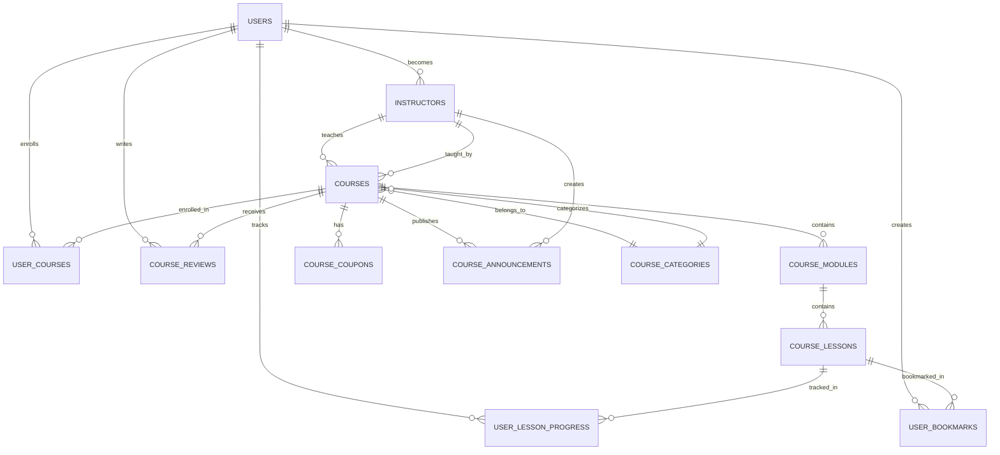

# Database Schema Report - 7P Education Platform

## 🗄️ Database Architecture Overview

7P Education Platform, PostgreSQL ve Supabase teknolojileri üzerine kurulmuş kapsamlı bir veritabanı şemasına sahiptir. Sistem, normalized database design principles takip ederek courses, users, progress tracking ve payment management için optimize edilmiş tablolar içerir.

## 🏗️ Schema Structure Overview



## 📊 Core Tables Analysis

### 1. Users Table (Base Authentication)
```sql
-- Users table (inherited from Supabase Auth)
-- Extended with custom profile fields
CREATE TABLE users (
    id UUID PRIMARY KEY,
    email VARCHAR(255) UNIQUE NOT NULL,
    encrypted_password VARCHAR(255),
    email_confirmed_at TIMESTAMPTZ,
    last_sign_in_at TIMESTAMPTZ,
    raw_app_meta_data JSONB,
    raw_user_meta_data JSONB,
    created_at TIMESTAMPTZ DEFAULT NOW(),
    updated_at TIMESTAMPTZ DEFAULT NOW(),
    
    -- Extended fields for 7P Education
    full_name VARCHAR(255),
    avatar_url TEXT,
    phone VARCHAR(20),
    date_of_birth DATE,
    timezone VARCHAR(50) DEFAULT 'Europe/Istanbul',
    language VARCHAR(10) DEFAULT 'tr',
    notification_preferences JSONB DEFAULT '{}',
    learning_preferences JSONB DEFAULT '{}',
    social_profiles JSONB DEFAULT '{}'
);
```

### 2. Course Categories (Taxonomy)
```sql
CREATE TABLE course_categories (
    id UUID PRIMARY KEY DEFAULT uuid_generate_v4(),
    name VARCHAR(255) NOT NULL UNIQUE,          -- "Amazon FBA", "Dijital Pazarlama"
    description TEXT,
    slug VARCHAR(255) NOT NULL UNIQUE,          -- "amazon-fba", "dijital-pazarlama"
    parent_id UUID REFERENCES course_categories(id), -- Hierarchical structure
    icon VARCHAR(100),                           -- Icon name for UI
    color VARCHAR(50),                          -- Theme color
    display_order INTEGER DEFAULT 0,            -- Sort order
    active BOOLEAN DEFAULT true,
    created_at TIMESTAMPTZ DEFAULT NOW(),
    updated_at TIMESTAMPTZ DEFAULT NOW()
);

-- Sample categories for 7P Education
INSERT INTO course_categories (name, slug, icon, color) VALUES
('Mentorluk', 'mentorluk', 'users', 'blue'),
('Dijital Pazarlama', 'dijital-pazarlama', 'trending-up', 'green'),
('E-ticaret', 'e-ticaret', 'shopping-cart', 'purple'),
('Teknoloji', 'teknoloji', 'code', 'orange');
```

### 3. Instructors (Course Teachers)
```sql
CREATE TABLE instructors (
    id UUID PRIMARY KEY DEFAULT uuid_generate_v4(),
    user_id UUID REFERENCES users(id) ON DELETE CASCADE,
    display_name VARCHAR(255) NOT NULL,         -- "7P Education Ekibi"
    bio TEXT,                                   -- Instructor biography
    avatar_url TEXT,
    expertise TEXT[],                           -- Array of expertise areas
    rating DECIMAL(3,2) DEFAULT 0.0,           -- Average instructor rating
    total_students INTEGER DEFAULT 0,           -- Student count across all courses
    total_courses INTEGER DEFAULT 0,            -- Number of courses taught
    social_links JSONB DEFAULT '{}',           -- Social media profiles
    verified BOOLEAN DEFAULT false,             -- Verified instructor badge
    created_at TIMESTAMPTZ DEFAULT NOW(),
    updated_at TIMESTAMPTZ DEFAULT NOW(),
    metadata JSONB DEFAULT '{}'                 -- Additional instructor data
);
```

### 4. Courses (Main Content)
```sql
CREATE TABLE courses (
    id UUID PRIMARY KEY DEFAULT uuid_generate_v4(),
    title VARCHAR(255) NOT NULL,               -- "Amazon Full Mentorluk Eğitimi"
    slug VARCHAR(255) NOT NULL UNIQUE,         -- "amazon-full-mentorluk-egitimi"
    description TEXT,                          -- Full course description
    short_description VARCHAR(500),            -- Brief summary
    thumbnail_url TEXT,                        -- Course image
    preview_video_url TEXT,                    -- Promotional video
    
    -- Pricing
    price DECIMAL(10,2) NOT NULL DEFAULT 0.00, -- Current price (2999.00)
    original_price DECIMAL(10,2),             -- Original price for discounts
    currency VARCHAR(3) DEFAULT 'TRY',        -- Turkish Lira
    
    -- Relations
    instructor_id UUID REFERENCES instructors(id),
    category_id UUID REFERENCES course_categories(id),
    
    -- Course metadata
    level VARCHAR(20) DEFAULT 'beginner' 
        CHECK (level IN ('beginner', 'intermediate', 'advanced')),
    language VARCHAR(10) DEFAULT 'tr',
    duration_hours DECIMAL(5,2),              -- Total course duration
    total_lessons INTEGER DEFAULT 0,          -- Calculated field
    
    -- Course content arrays
    requirements TEXT[],                       -- Prerequisites
    what_you_learn TEXT[],                    -- Learning outcomes
    target_audience TEXT[],                   -- Target demographics
    
    -- Ratings and engagement
    rating DECIMAL(3,2) DEFAULT 0.0,         -- Average rating (4.9)
    total_ratings INTEGER DEFAULT 0,          -- Number of reviews
    total_students INTEGER DEFAULT 0,         -- Enrollment count
    
    -- Publishing
    is_published BOOLEAN DEFAULT false,       -- Public visibility
    is_featured BOOLEAN DEFAULT false,        -- Featured on homepage
    published_at TIMESTAMPTZ,
    status VARCHAR(20) DEFAULT 'draft' 
        CHECK (status IN ('draft', 'review', 'published', 'archived')),
    
    -- SEO and discovery
    tags TEXT[],                              -- Course tags
    seo_title VARCHAR(255),
    seo_description VARCHAR(500),
    
    created_at TIMESTAMPTZ DEFAULT NOW(),
    updated_at TIMESTAMPTZ DEFAULT NOW(),
    metadata JSONB DEFAULT '{}'               -- Additional course data
);
```

### 5. Course Modules (Content Organization)
```sql
CREATE TABLE course_modules (
    id UUID PRIMARY KEY DEFAULT uuid_generate_v4(),
    course_id UUID REFERENCES courses(id) ON DELETE CASCADE,
    title VARCHAR(255) NOT NULL,              -- "Uygulama Etkinliği Canlı Yayını"
    description TEXT,                         -- Module description
    order_index INTEGER NOT NULL,            -- Sequential ordering (1, 2, 3...)
    duration_hours DECIMAL(5,2),             -- Module duration
    is_preview BOOLEAN DEFAULT false,        -- Preview module
    created_at TIMESTAMPTZ DEFAULT NOW(),
    updated_at TIMESTAMPTZ DEFAULT NOW(),
    UNIQUE(course_id, order_index)           -- Prevent duplicate orders
);
```

### 6. Course Lessons (Individual Content)
```sql
CREATE TABLE course_lessons (
    id UUID PRIMARY KEY DEFAULT uuid_generate_v4(),
    module_id UUID REFERENCES course_modules(id) ON DELETE CASCADE,
    course_id UUID REFERENCES courses(id) ON DELETE CASCADE,
    title VARCHAR(255) NOT NULL,             -- "Canlı Yayın Açılış ve Genel Bakış"
    slug VARCHAR(255) NOT NULL,              -- "canli-yayin-acilis-genel-bakis"
    description TEXT,
    content TEXT,                            -- Lesson content/notes
    
    -- Video content
    video_url TEXT,                          -- Video file URL
    video_duration INTEGER,                  -- Duration in seconds
    
    -- Lesson metadata
    lesson_type VARCHAR(20) DEFAULT 'video' 
        CHECK (lesson_type IN ('video', 'text', 'quiz', 'assignment', 'resource')),
    order_index INTEGER NOT NULL,            -- Lesson order within module
    is_preview BOOLEAN DEFAULT false,        -- Free preview lesson
    is_free BOOLEAN DEFAULT false,           -- Completely free lesson
    
    -- Additional resources
    resources JSONB DEFAULT '[]',            -- PDFs, links, downloads
    transcript TEXT,                         -- Video transcript
    notes TEXT,                             -- Instructor notes
    
    created_at TIMESTAMPTZ DEFAULT NOW(),
    updated_at TIMESTAMPTZ DEFAULT NOW(),
    UNIQUE(module_id, order_index),         -- Ordered within module
    UNIQUE(course_id, slug)                 -- Unique URL within course
);
```

## 👤 User Progress & Enrollment

### 7. User Course Enrollments
```sql
CREATE TABLE user_courses (
    id UUID PRIMARY KEY DEFAULT uuid_generate_v4(),
    user_id UUID REFERENCES users(id) ON DELETE CASCADE,
    course_id UUID REFERENCES courses(id) ON DELETE CASCADE,
    
    -- Enrollment tracking
    enrolled_at TIMESTAMPTZ DEFAULT NOW(),
    completed_at TIMESTAMPTZ,               -- Course completion timestamp
    progress_percentage DECIMAL(5,2) DEFAULT 0.00 
        CHECK (progress_percentage >= 0 AND progress_percentage <= 100),
    last_accessed TIMESTAMPTZ DEFAULT NOW(),
    time_spent INTEGER DEFAULT 0,          -- Total time in seconds
    
    -- Certification
    certificate_issued BOOLEAN DEFAULT false,
    certificate_url TEXT,                  -- Certificate download URL
    
    -- Status management
    status VARCHAR(20) DEFAULT 'active' 
        CHECK (status IN ('active', 'completed', 'paused', 'cancelled', 'refunded')),
    
    -- Reviews
    rating INTEGER CHECK (rating >= 1 AND rating <= 5),
    review TEXT,
    review_date TIMESTAMPTZ,
    
    -- Payment tracking
    payment_id TEXT,                       -- Stripe payment reference
    purchase_price DECIMAL(10,2),         -- Price paid
    refund_requested BOOLEAN DEFAULT false,
    refund_processed BOOLEAN DEFAULT false,
    
    created_at TIMESTAMPTZ DEFAULT NOW(),
    updated_at TIMESTAMPTZ DEFAULT NOW(),
    metadata JSONB DEFAULT '{}',
    UNIQUE(user_id, course_id)            -- One enrollment per user per course
);
```

### 8. Lesson Progress Tracking
```sql
CREATE TABLE user_lesson_progress (
    id UUID PRIMARY KEY DEFAULT uuid_generate_v4(),
    user_id UUID REFERENCES users(id) ON DELETE CASCADE,
    course_id UUID REFERENCES courses(id) ON DELETE CASCADE,
    lesson_id UUID REFERENCES course_lessons(id) ON DELETE CASCADE,
    module_id UUID REFERENCES course_modules(id) ON DELETE CASCADE,
    
    -- Progress tracking
    completed BOOLEAN DEFAULT false,        -- Lesson completed
    completed_at TIMESTAMPTZ,              -- Completion timestamp
    time_spent INTEGER DEFAULT 0,          -- Time spent in seconds
    progress_percentage DECIMAL(5,2) DEFAULT 0.00, -- Lesson progress
    last_position INTEGER DEFAULT 0,       -- Video playback position
    
    -- User interactions
    notes TEXT,                           -- User notes for lesson
    bookmarked BOOLEAN DEFAULT false,     -- Lesson bookmarked
    
    created_at TIMESTAMPTZ DEFAULT NOW(),
    updated_at TIMESTAMPTZ DEFAULT NOW(),
    UNIQUE(user_id, lesson_id)           -- One progress record per user per lesson
);
```

## 📝 Reviews & Social Features

### 9. Course Reviews
```sql
CREATE TABLE course_reviews (
    id UUID PRIMARY KEY DEFAULT uuid_generate_v4(),
    course_id UUID REFERENCES courses(id) ON DELETE CASCADE,
    user_id UUID REFERENCES users(id) ON DELETE CASCADE,
    rating INTEGER NOT NULL CHECK (rating >= 1 AND rating <= 5),
    review TEXT,                          -- Written review
    helpful_votes INTEGER DEFAULT 0,      -- Community helpful votes
    reported BOOLEAN DEFAULT false,       -- Reported for moderation
    approved BOOLEAN DEFAULT true,        -- Admin approved
    created_at TIMESTAMPTZ DEFAULT NOW(),
    updated_at TIMESTAMPTZ DEFAULT NOW(),
    UNIQUE(course_id, user_id)           -- One review per user per course
);
```

### 10. User Bookmarks
```sql
CREATE TABLE user_bookmarks (
    id UUID PRIMARY KEY DEFAULT uuid_generate_v4(),
    user_id UUID REFERENCES users(id) ON DELETE CASCADE,
    lesson_id UUID REFERENCES course_lessons(id) ON DELETE CASCADE,
    course_id UUID REFERENCES courses(id) ON DELETE CASCADE,
    title VARCHAR(255),                   -- Bookmark title
    notes TEXT,                          -- User notes
    timestamp_seconds INTEGER DEFAULT 0, -- Video bookmark position
    created_at TIMESTAMPTZ DEFAULT NOW(),
    UNIQUE(user_id, lesson_id, timestamp_seconds) -- Multiple bookmarks per lesson
);
```

## 💰 Commerce & Coupons

### 11. Course Coupons
```sql
CREATE TABLE course_coupons (
    id UUID PRIMARY KEY DEFAULT uuid_generate_v4(),
    code VARCHAR(50) NOT NULL UNIQUE,        -- "SUMMER2024", "NEWSTUDENT"
    course_id UUID REFERENCES courses(id) ON DELETE CASCADE,
    
    -- Discount configuration
    discount_type VARCHAR(10) DEFAULT 'percentage' 
        CHECK (discount_type IN ('percentage', 'fixed')),
    discount_value DECIMAL(10,2) NOT NULL,   -- 20.00 (for 20% or 20 TRY)
    
    -- Usage limits
    max_uses INTEGER,                        -- Maximum usage count
    used_count INTEGER DEFAULT 0,           -- Current usage count
    
    -- Validity period
    valid_from TIMESTAMPTZ DEFAULT NOW(),
    valid_until TIMESTAMPTZ,
    active BOOLEAN DEFAULT true,
    
    created_by UUID REFERENCES users(id) ON DELETE SET NULL,
    created_at TIMESTAMPTZ DEFAULT NOW(),
    updated_at TIMESTAMPTZ DEFAULT NOW()
);
```

### 12. Course Announcements
```sql
CREATE TABLE course_announcements (
    id UUID PRIMARY KEY DEFAULT uuid_generate_v4(),
    course_id UUID REFERENCES courses(id) ON DELETE CASCADE,
    instructor_id UUID REFERENCES instructors(id) ON DELETE CASCADE,
    title VARCHAR(255) NOT NULL,
    content TEXT NOT NULL,
    priority VARCHAR(10) DEFAULT 'normal' 
        CHECK (priority IN ('low', 'normal', 'high', 'urgent')),
    published BOOLEAN DEFAULT false,
    published_at TIMESTAMPTZ,
    created_at TIMESTAMPTZ DEFAULT NOW(),
    updated_at TIMESTAMPTZ DEFAULT NOW()
);
```

## 🗄️ Database Indexes for Performance

### Primary Performance Indexes
```sql
-- Course discovery and filtering
CREATE INDEX idx_courses_is_published ON courses(is_published);
CREATE INDEX idx_courses_is_featured ON courses(is_featured);
CREATE INDEX idx_courses_category_id ON courses(category_id);
CREATE INDEX idx_courses_price ON courses(price);
CREATE INDEX idx_courses_rating ON courses(rating);
CREATE INDEX idx_courses_created_at ON courses(created_at);

-- User progress tracking
CREATE INDEX idx_user_courses_user_id ON user_courses(user_id);
CREATE INDEX idx_user_courses_progress ON user_courses(progress_percentage);
CREATE INDEX idx_user_lesson_progress_user_id ON user_lesson_progress(user_id);
CREATE INDEX idx_user_lesson_progress_completed ON user_lesson_progress(completed);

-- Content organization
CREATE INDEX idx_course_modules_course_id ON course_modules(course_id);
CREATE INDEX idx_course_lessons_course_id ON course_lessons(course_id);
CREATE INDEX idx_course_lessons_lesson_type ON course_lessons(lesson_type);

-- Reviews and ratings
CREATE INDEX idx_course_reviews_course_id ON course_reviews(course_id);
CREATE INDEX idx_course_reviews_approved ON course_reviews(approved);

-- Coupons and promotions
CREATE INDEX idx_course_coupons_code ON course_coupons(code);
CREATE INDEX idx_course_coupons_active ON course_coupons(active);
CREATE INDEX idx_course_coupons_valid_until ON course_coupons(valid_until);
```

## 🔧 Database Functions & Triggers

### 1. Automatic Course Rating Updates
```sql
CREATE OR REPLACE FUNCTION update_course_rating()
RETURNS TRIGGER AS $$
BEGIN
    -- Recalculate course rating when review changes
    UPDATE courses SET
        rating = (
            SELECT AVG(rating)::DECIMAL(3,2)
            FROM course_reviews
            WHERE course_id = NEW.course_id AND approved = true
        ),
        total_ratings = (
            SELECT COUNT(*)
            FROM course_reviews
            WHERE course_id = NEW.course_id AND approved = true
        )
    WHERE id = NEW.course_id;
    
    RETURN NEW;
END;
$$ LANGUAGE plpgsql;

-- Trigger on review changes
CREATE TRIGGER update_course_rating_trigger
    AFTER INSERT OR UPDATE OR DELETE ON course_reviews
    FOR EACH ROW
    EXECUTE FUNCTION update_course_rating();
```

### 2. User Course Progress Calculation
```sql
CREATE OR REPLACE FUNCTION update_user_course_progress()
RETURNS TRIGGER AS $$
DECLARE
    total_lessons INTEGER;
    completed_lessons INTEGER;
    new_progress DECIMAL(5,2);
BEGIN
    -- Calculate progress when lesson completed
    SELECT COUNT(*) INTO total_lessons
    FROM course_lessons
    WHERE course_id = NEW.course_id;
    
    SELECT COUNT(*) INTO completed_lessons
    FROM user_lesson_progress
    WHERE user_id = NEW.user_id
    AND course_id = NEW.course_id
    AND completed = true;
    
    -- Calculate percentage
    IF total_lessons > 0 THEN
        new_progress := (completed_lessons::DECIMAL / total_lessons::DECIMAL) * 100;
    ELSE
        new_progress := 0;
    END IF;
    
    -- Update course enrollment progress
    UPDATE user_courses SET
        progress_percentage = new_progress,
        completed_at = CASE 
            WHEN new_progress = 100 AND completed_at IS NULL THEN NOW()
            WHEN new_progress < 100 THEN NULL
            ELSE completed_at
        END,
        status = CASE
            WHEN new_progress = 100 THEN 'completed'
            ELSE status
        END,
        updated_at = NOW()
    WHERE user_id = NEW.user_id AND course_id = NEW.course_id;
    
    RETURN NEW;
END;
$$ LANGUAGE plpgsql;

-- Trigger on lesson progress updates
CREATE TRIGGER update_user_course_progress_trigger
    AFTER INSERT OR UPDATE ON user_lesson_progress
    FOR EACH ROW
    EXECUTE FUNCTION update_user_course_progress();
```

## 🛡️ Row Level Security (RLS)

### Security Policies
```sql
-- Enable RLS on all tables
ALTER TABLE courses ENABLE ROW LEVEL SECURITY;
ALTER TABLE user_courses ENABLE ROW LEVEL SECURITY;
ALTER TABLE user_lesson_progress ENABLE ROW LEVEL SECURITY;
ALTER TABLE course_reviews ENABLE ROW LEVEL SECURITY;

-- Public access to published courses
CREATE POLICY "Anyone can view published courses" 
ON courses FOR SELECT 
USING (is_published = true);

-- Users can only access enrolled course content
CREATE POLICY "Enrolled users can view course lessons" 
ON course_lessons FOR SELECT 
USING (
    EXISTS (
        SELECT 1 FROM user_courses 
        WHERE user_courses.course_id = course_lessons.course_id 
        AND user_courses.user_id = auth.uid()
        AND user_courses.status = 'active'
    )
);

-- Users can only view/modify their own data
CREATE POLICY "Users can view their own enrollments" 
ON user_courses FOR SELECT 
USING (auth.uid() = user_id);

CREATE POLICY "Users can update their own progress" 
ON user_lesson_progress FOR ALL 
USING (auth.uid() = user_id);

-- Review moderation
CREATE POLICY "Anyone can view approved reviews" 
ON course_reviews FOR SELECT 
USING (approved = true);
```

## 📊 Sample Data Structure

### Course Data Example (Amazon FBA)
```sql
-- Sample course with full structure
INSERT INTO courses (
    title, slug, description, price, original_price,
    instructor_id, category_id, level, duration_hours,
    is_published, is_featured
) VALUES (
    'Amazon Full Mentorluk Eğitimi',
    'amazon-full-mentorluk-egitimi',
    'Amazon FBA ile e-ticaret dünyasında başarılı olmanız için gereken tüm bilgileri kapsayan kapsamlı mentorluk programı',
    2999.00,
    4999.00,
    (SELECT id FROM instructors WHERE display_name = '7P Education Ekibi'),
    (SELECT id FROM course_categories WHERE slug = 'mentorluk'),
    'intermediate',
    120.0,
    true,
    true
);

-- Sample module
INSERT INTO course_modules (course_id, title, order_index) VALUES
((SELECT id FROM courses WHERE slug = 'amazon-full-mentorluk-egitimi'),
 'Uygulama Etkinliği Canlı Yayını', 1);

-- Sample lessons
INSERT INTO course_lessons (
    module_id, course_id, title, slug, lesson_type, order_index, video_duration
) VALUES
((SELECT id FROM course_modules WHERE title = 'Uygulama Etkinliği Canlı Yayını'),
 (SELECT id FROM courses WHERE slug = 'amazon-full-mentorluk-egitimi'),
 'Canlı Yayın Açılış ve Genel Bakış',
 'canli-yayin-acilis-genel-bakis',
 'video', 1, 2700);
```

## 🔍 Query Optimization Examples

### Efficient Course Discovery Query
```sql
-- Optimized course listing with filtering
SELECT 
    c.id, c.title, c.slug, c.price, c.rating, c.total_students,
    cat.name as category_name,
    inst.display_name as instructor_name
FROM courses c
LEFT JOIN course_categories cat ON c.category_id = cat.id
LEFT JOIN instructors inst ON c.instructor_id = inst.id
WHERE c.is_published = true
    AND ($1::text IS NULL OR cat.slug = $1)  -- Category filter
    AND ($2::text IS NULL OR c.level = $2)   -- Level filter
    AND ($3::decimal IS NULL OR c.price <= $3) -- Price filter
ORDER BY 
    CASE WHEN $4 = 'rating' THEN c.rating END DESC,
    CASE WHEN $4 = 'price' THEN c.price END ASC,
    CASE WHEN $4 = 'newest' THEN c.created_at END DESC,
    c.is_featured DESC,
    c.total_students DESC
LIMIT $5 OFFSET $6;
```

### User Progress Dashboard Query
```sql
-- Single query for user dashboard
SELECT 
    c.id, c.title, c.thumbnail_url,
    uc.progress_percentage, uc.last_accessed,
    (
        SELECT COUNT(*) 
        FROM user_lesson_progress ulp 
        WHERE ulp.user_id = $1 AND ulp.course_id = c.id AND ulp.completed = true
    ) as completed_lessons,
    (
        SELECT COUNT(*) 
        FROM course_lessons cl 
        WHERE cl.course_id = c.id
    ) as total_lessons
FROM user_courses uc
JOIN courses c ON uc.course_id = c.id
WHERE uc.user_id = $1 AND uc.status = 'active'
ORDER BY uc.last_accessed DESC;
```

## 📈 Performance Metrics

### Database Performance Targets
```
Query Response Times:
- Course listing: < 100ms
- User dashboard: < 150ms
- Lesson content: < 50ms
- Progress updates: < 30ms

Concurrency Targets:
- Read operations: 1000+ req/sec
- Write operations: 200+ req/sec
- Progress updates: 500+ req/sec

Storage Efficiency:
- Table size optimization with proper indexing
- JSONB for flexible metadata (< 2KB per record)
- Efficient foreign key relationships
```

### Index Usage Analysis
```sql
-- Monitor index usage
SELECT schemaname, tablename, indexname, idx_tup_read, idx_tup_fetch
FROM pg_stat_user_indexes
WHERE schemaname = 'public'
ORDER BY idx_tup_read DESC;

-- Table size monitoring
SELECT 
    tablename,
    pg_size_pretty(pg_total_relation_size(tablename::regclass)) as size
FROM pg_tables 
WHERE schemaname = 'public'
ORDER BY pg_total_relation_size(tablename::regclass) DESC;
```

## 🔄 Migration Strategy

### Migration Files Structure
```
supabase/migrations/
├── 001_sso_schema.sql           # SSO configuration
├── 002_user_creation_trigger.sql # User profile triggers  
└── 003_course_system_schema.sql  # Complete course system
```

### Backward Compatibility
- All migrations use `IF NOT EXISTS` clauses
- Constraint additions with validation
- Index creation without locking
- Data migration with rollback support

---

**Sonuç:** 7P Education Platform'un database schema'sı, modern PostgreSQL özelliklerini kullanarak scalable, performant ve maintainable bir structure sağlar. RLS policies ile security, automated triggers ile data consistency ve comprehensive indexing ile performance optimization sunar.