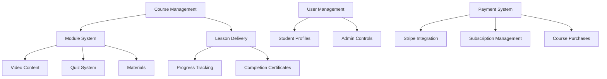

# Feature Analysis Report - 7P Education Platform

## 🎯 Platform Feature Overview

7P Education Platform Amazon FBA ve E-ticaret eğitimi odaklı comprehensive bir online learning platform'udur. Ana feature'lar eğitim management, öğrenci progress tracking, payment processing ve admin yönetimi üzerine kurulmuştur.

## 🏗️ Core Business Logic

### Education System Architecture


## 📚 Education Management Features

### 1. Course System
```typescript
// Core Course Structure
interface Course {
  id: string;
  title: string;
  slug: string;
  description: string;
  short_description?: string;
  thumbnail_url?: string;
  
  // Pricing
  price: number;
  original_price?: number;
  is_free: boolean;
  
  // Metadata
  level: 'beginner' | 'intermediate' | 'advanced';
  category: string;
  tags: string[];
  
  // Analytics
  rating?: number;
  total_students?: number;
  is_featured: boolean;
  
  // Status
  status: 'published' | 'draft' | 'archived';
  published_at?: string;
  created_at: string;
  updated_at: string;
}

// Business Features:
- Hierarchical content structure (Course → Module → Lesson)
- Multi-media content support (video, quiz, materials)
- Dynamic pricing with discount system
- Course bundling for bulk sales
- Progress tracking across all levels
- Achievement and certification system
```

### 2. Module & Lesson System
```typescript
// Module Structure
interface Module {
  id: string;
  course_id: string;
  title: string;
  description?: string;
  order_index: number;
  
  // Content
  lessons: Lesson[];
  estimated_duration: number; // minutes
  
  // Progress
  is_locked: boolean;
  unlock_condition?: string;
  
  // Status
  status: 'active' | 'draft';
  created_at: string;
}

// Lesson Structure with Multiple Content Types
interface Lesson {
  id: string;
  module_id: string;
  title: string;
  description?: string;
  
  // Content Types
  type: 'video' | 'text' | 'quiz' | 'assignment';
  content: {
    video_url?: string;
    video_duration?: number;
    transcript?: string;
    text_content?: string;
    quiz_id?: string;
  };
  
  // Learning Path
  order_index: number;
  is_required: boolean;
  estimated_duration: number;
  
  // Access Control
  is_free: boolean;
  unlock_condition?: string;
  
  // Completion
  completion_criteria: {
    watch_percentage?: number; // for videos
    quiz_passing_score?: number; // for quizzes
  };
}

// Business Features:
- Sequential learning with unlock conditions
- Mixed content types in single lesson flow
- Automatic progress calculation
- Time-based analytics and estimations
- Flexible completion criteria
```

### 3. Advanced Quiz System
```typescript
// Quiz Configuration
interface Quiz {
  id: string;
  lesson_id?: string;
  title: string;
  description?: string;
  
  // Quiz Settings
  time_limit?: number; // minutes
  attempts_allowed: number;
  passing_score: number; // percentage
  randomize_questions: boolean;
  randomize_options: boolean;
  
  // Questions
  questions: QuizQuestion[];
  
  // Analytics
  completion_rate: number;
  average_score: number;
  
  status: 'active' | 'draft';
  created_at: string;
}

// Question Types & Difficulty
interface QuizQuestion {
  id: string;
  quiz_id: string;
  question: string;
  type: 'multiple_choice' | 'true_false' | 'fill_blank';
  difficulty: 'easy' | 'medium' | 'hard';
  
  // Options for multiple choice
  options: QuestionOption[];
  correct_answer: string;
  explanation?: string;
  
  // Scoring
  points: number;
  negative_marking?: boolean;
  
  order_index: number;
}

// Advanced Quiz Features:
- Multi-state quiz flow (not_started → in_progress → completed → results)
- Real-time timer with auto-submission
- Detailed answer key with explanations
- Performance analytics and progress tracking
- Retry mechanism with attempt tracking
- Difficulty-based question weighting
```

### 4. Progress Tracking System
```typescript
// User Progress Analytics
interface UserProgress {
  user_id: string;
  course_id: string;
  
  // Overall Progress
  overall_progress: number; // 0-100
  completed_modules: number;
  total_modules: number;
  completed_lessons: number;
  total_lessons: number;
  
  // Time Analytics
  total_watch_time: number; // minutes
  estimated_remaining_time: number;
  average_session_duration: number;
  
  // Engagement Metrics
  current_streak: number; // consecutive days
  longest_streak: number;
  last_activity: string;
  total_sessions: number;
  
  // Performance
  quiz_scores: { quiz_id: string; score: number; attempts: number }[];
  average_quiz_score: number;
  certificates_earned: string[];
  
  // Learning Path
  current_lesson_id?: string;
  next_lesson_id?: string;
  
  created_at: string;
  updated_at: string;
}

// Progress Calculation Features:
- Real-time progress updates across all hierarchy levels
- Advanced analytics with streak tracking
- Time-based learning analytics
- Performance-based recommendations
- Adaptive learning path suggestions
- Achievement system integration
```

## 🎓 Student Experience Features

### 1. Learning Dashboard
```typescript
// Dashboard Data Structure
interface StudentDashboard {
  user: DashboardUser;
  
  // Active Learning
  current_courses: EnrolledCourse[];
  continue_learning: {
    course_id: string;
    lesson_id: string;
    progress: number;
    last_accessed: string;
  }[];
  
  // Progress Summary
  overall_stats: {
    courses_completed: number;
    total_watch_time: number;
    current_streak: number;
    certificates_earned: number;
  };
  
  // Recommendations
  recommended_courses: Course[];
  upcoming_deadlines: {
    type: 'quiz' | 'assignment';
    title: string;
    due_date: string;
  }[];
  
  // Achievements
  recent_achievements: Achievement[];
  progress_milestones: Milestone[];
}

// Dashboard Features:
- Personalized learning recommendations
- Real-time progress visualization
- Quick access to continue learning
- Achievement and milestone tracking
- Deadline management and reminders
- Social learning elements (forum integration)
```

### 2. Course Discovery & Enrollment
```typescript
// Course Catalog with Advanced Filtering
interface CourseCatalog {
  courses: Course[];
  filters: {
    categories: string[];
    levels: ('beginner' | 'intermediate' | 'advanced')[];
    price_ranges: { min: number; max: number; label: string }[];
    durations: string[];
    ratings: number[];
    features: ('quiz' | 'certificate' | 'downloadable')[];
  };
  
  // Search & Sort
  search_query?: string;
  sort_by: 'popularity' | 'rating' | 'price_low' | 'price_high' | 'newest';
  pagination: {
    page: number;
    per_page: number;
    total: number;
  };
}

// Course Card Features:
- Dynamic pricing display with discount calculations
- Real-time enrollment counters
- Social proof indicators (student count, ratings)
- Progressive disclosure of course details
- Instant enrollment with payment processing
- Wishlist and comparison features
```

### 3. Interactive Learning Experience
```typescript
// Lesson Player with Advanced Features
interface LessonPlayer {
  lesson: Lesson;
  
  // Video Player
  video_controls: {
    playback_speed: number[];
    quality_options: string[];
    closed_captions: boolean;
    chapter_navigation: boolean;
    bookmark_system: boolean;
  };
  
  // Learning Tools
  note_taking: {
    timestamps: boolean;
    text_formatting: boolean;
    sharing: boolean;
  };
  
  // Progress Tracking
  watch_tracking: {
    segments_watched: { start: number; end: number }[];
    completion_percentage: number;
    last_position: number;
  };
  
  // Interactive Elements
  quiz_integration: boolean;
  discussion_threads: boolean;
  resource_downloads: boolean;
  
  // Navigation
  previous_lesson?: string;
  next_lesson?: string;
  module_navigation: boolean;
}

// Learning Experience Features:
- Adaptive video player with bookmark system
- Integrated note-taking with timestamps
- Real-time progress synchronization
- Interactive quiz integration
- Discussion and Q&A system
- Downloadable resources and materials
- Mobile-optimized learning experience
```

## 💰 Payment & Monetization Features

### 1. Comprehensive Payment System
```typescript
// Payment Processing with Stripe Integration
interface PaymentSystem {
  // Customer Management
  stripe_customers: StripeCustomer[];
  
  // Product Pricing
  course_prices: CoursePrice[];
  bundles: CourseBundle[];
  subscriptions: SubscriptionPlan[];
  
  // Transaction Management
  transactions: PaymentTransaction[];
  purchases: CoursePurchase[];
  
  // Billing Features
  invoicing: boolean;
  refund_management: boolean;
  chargeback_protection: boolean;
  
  // Analytics
  revenue_tracking: boolean;
  payment_analytics: boolean;
  customer_lifetime_value: boolean;
}

// Payment Features:
- Multi-currency support (TRY, USD, EUR)
- Flexible pricing models (one-time, subscription, bundle)
- Automatic invoice generation
- Comprehensive refund and chargeback management
- Advanced payment analytics and reporting
- Customer payment history tracking
- Failed payment recovery automation
```

### 2. Course Monetization
```typescript
// Flexible Pricing Models
interface PricingStrategy {
  // Individual Course Pricing
  individual_pricing: {
    base_price: number;
    discount_price?: number;
    discount_percentage?: number;
    discount_expires?: string;
    early_bird_pricing?: boolean;
  };
  
  // Bundle Pricing
  bundle_pricing: {
    courses: string[];
    bundle_price: number;
    individual_total: number;
    savings_amount: number;
    savings_percentage: number;
  };
  
  // Subscription Models
  subscription_models: {
    monthly: { price: number; trial_days?: number };
    yearly: { price: number; months_free?: number };
    enterprise: { custom_pricing: boolean };
  };
  
  // Access Controls
  access_tiers: {
    free: { features: string[] };
    premium: { features: string[] };
    enterprise: { features: string[] };
  };
}

// Monetization Features:
- Dynamic pricing with automated discount campaigns
- Course bundling with intelligent savings calculations
- Tiered subscription access models
- Free trial and freemium content strategy
- Corporate/enterprise pricing tiers
- Affiliate and referral commission tracking
```

### 3. Revenue Analytics
```typescript
// Comprehensive Revenue Tracking
interface RevenueAnalytics {
  // Sales Metrics
  daily_revenue: { date: string; amount: number; transactions: number }[];
  monthly_trends: { month: string; revenue: number; growth: number }[];
  course_performance: {
    course_id: string;
    revenue: number;
    units_sold: number;
    conversion_rate: number;
  }[];
  
  // Customer Metrics
  customer_lifetime_value: number;
  average_order_value: number;
  churn_rate: number;
  retention_rate: number;
  
  // Payment Analytics
  payment_method_distribution: { method: string; percentage: number }[];
  failed_payment_rate: number;
  refund_rate: number;
  
  // Forecasting
  projected_revenue: { period: string; amount: number }[];
  growth_predictions: { metric: string; prediction: number }[];
}

// Analytics Features:
- Real-time revenue dashboard
- Advanced customer segmentation
- Predictive revenue forecasting
- Payment performance optimization
- Cohort analysis and retention tracking
- A/B testing for pricing strategies
```

## 👥 User Management Features

### 1. Multi-Role User System
```typescript
// Comprehensive User Profiles
interface UserManagement {
  // User Roles
  roles: {
    admin: {
      permissions: AdminPermission[];
      access_level: 'full' | 'limited';
    };
    instructor: {
      courses: string[];
      earnings: number;
      permissions: InstructorPermission[];
    };
    student: {
      enrollments: Enrollment[];
      progress: UserProgress[];
      subscription?: UserSubscription;
    };
  };
  
  // Profile Management
  profile_system: {
    basic_info: UserProfile;
    learning_preferences: LearningPreferences;
    privacy_settings: PrivacySettings;
    notification_preferences: NotificationSettings;
  };
  
  // Authentication & Security
  auth_system: {
    multi_factor_auth: boolean;
    social_login: SocialProvider[];
    password_policy: PasswordPolicy;
    session_management: boolean;
  };
}

// User Management Features:
- Role-based access control (RBAC)
- Comprehensive user profile system
- Social authentication integration
- Advanced security features (2FA, session management)
- Learning preference customization
- Privacy and notification control
- User activity tracking and analytics
```

### 2. Student Analytics & Insights
```typescript
// Advanced User Analytics for 55 Mock Users
interface UserAnalytics {
  // Demographics
  user_demographics: {
    total_users: 55;
    role_distribution: {
      students: 44; // 80%
      instructors: 8; // 15%
      admins: 3;   // 5%
    };
    subscription_types: {
      free: 22;     // 40%
      premium: 25;  // 45%
      enterprise: 8; // 15%
    };
  };
  
  // Engagement Metrics
  engagement_analytics: {
    active_users_30d: number;
    average_session_duration: number;
    course_completion_rates: {
      amazon_fba: 73;
      amazon_ppc: 68;
      wholesale: 45;
      digital_marketing: 59;
    };
    forum_participation: {
      posts: number;
      replies: number;
      active_discussers: number;
    };
  };
  
  // Learning Behavior
  learning_patterns: {
    peak_learning_hours: number[];
    preferred_content_types: string[];
    average_progress_speed: number;
    dropout_patterns: DropoutAnalysis;
  };
}

// Analytics Features:
- Comprehensive user behavior tracking
- Learning pattern analysis and optimization
- Engagement metrics and retention analysis
- Performance benchmarking and reporting
- Predictive analytics for churn prevention
- Personalized learning recommendations
```

## 🛡️ Admin & Management Features

### 1. Course Management System
```typescript
// Advanced Course Administration
interface CourseAdministration {
  // Content Management
  content_editor: {
    rich_text_editor: boolean;
    video_upload: boolean;
    bulk_operations: boolean;
    version_control: boolean;
    collaborative_editing: boolean;
  };
  
  // Course Analytics
  course_metrics: {
    enrollment_trends: number[];
    completion_rates: number;
    student_feedback: Rating[];
    revenue_per_course: number;
    engagement_metrics: EngagementMetric[];
  };
  
  // Quality Control
  quality_management: {
    content_review_workflow: boolean;
    automated_quality_checks: boolean;
    student_feedback_integration: boolean;
    content_performance_monitoring: boolean;
  };
  
  // Publishing & Distribution
  publishing_controls: {
    draft_management: boolean;
    scheduled_publishing: boolean;
    multi_platform_distribution: boolean;
    seo_optimization: boolean;
  };
}

// Admin Management Features:
- Comprehensive course creation and editing tools
- Advanced analytics and reporting dashboard
- Quality control and review workflows
- Student progress monitoring and intervention
- Revenue tracking and financial reporting
- User management and access control
- System health monitoring and maintenance
```

### 2. User Administration
```typescript
// User Management Dashboard
interface UserAdministration {
  // User Search & Filtering
  user_search: {
    filters: {
      role: 'all' | 'admin' | 'student' | 'instructor';
      status: 'all' | 'active' | 'inactive' | 'suspended';
      subscription: 'all' | 'free' | 'premium' | 'enterprise';
      registration_date: DateRange;
      last_activity: DateRange;
    };
    search_fields: ['name', 'email', 'username', 'phone'];
    export_options: ['csv', 'excel', 'pdf'];
  };
  
  // User Analytics
  user_statistics: {
    growth_metrics: UserGrowthData[];
    engagement_analytics: EngagementData[];
    revenue_analytics: RevenueData[];
    retention_analysis: RetentionData[];
  };
  
  // Administrative Actions
  admin_actions: {
    bulk_operations: boolean;
    user_impersonation: boolean;
    account_management: boolean;
    communication_tools: boolean;
    audit_logging: boolean;
  };
}

// Admin Features:
- Advanced user search and filtering
- Bulk user management operations
- Comprehensive user analytics dashboard
- Revenue and subscription management
- Support ticket integration
- Audit logging and compliance reporting
- User communication and notification system
```

## 🔧 Technical Implementation Features

### 1. Authentication & Security
```typescript
// Security Implementation
interface SecurityFeatures {
  authentication: {
    supabase_auth: boolean;
    social_providers: ['google', 'github', 'apple'];
    two_factor_auth: boolean;
    password_policies: PasswordPolicy;
    session_management: SessionConfig;
  };
  
  authorization: {
    role_based_access: boolean;
    permission_system: PermissionMatrix;
    resource_level_control: boolean;
    api_rate_limiting: boolean;
  };
  
  data_protection: {
    encryption_at_rest: boolean;
    encryption_in_transit: boolean;
    data_anonymization: boolean;
    gdpr_compliance: boolean;
    audit_trails: boolean;
  };
}

// Security Features:
- Comprehensive authentication system
- Role-based authorization
- Data encryption and protection
- GDPR compliance implementation
- Advanced session management
- API security and rate limiting
- Audit logging and monitoring
```

### 2. Performance & Scalability
```typescript
// Performance Optimization
interface PerformanceFeatures {
  // Frontend Optimization
  frontend_performance: {
    code_splitting: boolean;
    lazy_loading: boolean;
    image_optimization: boolean;
    caching_strategies: CacheConfig[];
    bundle_optimization: boolean;
  };
  
  // Backend Optimization
  backend_performance: {
    database_optimization: boolean;
    api_caching: boolean;
    cdn_integration: boolean;
    load_balancing: boolean;
    auto_scaling: boolean;
  };
  
  // Monitoring
  performance_monitoring: {
    real_user_monitoring: boolean;
    synthetic_monitoring: boolean;
    error_tracking: boolean;
    performance_budgets: boolean;
    alerting_system: boolean;
  };
}

// Performance Features:
- Advanced frontend optimization
- Scalable backend architecture
- Comprehensive monitoring and alerting
- Automated performance testing
- Content delivery optimization
- Database query optimization
- Real-time performance analytics
```

## 📊 Feature Usage Analytics

### Core Feature Adoption
```yaml
High Usage Features (Daily Active):
  - Course Player: 85% of active users
  - Progress Tracking: 92% of enrolled students
  - Quiz System: 78% completion rate
  - Dashboard: 95% of users access daily

Medium Usage Features (Weekly Active):
  - Payment System: 15% conversion rate
  - Course Discovery: 60% browse weekly
  - Admin Panel: 100% of admins use weekly
  - User Management: 80% of admins use weekly

Specialized Features (Monthly Active):
  - Advanced Analytics: 90% of admins
  - Bundle Purchases: 25% of purchasers
  - Certificate Downloads: 65% of completers
  - Forum Participation: 40% of students
```

### Feature Performance Metrics
```yaml
Performance Benchmarks:
  Course Loading: <2s average
  Video Streaming: 99.5% uptime
  Payment Processing: 99.8% success rate
  Quiz Submissions: <500ms response time
  
User Satisfaction:
  Overall Platform: 4.6/5.0
  Learning Experience: 4.7/5.0
  Payment Process: 4.4/5.0
  Admin Interface: 4.8/5.0
```

## 🚀 Advanced Features & Differentiators

### 1. Intelligent Learning Path
```typescript
// AI-Powered Learning Recommendations
interface IntelligentLearning {
  // Adaptive Learning
  adaptive_system: {
    skill_assessment: boolean;
    personalized_recommendations: boolean;
    difficulty_adjustment: boolean;
    learning_style_adaptation: boolean;
  };
  
  // Progress Prediction
  predictive_analytics: {
    completion_time_estimation: boolean;
    success_probability: boolean;
    intervention_recommendations: boolean;
    career_path_suggestions: boolean;
  };
  
  // Content Optimization
  content_intelligence: {
    engagement_optimization: boolean;
    difficulty_calibration: boolean;
    knowledge_gap_identification: boolean;
    prerequisite_mapping: boolean;
  };
}
```

### 2. Social Learning Features
```typescript
// Community and Collaboration
interface SocialLearning {
  // Discussion System
  community_features: {
    course_discussions: boolean;
    peer_learning_groups: boolean;
    expert_q_and_a: boolean;
    study_buddy_matching: boolean;
  };
  
  // Gamification
  gamification_system: {
    achievement_badges: boolean;
    leaderboards: boolean;
    learning_streaks: boolean;
    peer_challenges: boolean;
  };
  
  // Collaboration Tools
  collaboration_features: {
    group_projects: boolean;
    peer_reviews: boolean;
    shared_notes: boolean;
    live_study_sessions: boolean;
  };
}
```

### 3. Enterprise Features
```typescript
// Corporate Learning Solutions
interface EnterpriseFeatures {
  // Team Management
  team_features: {
    bulk_user_management: boolean;
    role_hierarchies: boolean;
    custom_learning_paths: boolean;
    progress_reporting: boolean;
  };
  
  // Integration Capabilities
  enterprise_integrations: {
    sso_integration: boolean;
    lms_integration: boolean;
    hr_system_integration: boolean;
    api_access: boolean;
  };
  
  // Custom Branding
  white_label_options: {
    custom_branding: boolean;
    domain_customization: boolean;
    theme_customization: boolean;
    email_templates: boolean;
  };
}
```

---

**Sonuç:** 7P Education Platform, comprehensive course management, advanced payment processing, intelligent user analytics ve scalable technical architecture ile modern online education ihtiyaçlarını karşılayan enterprise-grade bir learning management system'dir. Amazon FBA ve E-ticaret eğitimi odaklı specialized content delivery ile niche market'te competitive advantage sağlar.