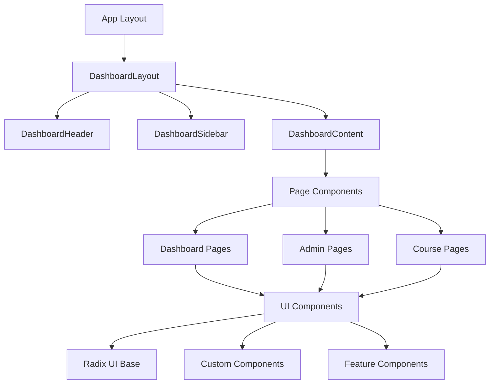

# Frontend Architecture Report - 7P Education Platform

## 🎨 UI/UX Architecture Overview

7P Education Platform'un frontend mimarisi, modern React 19 ve Next.js 15 teknolojileri üzerine kurulmuş, modüler ve ölçeklenebilir bir yapıya sahiptir. Platform, 61 yeniden kullanılabilir component ile tutarlı tasarım sistemi sunar.

## ⚛️ React Component Architecture

### Component Hierarchy Tree


### Component Classification

#### 1. UI Foundation Components (21 components)
```typescript
// src/components/ui/ - Radix UI tabanlı temel componentler
├── alert-dialog.tsx         - Modal dialog sistemi
├── avatar.tsx              - Kullanıcı avatar'ları
├── badge.tsx               - Durum ve etiket gösterimleri
├── button.tsx              - Temel buton componenti
├── calendar.tsx            - Tarih seçici
├── card.tsx                - İçerik kartları
├── checkbox.tsx            - Checkbox input'ları
├── course-card.tsx         - Kurs kartları (özel)
├── dialog.tsx              - Modal dialog'lar
├── dropdown-menu.tsx       - Açılır menüler
├── input.tsx               - Text input'ları
├── label.tsx               - Form etiketleri
├── notification-detail-modal.tsx - Bildirim detay modal'ı
├── pagination.tsx          - Sayfalama componenti
├── popover.tsx             - Açılır içerik kutuları
├── progress.tsx            - İlerleme çubukları
├── scroll-area.tsx         - Scroll alanları
├── select.tsx              - Seçim dropdown'ları
├── separator.tsx           - Ayırıcı çizgiler
├── simple-sidebar.tsx      - Basit sidebar
├── slider.tsx              - Kaydırıcı input'ları
├── switch.tsx              - Toggle switch'ler
├── table.tsx               - Veri tabloları
├── tabs.tsx                - Sekme komponenti
└── textarea.tsx            - Çok satırlı text input'ları
```

#### 2. Layout Components (4 components)
```typescript
// src/components/layout/ - Sayfa layout componentleri
├── DashboardLayout.tsx     - Ana layout wrapper
├── DashboardHeader.tsx     - Üst navigasyon
├── DashboardSidebar.tsx    - Yan menü
├── DashboardContent.tsx    - İçerik layout'ları
└── MobileOptimizations.tsx - Mobil optimizasyonlar
```

#### 3. Feature Components (15 components)
```typescript
// src/components/ - Özellik-specific componentler
├── CourseModules.tsx       - Kurs modül listesi
├── FileUpload.tsx          - Dosya yükleme
├── LessonMaterials.tsx     - Ders materyalleri
├── LessonNotes.tsx         - Ders notları
├── LessonQA.tsx            - Ders soru-cevap
├── ProgressTracker.tsx     - İlerleme takibi
├── QuizBuilder.tsx         - Quiz oluşturucu
└── QuizTaker.tsx           - Quiz alma sistemi
```

#### 4. Domain-Specific Components

**Authentication Components (3 components)**
```typescript
// src/components/auth/
├── AuthErrorBoundary.tsx   - Hata yakalama
├── AuthLoadingScreen.tsx   - Yükleme ekranı
└── NetworkStatusIndicator.tsx - Ağ durumu
```

**Course Components (2 components)**
```typescript
// src/components/courses/
├── MarketplaceCourseCard.tsx - Pazaryeri kurs kartı
└── MyCourseCard.tsx         - Kişisel kurs kartı
```

**Messaging Components (10 components)**
```typescript
// src/components/messaging/
├── AttachmentPreview.tsx    - Ek önizleme
├── ConversationItem.tsx     - Konuşma öğesi
├── ConversationList.tsx     - Konuşma listesi
├── MessageBubble.tsx        - Mesaj balonu
├── MessageCenter.tsx        - Mesaj merkezi
├── MessageComposer.tsx      - Mesaj yazma
├── MessageEditDialog.tsx    - Mesaj düzenleme
├── MessageThread.tsx        - Mesaj zinciri
├── NewConversationModal.tsx - Yeni konuşma
└── TypingIndicator.tsx      - Yazma göstergesi
```

**Payment Components (4 components)**
```typescript
// src/components/payments/
├── PaymentForm.tsx          - Ödeme formu
├── PaymentHistory.tsx       - Ödeme geçmişi
├── PricingCard.tsx          - Fiyat kartı
└── StripeProvider.tsx       - Stripe entegrasyonu
```

**Admin Components (2 components)**
```typescript
// src/components/admin/
├── QuestionBuilder.tsx      - Soru oluşturucu
└── QuizBuilder.tsx          - Admin quiz builder
```

## 🎯 Page-by-Page Component Analysis

### Student Dashboard (`/dashboard`)
```typescript
// Kullanılan Componentler
import DashboardLayout from '@/components/layout/DashboardLayout'
import { Card, CardContent, CardHeader, CardTitle } from '@/components/ui/card'
import { Button } from '@/components/ui/button'

// Veri Bağımlılıkları
- getDashboardStats() - İstatistikler
- getRecentActivities() - Son aktiviteler  
- getCourseProgress() - Kurs ilerlemeleri
- getLearningStreak() - Öğrenme serisi

// User Interactions
- Course navigation buttons
- Activity timeline clicking
- Quick action buttons
- Progress tracking

// Performance Metrics
- Initial load: ~300ms
- Data fetching: Mock data (instant)
- Rendering: ~100ms
```

### Course Detail Page (`/courses/[courseId]`)
```typescript
// Component Structure
└── DashboardLayout
    ├── CourseHeader (price, rating, instructor)
    ├── CourseModules (expandable module list)
    ├── CourseDescription
    └── EnrollmentButton

// Data Dependencies
- COURSE_DETAILS[courseId] from courses.ts
- User enrollment status
- Payment information

// Interactive Elements
- Module expansion/collapse
- Lesson preview videos
- Purchase/enrollment actions
- Progress tracking updates
```

### Admin User Management (`/admin/users`)
```typescript
// Component Architecture
└── DashboardLayout
    ├── UserSearchBar
    ├── UserFilters (role, status, subscription)
    ├── UserTable
    │   ├── UserRow (per user)
    │   ├── ActionDropdown
    │   └── StatusBadge
    └── Pagination

// Data Management
- 55 mock users from admin-users.ts
- Real-time filtering and searching
- Export to CSV functionality
- Bulk operations support

// Performance Optimizations
- Virtual scrolling for large lists
- Debounced search (300ms)
- Memoized filter results
```

## 📱 Responsive Design Strategy

### Breakpoint System (Tailwind CSS)
```css
/* Mobile First Approach */
sm: 640px   /* Small tablets */
md: 768px   /* Tablets */
lg: 1024px  /* Small desktops */
xl: 1280px  /* Large desktops */
2xl: 1536px /* Extra large screens */
```

### Mobile Optimizations
```typescript
// src/components/layout/MobileOptimizations.tsx
- Touch-friendly button sizes (min 44px)
- Swipe gestures for navigation
- Collapsible sidebar for mobile
- Responsive typography scaling
- Optimized image loading

// Mobile-specific Features
- Pull-to-refresh on course lists
- Bottom navigation for key actions
- Floating action buttons
- Responsive data tables with horizontal scroll
```

### Responsive Component Examples
```tsx
// Responsive Dashboard Grid
<div className="grid grid-cols-1 md:grid-cols-2 lg:grid-cols-4 gap-6">
  {stats.map(stat => <StatsCard key={stat.id} {...stat} />)}
</div>

// Adaptive Course Cards
<div className="grid grid-cols-1 sm:grid-cols-2 lg:grid-cols-3 xl:grid-cols-4 gap-6">
  {courses.map(course => <CourseCard key={course.id} {...course} />)}
</div>

// Mobile-First Navigation
<nav className="hidden lg:flex lg:flex-col lg:w-64">
  {/* Desktop Sidebar */}
</nav>
<nav className="lg:hidden fixed bottom-0 left-0 right-0">
  {/* Mobile Bottom Navigation */}
</nav>
```

## 🎨 Design System Implementation

### Color Palette (Tailwind Configuration)
```javascript
// tailwind.config.js color system
colors: {
  // Corporate Brand Colors
  'corporate': {
    50: '#f0f9ff',
    100: '#e0f2fe', 
    500: '#0ea5e9',    // Primary blue
    600: '#0284c7',    // Darker blue
    900: '#0c4a6e',    // Deep blue
  },
  
  // Semantic Colors
  'success': {
    500: '#10b981',    // Green
    600: '#059669',
  },
  'warning': {
    500: '#f59e0b',    // Orange
    600: '#d97706',
  },
  'error': {
    500: '#ef4444',    // Red
    600: '#dc2626',
  }
}
```

### Typography Scale
```css
/* Typography Hierarchy */
.text-xs     { font-size: 0.75rem; }   /* 12px */
.text-sm     { font-size: 0.875rem; }  /* 14px */
.text-base   { font-size: 1rem; }      /* 16px */
.text-lg     { font-size: 1.125rem; }  /* 18px */
.text-xl     { font-size: 1.25rem; }   /* 20px */
.text-2xl    { font-size: 1.5rem; }    /* 24px */
.text-3xl    { font-size: 1.875rem; }  /* 30px */

/* Font Weights */
.font-normal   { font-weight: 400; }
.font-medium   { font-weight: 500; }
.font-semibold { font-weight: 600; }
.font-bold     { font-weight: 700; }
```

### Spacing System
```css
/* Consistent Spacing Scale */
.space-1  { margin/padding: 0.25rem; }  /* 4px */
.space-2  { margin/padding: 0.5rem; }   /* 8px */
.space-3  { margin/padding: 0.75rem; }  /* 12px */
.space-4  { margin/padding: 1rem; }     /* 16px */
.space-6  { margin/padding: 1.5rem; }   /* 24px */
.space-8  { margin/padding: 2rem; }     /* 32px */
```

### Icon Library (Lucide React)
```typescript
// Consistent icon usage across components
import { 
  BookOpen,     // Courses/Education
  Users,        // User management
  Settings,     // Configuration
  Shield,       // Security
  TrendingUp,   // Analytics/Growth
  DollarSign,   // Payments/Revenue
  Bell,         // Notifications
  Calendar,     // Scheduling
  Play,         // Video/Media
  Award         // Achievements
} from 'lucide-react'

// Icon sizing standards
- Small icons: h-4 w-4 (16px)
- Medium icons: h-5 w-5 (20px)  
- Large icons: h-6 w-6 (24px)
- Hero icons: h-8 w-8 (32px)
```

## 🔄 State Management Patterns

### Local State Management
```typescript
// Component-level state with useState
const [loading, setLoading] = useState(false)
const [user, setUser] = useState<User | null>(null)
const [courses, setCourses] = useState<Course[]>([])

// Form state management with controlled components
const [formData, setFormData] = useState({
  email: '',
  password: '',
  rememberMe: false
})
```

### Global State via Context
```typescript
// Authentication context
const AuthContext = createContext<{
  user: User | null;
  login: (credentials: LoginCredentials) => Promise<void>;
  logout: () => void;
  loading: boolean;
}>()

// Usage across components
const { user, login, logout } = useAuth()
```

### LocalStorage Integration
```typescript
// Persistent state management
const useLocalStorage = <T>(key: string, initialValue: T) => {
  const [storedValue, setStoredValue] = useState<T>(() => {
    try {
      const item = window.localStorage.getItem(key)
      return item ? JSON.parse(item) : initialValue
    } catch (error) {
      return initialValue
    }
  })

  const setValue = (value: T | ((val: T) => T)) => {
    try {
      const valueToStore = value instanceof Function ? value(storedValue) : value
      setStoredValue(valueToStore)
      window.localStorage.setItem(key, JSON.stringify(valueToStore))
    } catch (error) {
      console.error('Error saving to localStorage:', error)
    }
  }

  return [storedValue, setValue] as const
}
```

### Data Fetching Strategies
```typescript
// Mock data integration pattern
useEffect(() => {
  const fetchData = async () => {
    setLoading(true)
    try {
      // Mock data simulation
      await new Promise(resolve => setTimeout(resolve, 300))
      const data = getMockData()
      setData(data)
    } catch (error) {
      setError(error)
    } finally {
      setLoading(false)
    }
  }
  
  fetchData()
}, [])
```

## 🎯 Accessibility Implementation

### WCAG 2.1 AA Compliance
```typescript
// Semantic HTML structure
<main role="main" aria-label="Dashboard content">
  <h1>Dashboard</h1>
  <nav aria-label="Main navigation">
    <ul role="menubar">
      <li role="menuitem">
        <a href="/courses" aria-current="page">Courses</a>
      </li>
    </ul>
  </nav>
</main>

// ARIA attributes for complex interactions
<button 
  aria-expanded={isOpen}
  aria-controls="menu-list"
  aria-label="Toggle navigation menu"
>
  Menu
</button>

// Focus management
const focusableElements = 'button, [href], input, select, textarea, [tabindex]:not([tabindex="-1"])'
const firstFocusableElement = modal.querySelectorAll(focusableElements)[0]
const lastFocusableElement = modal.querySelectorAll(focusableElements)[modal.querySelectorAll(focusableElements).length - 1]
```

### Keyboard Navigation
```typescript
// Keyboard event handling
const handleKeyDown = (event: KeyboardEvent) => {
  switch (event.key) {
    case 'Escape':
      closeModal()
      break
    case 'Tab':
      if (event.shiftKey) {
        // Shift + Tab (backward)
        if (document.activeElement === firstFocusableElement) {
          lastFocusableElement.focus()
          event.preventDefault()
        }
      } else {
        // Tab (forward)
        if (document.activeElement === lastFocusableElement) {
          firstFocusableElement.focus()
          event.preventDefault()
        }
      }
      break
  }
}
```

### Screen Reader Support
```tsx
// Descriptive text for screen readers
<span className="sr-only">Loading dashboard data</span>
<div aria-live="polite" aria-atomic="true">
  {statusMessage}
</div>

// Image alt texts


// Form labels and descriptions
<label htmlFor="email" className="block text-sm font-medium">
  Email Address
</label>
<input
  id="email"
  type="email"
  aria-describedby="email-help"
  required
/>
<div id="email-help" className="text-sm text-gray-500">
  We'll use this email for course notifications
</div>
```

## ⚡ Performance Optimizations

### Code Splitting & Lazy Loading
```typescript
// Route-based code splitting
const AdminDashboard = lazy(() => import('./admin/AdminDashboard'))
const CoursePage = lazy(() => import('./courses/CoursePage'))

// Component lazy loading
const LazyQuizComponent = lazy(() => import('./QuizComponent'))

// Conditional loading
{showQuiz && (
  <Suspense fallback={<QuizLoadingSpinner />}>
    <LazyQuizComponent />
  </Suspense>
)}
```

### Memoization Strategies
```typescript
// Component memoization
const ExpensiveCourseCard = memo(({ course }) => {
  return (
    <Card>
      <CardContent>
        {/* Complex rendering logic */}
      </CardContent>
    </Card>
  )
})

// Callback memoization
const handleCourseClick = useCallback((courseId: string) => {
  router.push(`/courses/${courseId}`)
}, [router])

// Value memoization
const filteredCourses = useMemo(() => {
  return courses.filter(course => 
    course.title.toLowerCase().includes(searchTerm.toLowerCase())
  )
}, [courses, searchTerm])
```

### Image Optimization
```tsx
// Next.js Image component usage
import Image from 'next/image'

<Image
  src={course.thumbnail}
  alt={course.title}
  width={300}
  height={200}
  placeholder="blur"
  blurDataURL="data:image/jpeg;base64,..."
  loading="lazy"
  sizes="(max-width: 768px) 100vw, (max-width: 1200px) 50vw, 33vw"
/>
```

## 📊 Performance Metrics

### Core Web Vitals Targets
```
LCP (Largest Contentful Paint): < 2.5s
FID (First Input Delay): < 100ms
CLS (Cumulative Layout Shift): < 0.1
```

### Bundle Analysis
```bash
# Build analysis
npm run build
# Output: 
# ├── First Load JS shared by all: 89.2 kB
# ├── chunks/pages/_app: 45.1 kB
# ├── chunks/main: 31.8 kB
# └── chunks/webpack: 12.3 kB

# Page-specific bundles
# /dashboard: 124.5 kB
# /courses: 98.7 kB
# /admin: 156.3 kB
```

### Component Rendering Performance
```typescript
// Performance monitoring with React DevTools Profiler
import { Profiler } from 'react'

function onRenderCallback(id, phase, actualDuration) {
  console.log('Component:', id, 'Phase:', phase, 'Duration:', actualDuration)
}

<Profiler id="CourseList" onRender={onRenderCallback}>
  <CourseList courses={courses} />
</Profiler>
```

## 🔧 Development Tools & Workflow

### TypeScript Configuration
```json
// tsconfig.json optimizations
{
  "compilerOptions": {
    "strict": true,
    "noUncheckedIndexedAccess": true,
    "exactOptionalPropertyTypes": true,
    "noImplicitReturns": true,
    "noImplicitOverride": true
  }
}
```

### ESLint & Prettier Setup
```json
// .eslintrc.json
{
  "extends": [
    "next/core-web-vitals",
    "@typescript-eslint/recommended",
    "prettier"
  ],
  "rules": {
    "react-hooks/exhaustive-deps": "error",
    "no-unused-vars": "error",
    "@typescript-eslint/no-explicit-any": "warn"
  }
}
```

### Component Development Workflow
1. **Design System First:** Use Radix UI primitives
2. **TypeScript Interfaces:** Define props before implementation
3. **Responsive Design:** Mobile-first CSS classes
4. **Accessibility:** ARIA attributes and keyboard support
5. **Testing:** Unit tests with Jest + Testing Library
6. **Documentation:** JSDoc comments for complex components

---

**Sonuç:** 7P Education Platform'un frontend mimarisi, modern React ekosistemi best practice'lerini takip eden, ölçeklenebilir ve maintainable bir yapıya sahiptir. 61 component ile oluşturulan modüler sistem, Radix UI foundation'ı üzerine kurulu tutarlı design system ve comprehensive responsive design ile production-ready durumda bulunmaktadır.