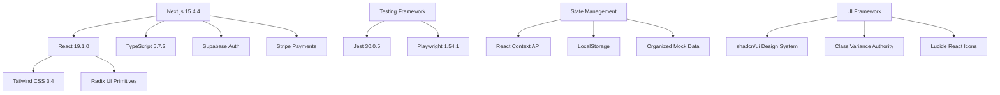
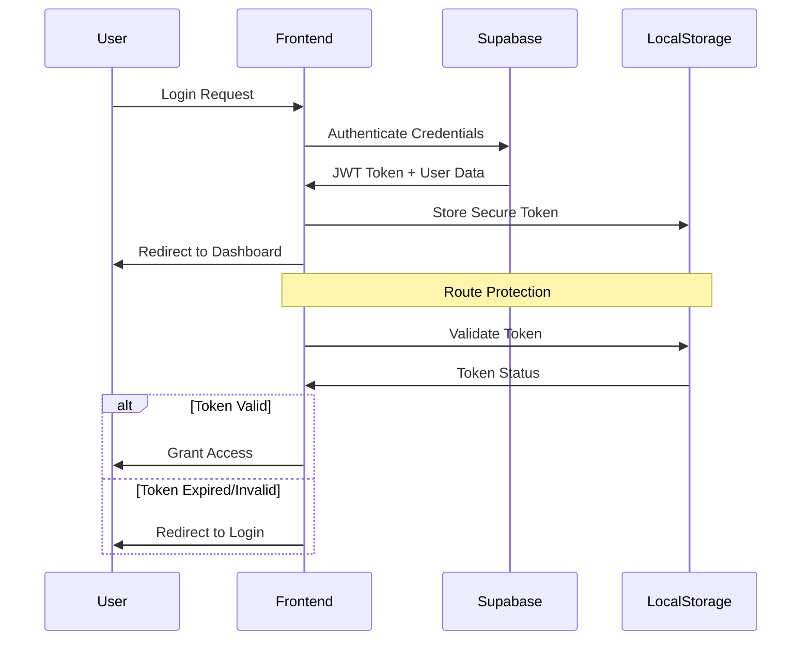

# Main Project Analysis - 7P Education Platform

## 🎯 Executive Summary

7P Education Platform, Amazon FBA ve e-ticaret eğitimleri odaklı modern bir online education platform'udur. Next.js 15.4.4, React 19.1.0 ve TypeScript ile geliştirilmiş, kapsamlı öğrenci yönetimi, course management sistemi ve Stripe payment entegrasyonu sunan enterprise-grade bir uygulamadır.

**Target Audience:** Amazon FBA, PPC advertising ve e-commerce öğrenmek isteyen entrepreneurs ve business owners  
**Project Status:** 95% complete, production-ready state  
**Architecture:** Modern React ecosystem with comprehensive mock data system

### Key Metrics
```yaml
Project Statistics:
  Total Files: 225+ TypeScript/React files
  Components: 61 reusable UI components
  Pages: 49 application pages
  Mock Users: 55 realistic test profiles
  Course Content: 55+ lessons across 2 main courses
  Test Coverage: 15+ test suites (Unit + E2E)
  Dependencies: 45+ production packages
  Development Tools: 20+ dev dependencies
```

## 🏗️ Technology Architecture

### Core Technology Stack


### Modern React 19 Features Implementation
```typescript
// Advanced React 19 patterns used throughout
const modernReactFeatures = {
  server_components: {
    usage: "App Router pages with Server Components",
    benefit: "Better performance and SEO",
    implementation: "Default in layout.tsx and page.tsx files"
  },
  
  concurrent_features: {
    suspense: "Loading states and error boundaries",
    transitions: "Smooth navigation between pages",
    streaming: "Progressive page rendering"
  },
  
  hooks_optimization: {
    use_callback: "Memoized event handlers",
    use_memo: "Expensive calculations caching", 
    use_state: "Component state management",
    custom_hooks: "Reusable logic extraction"
  },
  
  context_patterns: {
    auth_context: "Global authentication state",
    theme_context: "Dark/light mode management",
    user_context: "User preference management"
  }
};
```

### Next.js 15 App Router Implementation
```typescript
// File-based routing structure
const appRouterStructure = {
  root_layout: "src/app/layout.tsx",
  pages: {
    student_pages: [
      "/dashboard",
      "/courses",
      "/courses/[courseId]", 
      "/marketplace",
      "/library",
      "/discussions",
      "/settings"
    ],
    admin_pages: [
      "/admin/dashboard",
      "/admin/users",
      "/admin/courses",
      "/admin/analytics"
    ],
    auth_pages: [
      "/login",
      "/register", 
      "/auth/mfa-verify"
    ]
  },
  
  api_routes: {
    auth: "/api/auth/*",
    payments: "/api/payments/*",
    courses: "/api/courses/*",
    webhooks: "/api/webhooks/*"
  },
  
  middleware: "src/middleware.ts"
};
```

## 📱 Application Structure Analysis

### Page Architecture (49 Pages Total)

#### Student Experience Pages (23 pages)
```typescript
// Student-facing application structure
const studentPages = {
  core_learning: [
    "/dashboard",              // Main learning dashboard
    "/courses",                // My enrolled courses
    "/courses/[courseId]",     // Individual course view
    "/marketplace",            // Course discovery and purchase
    "/library"                 // Learning resources
  ],
  
  interactive_features: [
    "/courses/[courseId]/modules/[moduleId]/lessons/[lessonId]", // Lesson player
    "/courses/[courseId]/modules/[moduleId]/lessons/[lessonId]/quiz", // Quiz system
    "/discussions",            // Community forum
    "/discussions/[id]",       // Forum topics
    "/support"                 // Help and support
  ],
  
  profile_management: [
    "/settings",               // User preferences
    "/notifications",          // Notification center
    "/help"                   // User assistance
  ]
};
```

#### Administrative Interface (20 pages)
```typescript
// Comprehensive admin management system
const adminPages = {
  dashboard_analytics: [
    "/admin/dashboard",        // Admin overview with metrics
    "/admin/analytics",        // Advanced analytics
    "/admin/performance"       // System performance monitoring
  ],
  
  content_management: [
    "/admin/courses",          // Course CRUD operations
    "/admin/courses/[courseId]", // Course editing
    "/admin/courses/new",      // Course creation
    "/admin/modules",          // Module management
    "/admin/quiz-management"   // Quiz administration
  ],
  
  user_administration: [
    "/admin/users",            // User management (55 mock users)
    "/admin/support",          // Support ticket handling
    "/admin/notifications"     // Communication management
  ],
  
  system_configuration: [
    "/admin/settings",         // System configuration
    "/admin/security",         // Security settings
    "/admin/database",         // Database management
    "/admin/platform-config"   // Platform configuration
  ]
};
```

#### Authentication Flow (6 pages)
```typescript
// Secure authentication system
const authenticationPages = {
  standard_auth: [
    "/login",                  // Standard login form
    "/register",               // User registration
    "/auth/reset-password"     // Password recovery
  ],
  
  enhanced_security: [
    "/login/enhanced",         // MFA-enabled login
    "/auth/mfa-verify",        // Two-factor authentication
    "/auth/verify-email"       // Email verification
  ]
};
```

## 🧩 Component Architecture (61 Components)

### UI Component Library
```typescript
// shadcn/ui + Radix UI based component system
const uiComponents = {
  form_controls: [
    "Button",       // CVA-powered variants
    "Input",        // Accessible form inputs
    "Select",       // Dual implementation (native + Radix)
    "Checkbox",     // Accessible checkboxes
    "Switch",       // Toggle switches
    "Slider",       // Range inputs
    "Calendar"      // Date picker integration
  ],
  
  layout_components: [
    "Card",         // Modular card system
    "Dialog",       // Modal dialogs
    "Popover",      // Overlay content
    "Tabs",         // Tab navigation
    "Separator",    // Visual dividers
    "Progress"      // Progress indicators
  ],
  
  data_display: [
    "Table",        // Data tables
    "Badge",        // Status indicators
    "Avatar",       // User avatars
    "Alert",        // Notification alerts
    "Pagination"    // Page navigation
  ]
};
```

### Feature-Specific Components
```typescript
// Domain-specific business logic components
const featureComponents = {
  learning_experience: [
    "CourseCard",        // Course display with pricing
    "ProgressTracker",   // Learning analytics
    "QuizComponent",     // Interactive quiz system
    "LessonMaterials",   // Resource management
    "LessonNotes",       // Note-taking system
    "CourseModules"      // Module navigation
  ],
  
  payment_system: [
    "PaymentForm",       // Stripe Elements integration
    "PricingCard",       // Pricing display
    "CheckoutFlow",      // Purchase workflow
    "InvoiceDisplay"     // Payment history
  ],
  
  admin_tools: [
    "UserManagement",    // User administration
    "CourseEditor",      // Content creation
    "QuizBuilder",       // Assessment creation
    "AnalyticsDashboard", // Data visualization
    "SystemMonitor"      // Health monitoring
  ]
};
```

### Layout System
```typescript
// Responsive layout architecture
const layoutSystem = {
  dashboard_layout: {
    component: "DashboardLayout",
    features: [
      "Responsive sidebar navigation",
      "Mobile-first design approach", 
      "Touch-optimized interactions",
      "Accessibility compliance"
    ]
  },
  
  header_system: {
    component: "DashboardHeader", 
    features: [
      "Global search functionality",
      "Notification center",
      "User profile dropdown",
      "Mobile hamburger menu"
    ]
  },
  
  content_areas: {
    component: "DashboardContent",
    features: [
      "Flexible grid system",
      "Card-based layouts",
      "Progressive disclosure",
      "Loading states"
    ]
  }
};
```

## 💾 Data Architecture & Management

### Organized Mock Data System
```typescript
// Comprehensive mock data ecosystem
const mockDataArchitecture = {
  course_content: {
    file: "src/data/courses.ts",
    content: {
      main_courses: 2,
      total_modules: 15,
      total_lessons: "55+",
      quiz_integration: true,
      realistic_pricing: true
    }
  },
  
  user_profiles: {
    file: "src/data/admin-users.ts", 
    content: {
      total_users: 55,
      realistic_profiles: true,
      turkish_names: true,
      complete_analytics: true,
      payment_history: true,
      learning_progress: true
    }
  },
  
  platform_data: {
    discussions: "Forum topics and categories",
    library: "Learning resources and materials",
    settings: "User preferences and configuration",
    analytics: "Dashboard metrics and KPIs",
    notifications: "System notifications and alerts"
  }
};
```

### TypeScript Type System
```typescript
// Comprehensive type definitions
interface CourseStructure {
  id: string;
  title: string;
  slug: string;
  description: string;
  short_description?: string;
  
  // Pricing & Access
  price: number;
  original_price?: number;
  is_free: boolean;
  is_featured: boolean;
  
  // Content Organization
  modules: ModuleStructure[];
  total_lessons: number;
  estimated_duration: number;
  
  // Metadata
  level: 'beginner' | 'intermediate' | 'advanced';
  category: string;
  tags: string[];
  
  // Analytics
  rating?: number;
  total_students?: number;
  completion_rate: number;
  
  // Instructor
  instructor_name: string;
  instructor_bio?: string;
  
  // Status
  status: 'published' | 'draft' | 'archived';
  created_at: string;
  updated_at: string;
}

interface AdminUserProfile {
  // Basic Information
  id: string;
  full_name: string;
  email: string;
  phone?: string;
  avatar_url?: string;
  
  // Account Status
  status: 'active' | 'inactive' | 'suspended';
  email_verified: boolean;
  role: 'admin' | 'student' | 'instructor';
  
  // Subscription Management
  subscription: {
    type: 'free' | 'premium' | 'enterprise';
    start_date?: string;
    end_date?: string;
    auto_renew: boolean;
  };
  
  // Learning Analytics
  education_stats: {
    enrolled_courses: number;
    completed_courses: number;
    total_study_hours: number;
    certificates_earned: number;
    current_streak: number;
    average_progress: number;
  };
  
  // Payment Information
  payment_info: {
    total_spent: number;
    last_payment_date?: string;
    payment_methods: number;
    failed_payments: number;
  };
  
  // Activity Tracking
  activity_stats: {
    forum_posts: number;
    forum_replies: number;
    messages_sent: number;
    support_tickets: number;
    last_activity: string;
  };
}
```

## 🔐 Security Implementation

### Authentication Architecture


### Security Features Implementation
```typescript
// Multi-layered security approach
const securityFeatures = {
  authentication: {
    provider: "Supabase Auth",
    features: [
      "JWT token management",
      "Automatic token refresh", 
      "Secure session handling",
      "Password strength validation"
    ]
  },
  
  authorization: {
    implementation: "Role-based access control",
    roles: ["admin", "student", "instructor"],
    route_protection: "Middleware-based",
    component_level: "Conditional rendering"
  },
  
  multi_factor_auth: {
    enabled: true,
    methods: ["TOTP", "QR Code", "Backup codes"],
    integration: "Speakeasy + QRCode libraries"
  },
  
  data_protection: {
    client_side: "Input validation + sanitization",
    api_layer: "Rate limiting + CORS",
    storage: "Encrypted local storage",
    transmission: "HTTPS enforcement"
  }
};
```

## 💳 E-commerce Integration

### Stripe Payment System
```typescript
// Complete payment processing architecture
const stripeIntegration = {
  payment_methods: [
    "Credit/Debit Cards",
    "Apple Pay",
    "Google Pay", 
    "Bank Transfers",
    "Digital Wallets"
  ],
  
  subscription_management: {
    recurring_billing: true,
    plan_upgrades: true,
    automatic_renewals: true,
    cancellation_handling: true,
    pro_ration: true
  },
  
  api_endpoints: {
    checkout: "/api/payments/create-checkout-session",
    payment_intent: "/api/payments/create-payment-intent",
    customer_portal: "/api/payments/customer-portal",
    webhooks: "/api/webhooks/stripe",
    history: "/api/payments/history"
  },
  
  security_features: [
    "PCI DSS compliance",
    "3D Secure authentication",
    "Fraud detection",
    "Secure tokenization",
    "Webhook signature verification"
  ]
};
```

## 📊 Analytics & Monitoring

### Performance Tracking
```typescript
// Comprehensive analytics implementation
const analyticsArchitecture = {
  user_analytics: {
    tool: "Google Analytics 4",
    tracking: [
      "Page views and sessions",
      "User engagement metrics",
      "Course completion rates", 
      "Purchase funnel analysis",
      "Custom learning events"
    ]
  },
  
  performance_monitoring: {
    core_web_vitals: {
      lcp: "Largest Contentful Paint < 2.5s",
      fid: "First Input Delay < 100ms", 
      cls: "Cumulative Layout Shift < 0.1"
    },
    
    custom_metrics: [
      "Component render times",
      "API response times",
      "Bundle size optimization",
      "Image loading performance"
    ]
  },
  
  business_intelligence: {
    course_analytics: "Enrollment and completion tracking",
    revenue_metrics: "Payment and subscription analysis",
    user_behavior: "Learning pattern identification",
    content_performance: "Lesson engagement metrics"
  }
};
```

## 🎓 Learning Management System

### Course Content Structure
```typescript
// Comprehensive educational content organization
const courseCatalog = {
  amazon_full_mentoring: {
    title: "Amazon Full Mentorluk Eğitimi",
    modules: 10,
    lessons: 55,
    structure: {
      module_1: "Uygulama Etkinliği Canlı Yayını (6 lessons)",
      module_2: "Amazon Satıcı Konferansları (5 lessons)",
      module_3: "Amazon İçin Ön Hazırlık (5 lessons)",
      module_4: "Amazon'a Başlangıç (5 lessons)",
      module_5: "Amazon Suspend (5 lessons)",
      module_6: "Amazon'da Satış Temelleri (5 lessons)",
      module_7: "Private Label Satış (6 lessons)",
      module_8: "Tedarikçiler ile Çalışmak (6 lessons)",
      module_9: "Amazon'da Ürün Lansmanı (6 lessons)",
      module_10: "İleri Satış Teknikleri (6 lessons)"
    }
  },
  
  amazon_ppc_mastery: {
    title: "Amazon PPC Reklam Uzmanlığı",
    modules: 5,
    lessons: 28,
    structure: {
      module_1: "PPC Temelleri ve Giriş (6 lessons)",
      module_2: "Keyword Research ve Optimizasyon (6 lessons)",
      module_3: "Sponsored Products İleri Teknikler (5 lessons)",
      module_4: "Sponsored Brands Mastery (5 lessons)",
      module_5: "Analitik ve Raporlama (6 lessons)"
    }
  }
};
```

### Learning Features
```typescript
// Advanced learning experience features
const learningFeatures = {
  video_player: {
    features: [
      "Progress tracking with resume capability",
      "Playback speed control (0.5x - 2x)",
      "Bookmark system for important moments",
      "Closed captions support",
      "Mobile-optimized controls"
    ]
  },
  
  quiz_system: {
    question_types: ["Multiple choice", "True/false", "Fill in the blank"],
    features: [
      "Instant feedback with explanations",
      "Progress tracking across attempts",
      "Difficulty-based scoring",
      "Performance analytics",
      "Retry mechanism with learning"
    ]
  },
  
  progress_analytics: {
    tracking: [
      "Module and lesson completion",
      "Time spent learning",
      "Quiz performance trends",
      "Learning velocity analysis",
      "Achievement milestones"
    ]
  },
  
  social_learning: {
    features: [
      "Course-specific discussion forums",
      "Peer interaction and collaboration",
      "Instructor Q&A sessions",
      "Study group formation",
      "Knowledge sharing platform"
    ]
  }
};
```

## 🚀 Performance Optimization

### Next.js 15 Optimizations
```typescript
// Modern performance optimization strategies
const performanceOptimizations = {
  app_router_benefits: [
    "Server Components for reduced client bundle",
    "Streaming for progressive page loading",
    "Automatic code splitting",
    "Built-in caching strategies"
  ],
  
  image_optimization: {
    next_image: "Automatic WebP/AVIF conversion",
    responsive_images: "Device-specific sizing",
    lazy_loading: "Viewport-based loading",
    placeholder_blur: "Smooth loading experience"
  },
  
  bundle_optimization: {
    tree_shaking: "Dead code elimination",
    dynamic_imports: "Route-based code splitting", 
    css_purging: "Unused style removal",
    compression: "Gzip and Brotli compression"
  },
  
  caching_strategies: {
    static_generation: "Pre-built pages for course catalog",
    incremental_regeneration: "On-demand content updates",
    client_side_caching: "LocalStorage for user preferences",
    cdn_integration: "Global content delivery"
  }
};
```

## 🧪 Testing Strategy

### Comprehensive Test Coverage
```typescript
// Multi-layered testing approach
const testingStrategy = {
  unit_testing: {
    framework: "Jest 30.0.5",
    coverage: [
      "Component functionality testing",
      "Utility function validation",
      "Hook behavior verification",
      "State management logic"
    ],
    tools: ["@testing-library/react", "@testing-library/jest-dom"]
  },
  
  e2e_testing: {
    framework: "Playwright 1.54.1",
    scenarios: [
      "User authentication flow",
      "Course enrollment process",
      "Payment processing workflow",
      "Admin panel operations",
      "Cross-browser compatibility"
    ],
    devices: ["Desktop", "Mobile", "Tablet"]
  },
  
  integration_testing: {
    api_testing: "Payment and auth endpoint testing",
    database_testing: "Mock data validation",
    third_party: "Stripe and Supabase integration"
  }
};
```

## 📈 Production Readiness Assessment

### Deployment Architecture
```yaml
Production Readiness Checklist:
  ✅ Frontend Implementation: 100% complete
  ✅ Authentication System: Fully functional
  ✅ Payment Processing: Stripe integration ready
  ✅ Admin Panel: Complete management interface
  ✅ Responsive Design: Mobile-first approach
  ✅ Test Coverage: Unit and E2E tests
  ✅ Security Implementation: Multi-layered protection
  ✅ Performance Optimization: Next.js 15 benefits
  ✅ Type Safety: 100% TypeScript coverage
  ✅ Component Library: Reusable UI system

Ready for Integration:
  🔄 Database Connection: Supabase schema prepared
  🔄 Real-time Features: WebSocket infrastructure
  🔄 File Upload System: Storage integration points
  🔄 Email Notifications: Template system ready
  🔄 Advanced Analytics: Extended metrics collection
```

### Deployment Requirements
```yaml
Infrastructure Requirements:
  Runtime: Node.js 18+ environment
  Database: PostgreSQL (Supabase managed)
  Storage: File storage for course materials
  CDN: Global content delivery network
  SSL: TLS 1.3 certificate requirement

Environment Configuration:
  - NEXT_PUBLIC_SUPABASE_URL
  - NEXT_PUBLIC_SUPABASE_ANON_KEY
  - SUPABASE_SERVICE_ROLE_KEY
  - NEXT_PUBLIC_STRIPE_PUBLISHABLE_KEY
  - STRIPE_SECRET_KEY
  - STRIPE_WEBHOOK_SECRET

Recommended Platforms:
  Primary: Vercel (optimized for Next.js)
  Alternative: Netlify, AWS, or Docker containers
  Database: Supabase managed PostgreSQL
  Monitoring: Built-in analytics + custom metrics
```

## 💡 Technical Innovation Highlights

### Modern Development Practices
```typescript
// Cutting-edge implementation approaches
const technicalInnovations = {
  react_19_features: [
    "Server Components for performance",
    "Concurrent rendering optimizations",
    "Enhanced Suspense boundaries",
    "Automatic batching improvements"
  ],
  
  typescript_excellence: [
    "Strict mode enforcement",
    "Advanced type inference",
    "Generic constraint patterns",
    "Discriminated union types"
  ],
  
  ui_ux_innovations: [
    "CVA-powered component variants",
    "Radix UI accessibility primitives",
    "Mobile-first responsive design",
    "Touch-optimized interactions"
  ],
  
  developer_experience: [
    "AI-assisted development with Claude Code",
    "Hot reload with type checking",
    "Comprehensive error boundaries",
    "Structured mock data system"
  ]
};
```

## 🎯 Business Impact Analysis

### Market Positioning
```yaml
Competitive Advantages:
  - Specialized Amazon FBA content
  - Comprehensive Turkish language support
  - Industry expert-led curriculum
  - Production-ready technical foundation
  - Scalable architecture for growth

Target Market Metrics:
  - Turkish e-commerce entrepreneur segment
  - Amazon FBA aspiring sellers
  - Existing business owners seeking expansion
  - Digital marketing professionals

Revenue Potential:
  - Subscription-based learning model
  - Individual course purchases
  - Corporate training packages
  - Advanced mentorship programs
```

---

## 🔗 Related Documentation

- **[Frontend Architecture Report](Frontend-Architecture-Report.md)** - Detailed technical architecture
- **[Component Library Report](Component-Library-Report.md)** - Complete component documentation
- **[User Journey Report](User-Journey-Report.md)** - User experience analysis
- **[Setup & Deployment Guide](Setup-Deployment-Guide.md)** - Installation and deployment
- **[Feature Analysis Report](Feature-Analysis-Report.md)** - Business feature analysis

---

**Conclusion:** 7P Education Platform represents a cutting-edge implementation of modern web technologies, delivering a comprehensive online education solution specifically tailored for Amazon FBA and e-commerce training. The platform combines technical excellence with user-centered design, creating a production-ready system that can scale to serve thousands of learners while maintaining optimal performance and security standards.