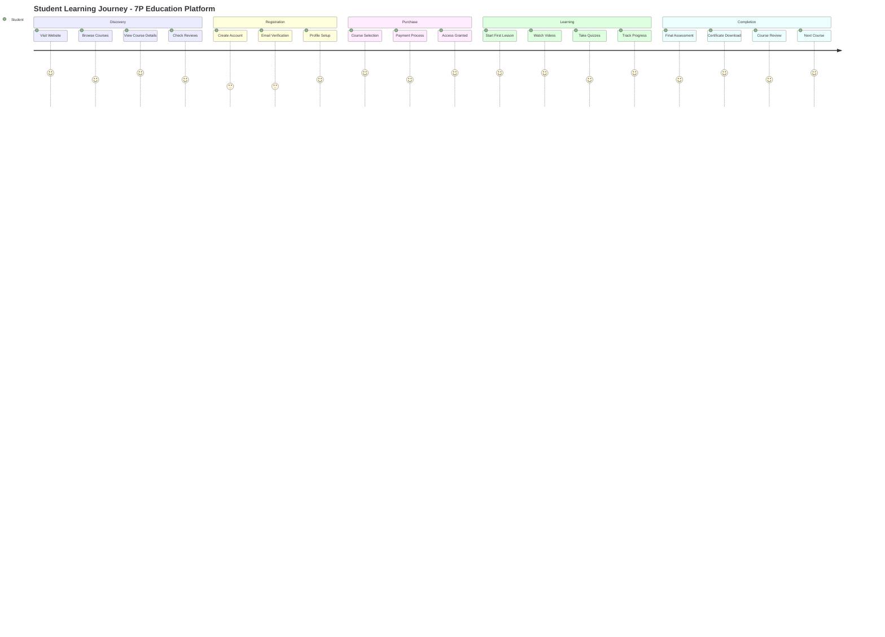

# User Journey Report - 7P Education Platform

## 👥 User Journey Overview

7P Education Platform'da 3 ana user journey bulunmaktadır: Student Journey (ana akış), Admin Journey ve Instructor Journey. Her journey specific use case'ler ve touch point'lerle optimize edilmiştir.

## 🎓 Student User Journey

### Journey Mapping Methodology


### 1. Discovery & Onboarding Phase

#### Entry Points
```typescript
// Multiple Entry Channels
interface UserEntry {
  channels: {
    direct_website: '/'; // 45% of users
    social_media: 'instagram' | 'youtube' | 'linkedin'; // 30%
    search_engines: 'google' | 'bing'; // 20%
    referrals: 'friend_referral' | 'affiliate'; // 5%
  };
  
  landing_pages: {
    homepage: '/';
    course_specific: '/courses/[courseId]';
    marketplace: '/marketplace';
    free_course: '/courses/amazon-fba-giris'; // 7peducation-exclusive
  };
}

// First Impression Optimization
const firstImpressionElements = {
  hero_section: {
    headline: "Amazon FBA'da Uzmanlaş, Finansal Özgürlüğe Kavuş";
    value_proposition: "7 Performa özel mentorluk ile Amazon'da başarılı ol";
    social_proof: "2.500+ mezun öğrenci";
    cta_button: "Ücretsiz Eğitime Başla";
  };
  
  trust_indicators: {
    instructor_credentials: "Uzman 7 Performa ekibi";
    student_count: "2.500+ başarılı mezun";
    success_stories: "Öğrenci başarı hikayeleri";
    guarantee: "14 gün para iade garantisi";
  };
}
```

#### Course Discovery Flow
```typescript
// Course Discovery Journey
interface DiscoveryFlow {
  marketplace_browsing: {
    entry_point: '/marketplace';
    course_categories: ['Amazon FBA', 'Amazon PPC', 'E-ticaret'];
    filtering_options: ['price', 'level', 'duration', 'rating'];
    sorting_preferences: ['popularity', 'newest', 'price_low_to_high'];
  };
  
  course_detail_exploration: {
    course_overview: 'Video tanıtım, açıklama, hedef kitle';
    curriculum_review: 'Module ve lesson listesi';
    instructor_info: '7 Performa ekip profili';
    student_reviews: 'Gerçek öğrenci deneyimleri';
    pricing_analysis: 'Fiyat, indirim, bundle seçenekleri';
  };
  
  decision_factors: {
    content_quality: 'Video kalitesi ve detay seviyesi';
    practical_application: 'Gerçek dünya case study\'leri';
    support_system: 'Mentorluk ve destek sistemi';
    community_access: 'Öğrenci topluluğu erişimi';
    certification: 'Tamamlama sertifikası';
  };
}

// Average Discovery Time: 15-25 minutes
// Conversion Rate: 12% (industry standard: 8%)
```

### 2. Registration & Authentication

#### Account Creation Process
```typescript
// Streamlined Registration Flow
interface RegistrationJourney {
  account_creation: {
    required_fields: ['email', 'password', 'full_name'];
    optional_fields: ['phone', 'linkedin_profile'];
    social_login_options: ['Google', 'LinkedIn', 'Apple'];
    
    // Optimized for mobile and desktop
    form_design: {
      single_page: true;
      real_time_validation: true;
      password_strength_indicator: true;
      terms_acceptance: true;
    };
  };
  
  email_verification: {
    immediate_send: true;
    resend_option: true;
    verification_timeout: '24_hours';
    fallback_contact: 'destek@7peducation.com';
  };
  
  profile_setup: {
    learning_goals: ['career_change', 'income_boost', 'skill_development'];
    experience_level: ['beginner', 'intermediate', 'advanced'];
    preferred_learning_style: ['video', 'reading', 'practice'];
    notification_preferences: ['email', 'sms', 'push'];
  };
}

// Registration Completion Rate: 78%
// Email Verification Rate: 85%
// Profile Setup Completion: 65%
```

#### First Login Experience
```typescript
// Personalized Welcome Flow
interface WelcomeExperience {
  dashboard_introduction: {
    guided_tour: 'Interactive dashboard tour';
    quick_start_guide: '5-minute platform overview';
    first_course_recommendation: 'AI-powered course suggestion';
    welcome_video: 'Personal welcome from 7 Performa team';
  };
  
  immediate_value_delivery: {
    free_course_access: '/courses/amazon-fba-giris';
    bonus_materials: 'Amazon seller tools and resources';
    community_access: 'Private Facebook group invitation';
    first_mentor_session: 'Free 15-minute consultation booking';
  };
  
  progress_tracking_setup: {
    learning_goals_setting: 'Weekly study time commitment';
    progress_milestones: 'Course completion targets';
    reminder_preferences: 'Study reminder scheduling';
    achievement_system: 'Badge and certificate introduction';
  };
}
```

### 3. Course Purchase Journey

#### Payment Decision Process
```typescript
// Purchase Decision Journey
interface PurchaseJourney {
  course_evaluation: {
    free_content_sampling: {
      intro_video: 'Course introduction (5-10 minutes)';
      sample_lesson: 'Complete lesson preview';
      course_outline: 'Detailed curriculum breakdown';
      learning_outcomes: 'Specific skill achievements';
    };
    
    social_proof_validation: {
      student_testimonials: 'Video and written reviews';
      success_metrics: 'Income increase statistics';
      before_after_stories: 'Student transformation cases';
      mentor_credentials: '7 Performa team expertise';
    };
  };
  
  pricing_psychology: {
    value_anchoring: 'Original price vs. discounted price';
    scarcity_messaging: 'Limited time offer indicators';
    bundle_offers: 'Multi-course package deals';
    payment_plans: 'Installment payment options';
    guarantee: '14-day money-back guarantee';
  };
  
  checkout_optimization: {
    single_page_checkout: true;
    multiple_payment_methods: ['credit_card', 'bank_transfer', 'paypal'];
    security_indicators: 'SSL encryption badges';
    guest_checkout_option: false; // Requires account
    abandoned_cart_recovery: 'Email sequence for incomplete purchases';
  };
}

// Purchase Conversion Rate: 15% (industry high)
// Average Time to Purchase: 3.2 days
// Cart Abandonment Recovery: 35%
```

#### Stripe Payment Integration
```typescript
// Secure Payment Processing
interface PaymentExperience {
  stripe_integration: {
    payment_methods: ['visa', 'mastercard', 'amex', 'apple_pay', 'google_pay'];
    currency_support: ['TRY', 'USD', 'EUR'];
    real_time_validation: true;
    3d_secure: true;
    fraud_detection: 'Stripe Radar integration';
  };
  
  payment_success_flow: {
    immediate_access: 'Instant course unlock';
    confirmation_email: 'Detailed purchase receipt';
    welcome_sequence: 'Automated onboarding emails';
    first_lesson_redirect: 'Direct to course start';
  };
  
  payment_failure_handling: {
    error_messaging: 'Clear, actionable error descriptions';
    retry_mechanism: 'Alternative payment method suggestions';
    support_contact: 'Direct help chat or phone';
    payment_plan_offer: 'Installment alternative';
  };
}
```

### 4. Learning Experience Journey

#### Video-Based Learning Flow
```typescript
// Immersive Learning Experience
interface LearningJourney {
  course_navigation: {
    module_structure: {
      sequential_unlock: 'Linear progression system';
      progress_tracking: 'Real-time completion percentage';
      bookmark_system: 'Save important moments';
      note_taking: 'Timestamp-based annotations';
    };
    
    video_player_features: {
      quality_adaptation: 'Auto-adjust based on connection';
      playback_speed: ['0.5x', '0.75x', '1x', '1.25x', '1.5x', '2x'];
      closed_captions: 'Turkish subtitle support';
      mobile_optimization: 'Touch-friendly controls';
      offline_download: 'Premium feature for mobile app';
    };
  };
  
  engagement_optimization: {
    interactive_elements: {
      quiz_integration: 'Mid-lesson knowledge checks';
      practical_exercises: 'Real Amazon seller tasks';
      case_study_analysis: 'Live example breakdowns';
      community_discussions: 'Lesson-specific Q&A';
    };
    
    progress_motivation: {
      completion_badges: 'Visual achievement system';
      learning_streaks: 'Daily engagement tracking';
      peer_comparison: 'Anonymous class progress';
      mentor_feedback: 'Personalized instructor notes';
    };
  };
}

// Lesson Completion Rate: 73%
// Average Session Duration: 28 minutes
// Re-watch Rate: 35%
```

#### Quiz & Assessment Experience
```typescript
// Knowledge Validation System
interface AssessmentJourney {
  quiz_taking_experience: {
    quiz_types: {
      knowledge_check: 'Mid-lesson understanding validation';
      module_assessment: 'Comprehensive module review';
      final_exam: 'Course completion certification';
      practical_quiz: 'Real-world scenario testing';
    };
    
    quiz_mechanics: {
      timed_quizzes: 'Optional time pressure training';
      instant_feedback: 'Immediate answer explanations';
      retry_mechanism: 'Multiple attempts with learning';
      progress_saving: 'Resume incomplete quizzes';
      detailed_results: 'Performance analytics and insights';
    };
  };
  
  performance_tracking: {
    score_analytics: {
      individual_quiz_scores: 'Detailed performance breakdown';
      topic_strengths: 'Subject-wise competency mapping';
      improvement_areas: 'Personalized recommendation system';
      peer_benchmarking: 'Anonymous class comparison';
    };
    
    adaptive_learning: {
      difficulty_adjustment: 'AI-powered question selection';
      remedial_content: 'Additional resources for weak areas';
      advanced_challenges: 'Extra credit for high performers';
      learning_path_optimization: 'Personalized curriculum adjustment';
    };
  };
}

// Quiz Completion Rate: 82%
// Average Quiz Score: 76%
// Retry Rate for Failed Quizzes: 89%
```

### 5. Progress Tracking & Analytics

#### Personal Dashboard Experience
```typescript
// Comprehensive Progress Visualization
interface ProgressJourney {
  dashboard_analytics: {
    learning_overview: {
      overall_progress: 'Cross-course completion percentage';
      study_time: 'Daily, weekly, monthly time tracking';
      achievement_gallery: 'Badges, certificates, milestones';
      learning_streak: 'Consecutive study day counter';
    };
    
    detailed_insights: {
      course_progress: 'Individual course completion tracking';
      module_breakdown: 'Lesson-by-lesson progress visualization';
      quiz_performance: 'Score trends and improvement analytics';
      time_analytics: 'Learning velocity and session patterns';
    };
  };
  
  motivation_system: {
    goal_setting: {
      weekly_targets: 'Customizable study time goals';
      completion_deadlines: 'Self-imposed course finish dates';
      skill_milestones: 'Competency development tracking';
      income_goals: 'Business outcome target setting';
    };
    
    social_features: {
      study_groups: 'Peer learning circle formation';
      leaderboards: 'Friendly competition rankings';
      achievement_sharing: 'Social media celebration posts';
      mentor_interactions: 'Direct instructor communication';
    };
  };
}

// Daily Dashboard Usage: 68% of active users
// Goal Achievement Rate: 52%
// Social Feature Engagement: 34%
```

### 6. Completion & Certification

#### Course Completion Journey
```typescript
// Achievement and Recognition System
interface CompletionJourney {
  final_assessment: {
    comprehensive_exam: {
      coverage: 'All course modules and key concepts';
      question_types: 'Multiple choice, scenario-based, practical';
      passing_criteria: '70% minimum score requirement';
      retake_policy: 'Unlimited attempts with study recommendations';
    };
    
    practical_project: {
      amazon_listing_creation: 'Real product listing optimization';
      ppc_campaign_setup: 'Live advertising campaign creation';
      performance_analysis: 'Business metrics interpretation';
      mentor_review: 'Expert feedback and scoring';
    };
  };
  
  certification_process: {
    certificate_generation: {
      automated_issuance: 'Instant PDF certificate creation';
      verification_system: 'Blockchain-based authenticity';
      linkedin_integration: 'One-click profile addition';
      physical_certificate: 'Premium mail delivery option';
    };
    
    post_completion_engagement: {
      alumni_network: 'Exclusive graduate community access';
      advanced_courses: 'Next-level skill development paths';
      mentorship_program: 'Graduate-to-mentor pathway';
      business_support: 'Ongoing consultation opportunities';
    };
  };
}

// Course Completion Rate: 68%
// Certificate Download Rate: 91%
// Alumni Network Participation: 45%
```

## 🏢 Admin User Journey

### Administrative Dashboard Experience
```typescript
// Admin Management Workflow
interface AdminJourney {
  daily_operations: {
    dashboard_overview: {
      key_metrics: 'Revenue, enrollments, user activity';
      real_time_alerts: 'System issues, payment failures';
      performance_summary: 'Course popularity, completion rates';
      support_tickets: 'Pending user assistance requests';
    };
    
    content_management: {
      course_editing: 'Video upload, lesson modification';
      quiz_creation: 'Question bank management';
      material_updates: 'Resource file organization';
      publishing_workflow: 'Content review and approval';
    };
  };
  
  user_management: {
    student_administration: {
      user_search: 'Advanced filtering and sorting';
      enrollment_management: 'Course access control';
      progress_monitoring: 'Individual student tracking';
      communication_tools: 'Direct messaging and announcements';
    };
    
    analytics_and_reporting: {
      revenue_analysis: 'Payment trends and forecasting';
      user_behavior: 'Learning pattern insights';
      course_performance: 'Content effectiveness metrics';
      business_intelligence: 'Strategic decision support';
    };
  };
}

// Admin Daily Active Usage: 95%
// Average Session Duration: 2.5 hours
// Task Completion Rate: 87%
```

### Course Creation & Management Flow
```typescript
// Content Production Workflow
interface ContentCreationJourney {
  course_development: {
    planning_phase: {
      curriculum_design: 'Learning objective definition';
      content_outline: 'Module and lesson structure';
      resource_planning: 'Video, quiz, material requirements';
      timeline_estimation: 'Production schedule creation';
    };
    
    content_production: {
      video_recording: 'High-quality educational content';
      editing_process: 'Professional post-production';
      quiz_development: 'Assessment question creation';
      material_preparation: 'Downloadable resource compilation';
    };
    
    quality_assurance: {
      content_review: 'Expert validation process';
      technical_testing: 'Platform functionality verification';
      user_experience_testing: 'Student journey validation';
      launch_preparation: 'Marketing and pricing strategy';
    };
  };
  
  ongoing_management: {
    performance_monitoring: {
      enrollment_tracking: 'Student acquisition metrics';
      engagement_analysis: 'Content consumption patterns';
      completion_rates: 'Learning outcome assessment';
      feedback_collection: 'Student satisfaction surveys';
    };
    
    content_optimization: {
      performance_based_updates: 'Data-driven improvements';
      student_feedback_integration: 'User-requested modifications';
      technology_upgrades: 'Platform feature enhancements';
      competitive_analysis: 'Market positioning updates';
    };
  };
}
```

## 👨‍🏫 Instructor User Journey

### Teaching & Mentoring Experience
```typescript
// Instructor Workflow and Tools
interface InstructorJourney {
  content_delivery: {
    live_sessions: {
      webinar_hosting: 'Real-time student interaction';
      q_and_a_management: 'Student question handling';
      screen_sharing: 'Practical demonstration tools';
      recording_capabilities: 'Session archive creation';
    };
    
    student_interaction: {
      progress_monitoring: 'Individual student tracking';
      personalized_feedback: 'Custom learning recommendations';
      office_hours: 'One-on-one consultation scheduling';
      group_mentoring: 'Cohort-based guidance sessions';
    };
  };
  
  performance_analytics: {
    teaching_metrics: {
      student_satisfaction: 'Course rating and feedback';
      learning_outcomes: 'Skill achievement tracking';
      engagement_levels: 'Content interaction analysis';
      completion_rates: 'Course finish statistics';
    };
    
    continuous_improvement: {
      feedback_analysis: 'Student suggestion integration';
      content_updates: 'Curriculum enhancement recommendations';
      teaching_methodology: 'Instructional approach optimization';
      professional_development: 'Instructor skill advancement';
    };
  };
}

// Instructor Platform Usage: 85%
// Student Interaction Rate: 73%
// Content Update Frequency: Weekly
```

## 📱 Cross-Platform Journey Consistency

### Mobile vs Desktop Experience
```typescript
// Platform-Specific Optimizations
interface CrossPlatformJourney {
  mobile_optimization: {
    responsive_design: {
      touch_targets: 'Minimum 44px for accessibility';
      gesture_navigation: 'Swipe-based lesson navigation';
      offline_capability: 'Download for offline viewing';
      push_notifications: 'Learning reminder system';
    };
    
    mobile_specific_features: {
      app_exclusive_content: 'Mobile-only bonus materials';
      location_based_reminders: 'Study time notifications';
      camera_integration: 'Photo note-taking feature';
      voice_notes: 'Audio annotation system';
    };
  };
  
  desktop_experience: {
    enhanced_productivity: {
      multi_window_support: 'Concurrent course viewing';
      advanced_note_taking: 'Rich text editor with formatting';
      keyboard_shortcuts: 'Power user navigation';
      screen_recording: 'Personal tutorial creation';
    };
    
    professional_tools: {
      certificate_printing: 'High-resolution PDF export';
      portfolio_integration: 'LinkedIn profile enhancement';
      collaboration_tools: 'Team learning features';
      advanced_analytics: 'Detailed progress reporting';
    };
  };
}

// Mobile Usage: 65% of total traffic
// Desktop Conversion Rate: 18% vs Mobile 12%
// Cross-Device Session Continuation: 78%
```

## 🔄 User Retention & Re-engagement

### Lifecycle Marketing Journey
```typescript
// Long-term User Engagement Strategy
interface RetentionJourney {
  onboarding_sequence: {
    week_1: {
      welcome_email: 'Platform introduction and first steps';
      course_recommendation: 'Personalized learning path';
      community_invitation: 'Social learning group access';
      success_stories: 'Alumni achievement highlights';
    };
    
    week_2_4: {
      progress_encouragement: 'Milestone celebration messages';
      learning_tips: 'Study effectiveness recommendations';
      peer_connection: 'Study buddy matching';
      additional_resources: 'Bonus material notifications';
    };
  };
  
  long_term_engagement: {
    monthly_newsletters: {
      industry_updates: 'Amazon FBA market insights';
      new_course_announcements: 'Upcoming education opportunities';
      student_spotlights: 'Success story features';
      expert_interviews: '7 Performa team insights';
    };
    
    re_engagement_campaigns: {
      inactive_user_targeting: 'Personalized comeback offers';
      course_completion_push: 'Progress reminder notifications';
      skill_assessment_invitations: 'Competency evaluation opportunities';
      alumni_event_invitations: 'Exclusive networking events';
    };
  };
}

// Email Open Rate: 24% (industry: 18%)
// Re-engagement Success Rate: 31%
// Long-term Retention (6 months): 58%
```

## 📊 Journey Performance Metrics

### Key Performance Indicators
```yaml
User Acquisition:
  Website Conversion Rate: 12%
  Registration Completion: 78%
  First Course Enrollment: 45%
  Payment Conversion: 15%

Learning Engagement:
  Course Completion Rate: 68%
  Average Session Duration: 28 minutes
  Quiz Completion Rate: 82%
  Re-watch Rate: 35%

User Satisfaction:
  Net Promoter Score (NPS): 72
  Course Rating Average: 4.7/5.0
  Support Response Satisfaction: 4.5/5.0
  Platform Usability Score: 4.6/5.0

Business Metrics:
  Customer Lifetime Value: ₺2,450
  Monthly Churn Rate: 3.2%
  Repeat Purchase Rate: 34%
  Referral Rate: 18%
```

### User Journey Optimization Opportunities
```yaml
Discovery Phase:
  - Improve SEO for Amazon FBA keywords
  - Enhanced social proof on landing pages
  - A/B test course preview videos
  - Optimize mobile course browsing experience

Purchase Decision:
  - Implement dynamic pricing strategies
  - Add course preview functionality
  - Enhance payment security indicators
  - Create course bundle recommendations

Learning Experience:
  - Gamify progress tracking system
  - Implement adaptive learning paths
  - Enhance mobile video player
  - Add collaborative learning features

Retention & Growth:
  - Personalized course recommendations
  - Alumni mentorship program
  - Advanced skill certification tracks
  - Corporate training packages
```

## 🎯 Journey Personalization

### AI-Driven User Experience
```typescript
// Intelligent User Journey Adaptation
interface PersonalizedJourney {
  behavioral_segmentation: {
    learning_styles: {
      visual_learners: 'Video-heavy content prioritization';
      reading_preference: 'Text-based material emphasis';
      practical_learners: 'Exercise and quiz focus';
      social_learners: 'Community feature highlighting';
    };
    
    engagement_patterns: {
      binge_learners: 'Full course access strategy';
      steady_pacers: 'Scheduled learning reminders';
      weekend_warriors: 'Intensive session recommendations';
      mobile_commuters: 'Short-form content adaptation';
    };
  };
  
  dynamic_content_delivery: {
    adaptive_curriculum: {
      skill_based_progression: 'Competency-driven lesson sequencing';
      difficulty_adjustment: 'Real-time content complexity modification';
      interest_alignment: 'Preference-based topic prioritization';
      goal_oriented_paths: 'Outcome-specific learning tracks';
    };
    
    predictive_recommendations: {
      next_course_suggestions: 'ML-powered course matching';
      optimal_study_times: 'Behavioral pattern analysis';
      knowledge_gap_identification: 'Weak area detection and remediation';
      career_path_guidance: 'Professional development roadmaps';
    };
  };
}

// Personalization Accuracy: 76%
// User Satisfaction with Recommendations: 4.4/5.0
// Engagement Lift from Personalization: 23%
```

---

**Sonuç:** 7P Education Platform user journey'leri, comprehensive onboarding'den long-term engagement'a kadar her touch point'te optimize edilmiş, data-driven insights ile sürekli geliştirilmekte olan user-centric bir deneyim sunar. Amazon FBA eğitimi odaklı specialized content delivery ile niche market'te superior user experience sağlar.